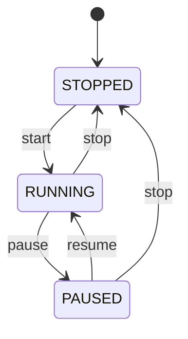
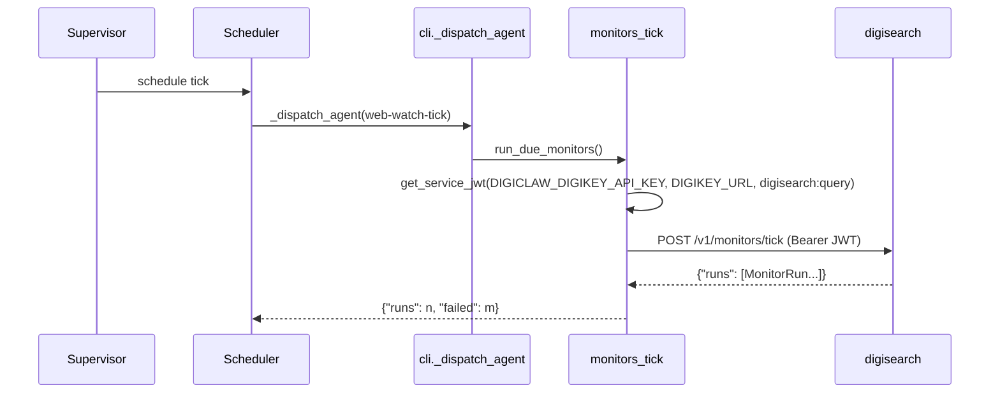

# digiclaw Architecture

digiclaw is the intended user-facing gateway and runtime layer of the
digithings stack. As built, it ships four implemented concerns — a
**heartbeat runner**, a **JSONL audit log**, an **agent scheduler**, and the
Phase C **monitors_tick** caller — as a **CLI with no HTTP server of its
own**. Channel adapters (Slack, Discord, Telegram, WhatsApp), session/queue
managers, the WebSocket control plane, and the `run_digigraph_workflow` skill
runtime are explicitly deferred.

## Heartbeat runner

`python -m digiclaw` (or `digiclaw heartbeat`) executes **one cycle and
exits 0** when every health ping succeeds (1 otherwise). One cycle GETs
`{DIGIGRAPH_URL}/health` and `{DIGIQUANT_URL}/health` (5s timeout), calls
digiquant `GET /check_drift` with a digikey bearer when available, triggers
re-optimization on reported drift, and logs one `heartbeat` audit event with
per-service status. The Docker loop
(`while true; do python -m digiclaw; sleep 1800; done`) lives outside the
runner — no daemon loop inside.

The drift check is **auth-gated, not logic-gated**: without a digikey bearer
(`digikey_bearer_token()`) the runner logs `drift_check_skipped` and never
calls `/check_drift`. With a bearer and sufficient Sharpe history, a
`drift_detected: true` response logs `reoptimize_triggered` and POSTs
`/run_optimize` (60s timeout) with a hardcoded symbol list
(`AAPL`, `MSFT`, `GOOGL`), logging `reoptimize_completed` or
`reoptimize_failed`. Re-optimization additionally requires
`DIGIQUANT_DATA_DIR`, else `reoptimize_skipped` is logged. Every failure path
writes an explicit audit event — nothing skips silently.

## JSONL audit

`digiclaw.audit.audit_log()` is a thin wrapper over
`digibase.audit.emit_event`: append-only structured lines, never delete or
truncate. Four key patterns (`password`, `api_key`, `token`, `secret`)
redact to `[REDACTED]` by case-insensitive substring match (recursive)
before writing — no fast-path bypass. An optional `AUDIT_SINK_URL` POST is
best-effort (3s timeout): failures are swallowed, never propagated. The
default log path is `digiquant/results/audit/events.jsonl`, overridden by
`AUDIT_LOG_PATH`; digigraph and digiquant write to the same file through
their own thin wrappers over the same fleet emitter, so audit lines from all
sources converge in one file.

## Agent scheduler

`digiclaw schedule …` owns agent lifecycle (`start`/`stop`/`pause`/`resume`)
over YAML definitions in `digiclaw/agents/`, with 5-field cron parsing,
next-fire calculation, durable tick state, and `schedule status` for
next-run visibility. Continuous mode is `interval_seconds` between isolated
ticks via `digiclaw schedule tick`. Event-triggered runs are schema-only.

*Lifecycle of a scheduled agent, persisted in `DIGICLAW_SCHEDULER_STATE`.*

State is persisted as JSON (atomic tmp-file replace) at
`DIGICLAW_SCHEDULER_STATE` (default
`{DIGI_WORKSPACE}/.digiclaw/scheduler_state.json`). On restart, running
agents whose `next_run_at` is overdue (or marked `pending`) are re-queued
immediately so missed ticks are not dropped. Each tick invokes the agent's
runner in isolation: an exception records `last_status="error"` +
`last_error` and still advances `next_run_at`, so one failing agent never
poisons the next schedule.

## Phase C monitors_tick (web-watch-tick)

A fourth concern landed with digisearch monitors Phase C (#4065): the
`web-watch-tick` agent (continuous, 60s) drives digisearch's scheduled web
watches by POSTing `/v1/monitors/tick` with a digikey service JWT.

*The web-watch-tick agent maps to `run_due_monitors`, the only non-no-op runner.*

`digiclaw.monitors_tick.run_due_monitors()` POSTs
`{DIGISEARCH_URL}/v1/monitors/tick` and returns `{"runs": n, "failed": m}`.
The base URL resolves as explicit arg → `DIGISEARCH_URL` env →
`http://127.0.0.1:8002` (trailing `/` normalized, blank env falls through).
It mints its bearer with `digibase.service_auth.get_service_jwt` (a
function-local, fully qualified lazy import) using
`key_env="DIGICLAW_DIGIKEY_API_KEY"`, `digikey_url_env="DIGIKEY_URL"`, and
`scopes=("digisearch:query",)`; an explicit `bearer_token` argument skips
minting entirely. The POST uses a 120s httpx timeout and
`raise_for_status()`: transport and auth failures **raise** rather than
returning an empty tick, the scheduler persists them as the agent's
`last_status="error"` + `last_error`, and `digiclaw schedule tick` prints the
failed outcome. `failed` counts runs with `status == "failed"` (per-watch
failures are isolated inside digisearch and still return as stored runs).

Only `web-watch-tick` maps to this runner; every other agent name keeps the
scheduler's no-op `default_agent_runner`. The YAML file only marks the
schedule `enabled` — lifecycle still defaults to `stopped`, so the container
bootstrap `digiclaw schedule start web-watch-tick` is what makes `tick()`
pick it up.

## Explicitly not built

OpenClaw runtime, channel adapters, session/queue managers, WebSocket
control plane, skill execution, full agent registry (#217), durable ADDM
history across restarts (in-process deque today), and any REST surface —
adding an HTTP server requires its own scoped task covering auth, loopback
binding, and scopes.

## Representative tests

`tests/dc/`: audit append/redaction behavior (`test_audit.py`), scheduler
lifecycle and cron (`test_scheduler.py`), heartbeat cycle with drift-check
skipped semantics when no bearer is configured (`test_heartbeat.py`), and
the monitor tick JWT/URL/failure-count behavior (`test_monitors_tick.py`).
