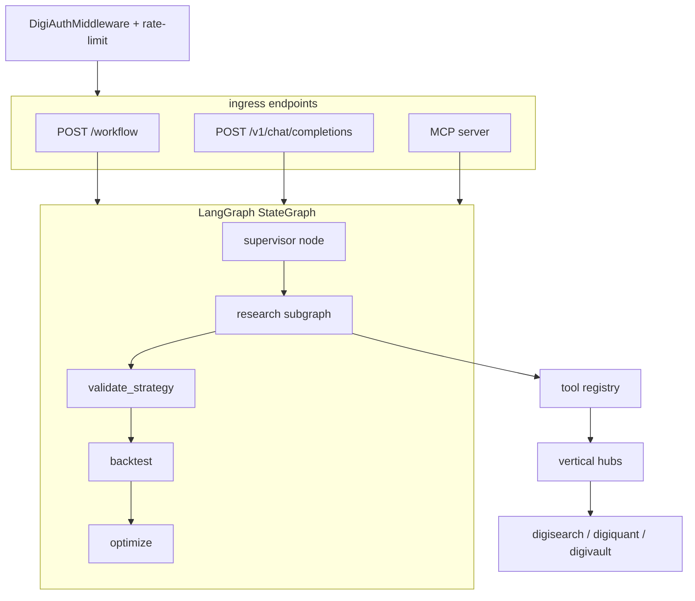
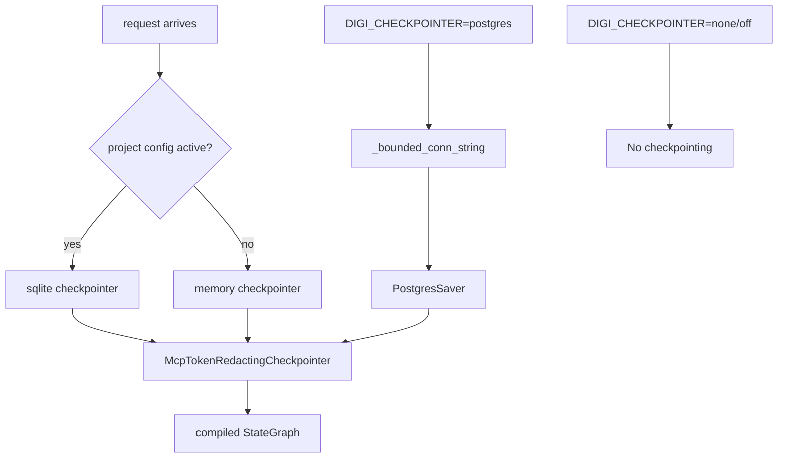
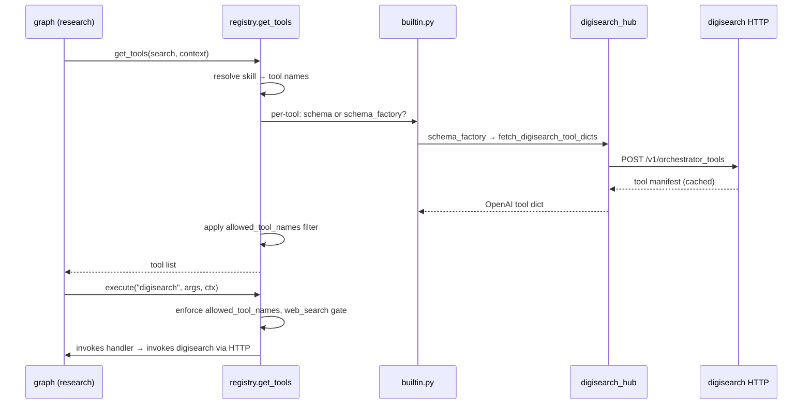
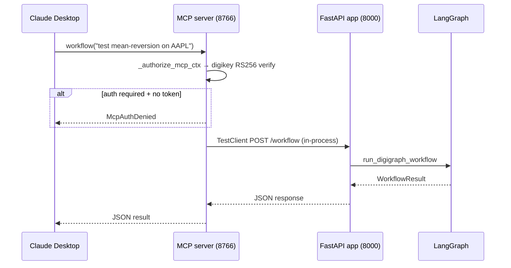

# digigraph Architecture

digigraph (port 8000) is the central orchestration hub: every user request
flows through it from digiclaw, digichat, Open WebUI, or MCP clients, and
it coordinates the verticals without owning their domain logic. Three
roles, one rule: **coordinate, don't implement** — no quant pipeline
ordering (digiquant's), no tiered RAG (digisearch's), no Python imports of
vertical packages (HTTP only).



*Figure: Request ingress paths and LangGraph node routing, with the research subgraph dispatching tools through the registry to vertical hubs.*

## Role 1 — LangGraph state machine

A compiled `StateGraph[WorkflowState]` owns the central decision loop:

```
START → research → validate_strategy → backtest → optimize → END
```

With `DIGI_SUPERVISOR=1`, a `supervisor` node runs first and conditionally
routes to `research` or `END`. The research node is itself a **compiled
subgraph** (LLM + tool loop with two-tier context compaction from
`compaction.py`); backtest and optimize nodes delegate to digiquant jobs
via HTTP with local catch for connection errors.

Profile-driven conditional edges control which nodes fire:

| Edge | Decision |
|------|----------|
| `_route_after_research` | Profile `research_rag` → END; no strategy extracted → END; digiquant unavailable (explicit empty `DIGIQUANT_URL=""`) or `backtest` not in enabled agents → END; else → validate_strategy |
| `_route_after_validate` | Error → END; else → backtest |
| `_route_after_backtest` | `DIGI_GRAPH_OPTIMIZE_AFTER_BACKTEST=1` or `optimize` in enabled agents → optimize; else → END |

Source: `build_workflow_graph()` and routing functions in
`repo://digigraph/src/digigraph/graph/graph.py#L272-L318`.

**Checkpointer** — process-wide singleton (`get_checkpointer()`), shared
across HTTP requests so thread state survives. `DIGI_CHECKPOINTER=memory`
(default for dev, lost on restart), `sqlite` (default when a
`digiproject.yaml` is active — survives restarts), or `postgres`
(required for HA). An `McpTokenRedactingCheckpointer` wrapper strips MCP
bearer tokens and other secret-named keys from durable writes while
keeping them in-request. State stays lean — refs and summaries only,
large datasets in `digistore`, never checkpoints full of document bodies
or DataFrames.



*Figure: Checkpointer resolution path — memory, sqlite, postgres, or none, all wrapped with MCP token redaction.*

## Role 2 — Tool registry and dispatcher

`orchestration/registry.py` holds two module-level registries:

- **`_tools`**: `name → (schema, schema_factory, handler, tags)`. Populated by
  `register_tool()` called from `orchestration/builtin.py`. Tools with a
  `schema_factory` (e.g. `digisearch`, `digivault_search_notes`) resolve
  their OpenAI schema from the vertical's live manifest at dispatch time.
- **`_skills`**: `skill_id → (tool_names, when_predicate)`. Skills are named
  bundles of tools, optionally gated by a `when(context)` predicate — `search`
  and `project_rag` are the primary skills.



*Figure: Tool discovery (lazy schema resolution from vertical manifests) and dispatch with allowlist enforcement.*

**`register_mcp_server()`** loads a `mcp_servers.yaml` entry and returns
tool *descriptors* for active providers — it does not auto-register them
with `register_tool()`. Production tools register directly via
`register_tool` from builtin skills; MCP config registration is a
descriptor-only path pending full MCP wire-up (issue #401).

**Allowlist enforcement** is two-tier:

1. At **discovery** (`get_tools()`): any tool whose name is absent from
   `ToolContext.allowed_tool_names` is omitted from the tool list sent to
   the LLM.
2. At **execution** (`execute()`): the same allowlist check on dispatch,
   with SHA-256 audit logging for denials.

**Operator MCP** (`extra_mcp_servers`): trusted BFF headers
(`X-Digi-Mcp-Servers`) inject per-turn server `{id, url}` pairs.
`openai_tools_for_servers()` lists them (prefixed `{id}_{name}`),
`call_prefixed_tool()` proxies invocations. All remote-MCP URLs are
DNS-validated at connect time via `_SsrfSafeNetworkBackend`
(`orchestration/mcp_client.py`): the host resolves immediately before the
socket, every A/AAAA record must be globally routable, and validated IPs
are dialed without a second lookup. Loopback, link-local, metadata, and
CGNAT are always blocked.

**Hub mode**: `DIGI_HUB_MODE=legacy` (default) runs the monolith graph
with inline tools. `DIGI_HUB_MODE=federated` additionally registers
delegate tools (`digisearch_research_delegate`,
`digiquant_pipeline_delegate`) that send the entire research or pipeline
job to the vertical via orchestrator_invoke.

## Role 3 — HTTP + MCP surface

Covered in detail in [API and Operations](/openwiki/digigraph/api-and-operations.md).
In brief:

- **`POST /workflow`** — digiclaw custom skill, returns `WorkflowResult`
  (research + backtest).
- **`POST /v1/chat/completions`** — OpenAI-compatible with SSE streaming
  (`stream: true`), tool-call blocks, and Open WebUI format chrome.
- **Thread endpoints** (opt-in, `DIGI_ENABLE_THREAD_API=1`): state,
  history, resume.
- **MCP server** (`mcp_server.py`, FastMCP): streamable-http on port
  8766, stdio for Claude Desktop. Exposes `workflow`, `chat`,
  `thread_state`, `list_orchestrator_tools`,
  `list_orchestrator_tools_detailed`. Auth via `DIGI_MCP_REQUIRE_AUTH=1`
  with RS256 bearer token verification.



*Figure: MCP workflow tool call path — auth, in-process HTTP to FastAPI, graph execution.*

## Module map (selected)

| Area | Role |
|------|------|
| `graph/` | `StateGraph` compilation, `WorkflowState`, nodes, research subgraph, brief builder, MCP token redaction |
| `orchestration/` | Registry, built-in tools, federated delegate tools, MCP client (SSRF-safe), planning tools, web search |
| `vertical_orchestrator/` | HTTP hubs for digisearch, digiquant, digivault with circuit breakers |
| `planning/` | Topo-sorted parallel plan executor |
| `agents/` | Sub-agents: analysis, visualization, data_prep, data_manipulation, data_engineer |
| `http_api/` | Chat request resolution, SSE streaming, context extraction |
| `llm_client.py` + `digillm` | All LLM traffic (no direct SDK calls); parallel-safe tool execution |
| `compaction.py` | Two-tier context compaction (tool-result truncation + tagged summarisation) |
| `digistore.py`, `run_storage.py` | Session-scoped named datasets |
| `mcp_server.py` | FastMCP server with auth gating and in-process HTTP calls |
| `rate_limit.py`, `policy.py` | Per-IP sliding-window limiter, feature flags |
| `circuit_breaker.py` | Process-wide circuit breaker for vertical hubs |

## Non-negotiable boundaries

- **Never import digisearch/digiquant packages.** Route all vertical calls through
  `vertical_orchestrator/` hubs via `POST /v1/orchestrator_tools` (schema fetch)
  and `POST /v1/orchestrator_invoke` (execution). Each hub carries its own
  `CircuitBreaker` (5 failures, 30s recovery).
- **Route all LLM calls through `llm_client`** (`completion` / `completion_text`
  / `run_tools`), wrapping the `digillm` toolkit client. No direct OpenAI SDK
  calls. Resolve models via `get_model_for_mode()`.
- **MCP-first capability registration.** New tools register via `register_tool()`
  in `orchestration/builtin.py`; never inline tool logic in a LangGraph node.
- **State stays lean.** `WorkflowState` carries refs and summaries; large datasets
  live in `digistore` (session-scoped named datasets). MCP tokens are redacted
  from durable checkpoints by `McpTokenRedactingCheckpointer`.
- **Default checkpointer is memory** for dev; use `DIGI_CHECKPOINTER=postgres`
  for production HA. When a `digiproject.yaml` is active and `DIGI_CHECKPOINTER`
  is unset, sqlite is the default to survive restarts.
- **Extend `digigraph_path_scopes`** for new FastAPI routes; auth middleware
  (`DigiAuthMiddleware`) gates every endpoint accordingly.
- **MCP auth binds to loopback** by default; set `DIGI_MCP_REQUIRE_AUTH=1` and
  configure `DIGIKEY_JWKS_URL` or `DIGIKEY_PUBLIC_KEY_PEM` when exposing beyond
  localhost.
- **No PII in digismith spans.** Raw prompts, full document bodies, and bearer
  tokens are excluded.

## Vertical orchestration flow

The hub clients unify how digigraph coordinates verticals without importing them:

```
digigraph handler (builtin.py)
        │ handler calls fetch_*_tool_dicts()
        ▼
vertical_orchestrator/digisearch_hub.py  ────  POST /v1/orchestrator_tools
vertical_orchestrator/digiquant_hub.py   ────  POST /v1/orchestrator_tools
vertical_orchestrator/digivault_hub.py   ────  POST /v1/orchestrator_tools
        │ manifest cached in-process
        ▼
digigraph handler calls invoke_*_tool()
        ▼
vertical_orchestrator/*_hub.py           ────  POST /v1/orchestrator_invoke
        │ circuit breaker guards transport failures
        ▼
        returns result to handler → LLM
```

Each hub's `invoke_*_tool` places only the network call itself inside the
circuit breaker (`with _cb:`), so a genuine transport failure
(connection refused, timeout) counts toward opening the circuit, but a
4xx/5xx response (a real rejection from a reachable service) does not.
The `fetch_*_tool_dicts` calls cache manifests in-process by base URL;
there is no TTL expiry on the cache, which is adequate because manifests
only change on vertical redeploy.
