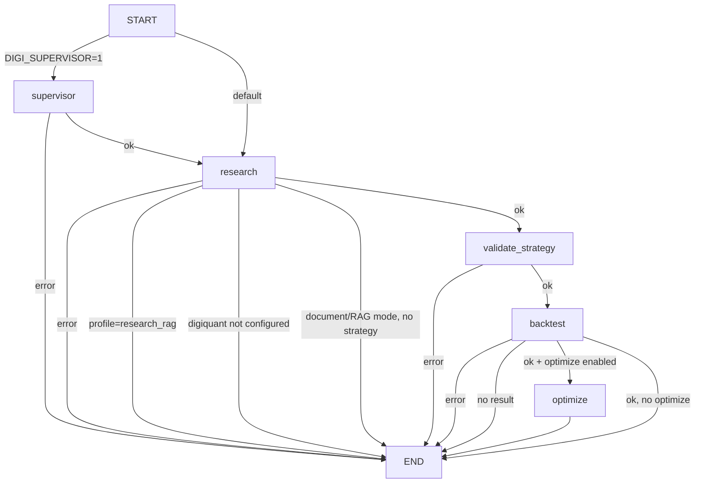
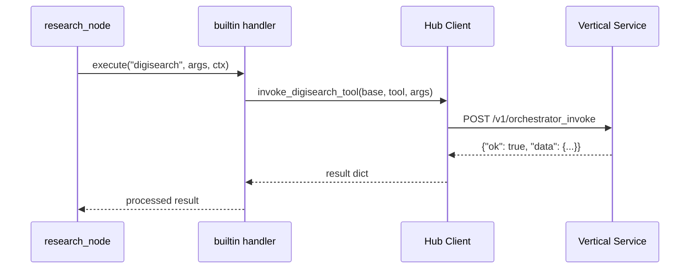

# digigraph Architecture

digigraph (port 8000 HTTP, 8766 MCP streamable-http) is the central orchestration
hub: every user request flows through it from digiclaw, digichat, Open WebUI, or
MCP clients, and it coordinates the verticals without owning their domain logic.
Three roles, one rule: **coordinate, don't implement** — no quant pipeline
ordering (digiquant's), no tiered RAG (digisearch's), no Python imports of
vertical packages (HTTP only).

## Role 1 — LangGraph state machine

A compiled `StateGraph[WorkflowState]` routes through profile-driven conditional
edges, with an opt-in `supervisor` node (`DIGI_SUPERVISOR=1`) ahead of research:



*Workflow routing: conditional edges controlled by error state, profile, and
feature flags.*

The research node is itself a compiled subgraph built by
`build_research_subgraph` — an LLM + tool loop with two-tier context compaction.
Backtest and optimize nodes delegate to digiquant via HTTP (`invoke_digiquant_tool`)
with local fallback on errors; each node catches `httpx.RequestError` internally
and returns an error-state dict rather than propagating, so LangGraph node-level
`RetryPolicy` is deliberately absent (no idempotency-key protection on POST calls).

Profiles are `full_stack`, `research_rag`, `quant_backtest`, and `plan_execute`.
The `plan_execute` profile shares the same graph topology as `full_stack` but
engages the plan-execute coordinator in the research node.

State stays lean — refs and summaries only. Large datasets live in digistore
(`digistore.py`), and checkpoints never carry full document bodies or DataFrames.

A process-wide `Store` (`InMemoryStore` or `PostgresStore`, selected by
`DIGI_CHECKPOINTER`) provides cross-thread, per-subject memory (e.g. response-language
preference) distinct from the checkpointer's per-thread-state.

### Checkpointer selection

The graph is compiled with a process-wide checkpointer so thread state survives
across HTTP requests. `get_checkpointer()` selects:

| `DIGI_CHECKPOINTER` | Backend | Production |
|---|---|---|
| (unset, project active) | SqliteSaver (`~/.digigraph/checkpoints.sqlite`) | No |
| `memory` | MemorySaver | No |
| `sqlite` | SqliteSaver | No |
| `postgres` | PostgresSaver (from `CORE_POSTGRES_URI`) | **Yes** |

Postgres connections pass through `_bounded_conn_string` to inject connect-timeout
and TCP keepalive parameters preventing indefinite stalls on vanished peers.
All checkpointer writes pass through `McpTokenRedactingCheckpointer` to strip
`mcp_servers.token` from durable state.

### Product graphs

`graph/product_graphs.py` defines scheduled product graphs — separate compiled
`StateGraph` instances with their own `ProductGraphRunState`. The first slice,
`research-portfolio-chain`, invokes `digiquant_compile_research_portfolio` through
the digiquant orchestrator. Product graphs use the same `invoke_digiquant_tool`
hub client and the digillm/LiteLLM path when LLM nodes exist.

## Role 2 — Tool registry, skills, and dispatcher

`orchestration/registry.py` owns the in-process tool registry: named
orchestrator tools and skills with handlers, schemas, and optional
`schema_factory` callbacks for context-dependent schemas.

### Registration

```text
register_tool(name, schema, handler, tags, schema_factory)
register_skill(skill_id, tool_names, when)
register_mcp_server(name, config_path, mode)
```

Built-in tools and skills are registered in `orchestration/builtin.py`:
- **Search tools:** `digisearch`, `digisearch_fetch_all`
- **Vault tools:** `digivault_search_notes`, `digivault_get_note`
- **Agent tools:** `visualization_agent`, `analysis_agent`, `data_prep_agent`,
  `data_manipulation_agent`, `data_engineer_agent` (all tagged `delegate` and
  `parallel_safe`; `data_engineer_agent` only when `code_execution_allowed()`)
- **Digistore introspection:** `digistore_list`, `digistore_profile`
- **Planning primitives:** `todo`, `create_plan`
- **Web search:** `web_search` (opt-in via `enable_web_search`)
- **Session prefs:** model/language/effort/tools/MCP selection tools
- **Federated delegates:** `digisearch_research_delegate`, `digiquant_pipeline_delegate`
  (when `federated_hub_enabled()`)
- **Entry-point tools:** loaded via `load_entrypoint_tools()` from plugins

Skills bundle tool names with optional `when(context)` predicates that gate
availability per request:

| Skill | Tools | When |
|-------|-------|------|
| `search` | digisearch, digisearch_fetch_all | digisearch URL configured |
| `project_rag` | search + agents + todo + create_plan | `run_data_dir` present |
| `digivault` | vault search + get_note | digivault URL configured |
| `web` | web_search | web search available |
| `session` | session prefs | always |

The `skills/` package (`skills/registry.py`) wraps the orchestration registry
for consumers, providing `Skill` metadata objects and `get_tools_for_skills()`
as the preferred consumption API.

### Dispatch and enforcement

`get_tools(skill_ids, context, mode)` collects tool descriptors from matching
skills, deduplicates by name, and applies `ToolContext.allowed_tool_names`
filtering. When `extra_mcp_servers` are present (operator MCP from trusted BFF),
their discovered tools are unioned under the same allowlist constraint.

Two exposure modes control context window usage:
- `DETAILED` (default): full OpenAI function-tool dicts
- `SUMMARY`: compact `"tool_name: description"` strings

`execute(name, args, context)` dispatches to the handler, enforcing:
1. Tool registration check (`has_tool` or extra MCP)
2. Web-search opt-out gate for proxied MCP tools
3. `allowed_tool_names` membership (audit-logged on denial)
4. Extra MCP delegation for unknown prefixed tools

### Vertical integration

Verticals (digisearch, digiquant, digivault) own their tool schemas. digigraph
fetches them lazily via `POST /v1/orchestrator_tools` and invokes via
`POST /v1/orchestrator_invoke`. Hub clients in `vertical_orchestrator/` wrap
the HTTP boundary:



*Tool invocation flow: registry dispatch through hub client to vertical service.*

Manifest fetches are cached in-process (`_MANIFEST_CACHE`), and each hub client
carries a `CircuitBreaker` (failure threshold 5, recovery timeout 30s) that only
trips on genuine transport failures (`httpx.RequestError`), not HTTP 4xx/5xx.

### Tool allowlist resolution

`tool_policy.allowed_tool_names_for_workflow()` resolves the effective allowlist
from, in precedence order: request `allowed_tools` → project config
`agents.allowed_tools` → env `DIGI_ALLOWED_TOOLS` → unrestricted (`None`).
`require_tool_calls` uses a **floor** semantic (request-level `true` adds the
requirement but never removes a deployment mandate). Web search is always
opt-in: the `web_search` and any MCP-proxied `{id}_web_search` tool are stripped
unless the request explicitly enables them.

## Role 3 — HTTP + MCP surface

Covered in [API and Operations](/openwiki/digigraph/api-and-operations.md):
`POST /workflow`, OpenAI-compatible chat with SSE streaming, opt-in thread APIs,
and the FastMCP server (streamable-http on 8766 / stdio). The MCP server exposes
`workflow`, `chat`, `thread_state`, `list_orchestrator_tools`, and
`list_orchestrator_tools_detailed` tools, using FastAPI's `TestClient` for
in-process chat/thread calls (bypassing rate limiter and auth middleware).

## Key architectural patterns

### Planning executor

`planning/executor.py` executes structured plans: topo-sort by `depends_on`,
resolve `{{step_id.field}}` placeholders from prior step results, and run
independent layers in parallel via `ThreadPoolExecutor` wrapped in
`contextvars.copy_context().run()` for credential propagation.

### Two-tier compaction

`compaction.py` implements tier-1 tool-result truncation followed by tier-2
tagged LLM summarisation when transcripts exceed configured thresholds
(`CompactionConfig` / `DIGI_COMPACTION_*` env vars). Compacted state carries
lean `_compaction_event` markers; originals stay in the session workspace.

### LLM routing

All LLM traffic routes through `digigraph.llm_client` (`completion`,
`completion_text`, `run_tools`), which wraps the `digillm` toolkit. Models
resolve via `get_model_for_mode()` / `get_model_for_phase()` from
`model_config.py`. No direct OpenAI SDK calls exist in digigraph nodes.

### Operator MCP

`orchestration/mcp_client.py` proxies tools from extra MCP servers declared by a
trusted BFF via `X-Digi-Mcp-Servers` header (or `DIGI_MCP_SERVERS` env var for
process-wide). Connect-time DNS validation with SSRF protection
(`_SsrfSafeNetworkBackend`) resolves and pins IPs before connecting, blocking
loopback/link-local/metadata/CGNAT addresses.

## Module map

| Area | Role |
|------|------|
| `graph/` | StateGraph, WorkflowState, nodes, research subgraph, research agent, product graphs |
| `orchestration/` | Registry, built-in tools/skills, MCP client, tool modules, tool policy |
| `skills/` | Skill metadata and `get_tools_for_skills` consumer API |
| `vertical_orchestrator/` | digisearch/digiquant/digivault HTTP hub clients |
| `planning/` | Topo-sorted parallel plan executor |
| `tools/` | Tool implementations behind registry names |
| `llm_client.py` + `digillm` | All LLM traffic (no direct SDK calls) |
| `model_config.py` | Model resolution (`get_model_for_mode`, `get_model_for_phase`) |
| `digistore.py`, `run_storage.py` | Session-scoped named datasets |
| `compaction.py` | Two-tier transcript compaction |
| `rate_limit.py`, `policy.py` | Sliding-window limiter, feature flags |
| `tool_policy.py` | Tool allowlist resolution and web-search gating |
| `circuit_breaker.py` | Process-wide circuit breaker for vertical hub clients |
| `mcp_server.py` | FastMCP server with auth-gated tools |
| `mcp_client.py` | Operator remote MCP proxy with SSRF-safe networking |
| `project_config.py` | `digiproject.yaml` loading and profile resolution |
| `usage.py` | Ordered body-free run-call events and telemetry |

## Non-negotiable boundaries

- Never import digisearch/digiquant/digivault Python packages — all vertical
  calls go through hub clients via HTTP (`POST /v1/orchestrator_invoke`).
- Route all LLM calls through `llm_client` wrapping digillm.
- Resolve models via `get_model_for_mode()` / `get_model_for_phase()`.
- Extend `digigraph_path_scopes` for new FastAPI routes.
- Default checkpointer is memory; set `DIGI_CHECKPOINTER=postgres` for production
  (requires `CORE_POSTGRES_URI`).
- Every new capability registers as a discoverable tool in the orchestration
  registry — never add logic directly to a LangGraph node.
- `ToolContext.allowed_tool_names` must be respected by every handler; never
  bypass the allowlist check.
- `WorkflowState` carries only refs and summaries — no full document bodies or
  large DataFrames in state or checkpoints.
- MCP binds loopback by default; set `DIGI_MCP_REQUIRE_AUTH=1` when exposing
  beyond localhost (requires digikey RS256 bearer tokens with per-tool scopes).
- Remote MCP URLs from `X-Digi-Mcp-Servers` undergo DNS validation at connect
  time; loopback/link-local/metadata/CGNAT addresses are always blocked.
