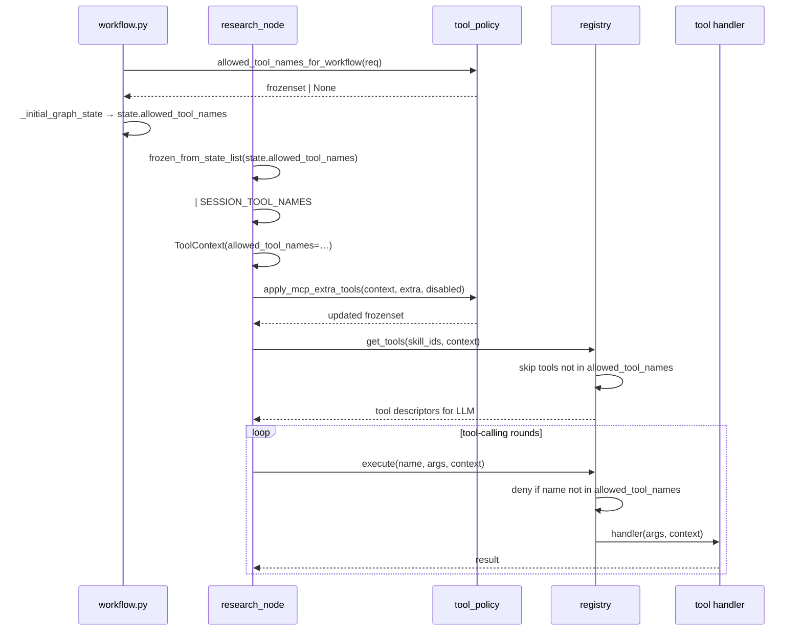

# digigraph Workflow and Tools

A digigraph run is a LangGraph traversal over `WorkflowState`, with tools
dispatched through the registry allowlist, large data parked in digistore, and
long transcripts compacted in two tiers. Every behavior below traces to the
node, registry, store, or compaction module — new capabilities belong in those
seams, never inline in a node.

## Nodes and routing

`graph/nodes.py` implements `supervisor_node` (opt-in via `DIGI_SUPERVISOR=1`),
`strategy_validator_node`, `backtest_node` (digiquant jobs + fallback), and
`optimize_node`, wired in `graph/graph.py` with conditional edges
(`_route_after_research`, `_route_after_validate`, `_route_after_backtest`)
that skip or repeat stages by profile and result. The primary entrypoint is
`run_digigraph_workflow` (`workflow.py`), which builds the graph, seeds
`_initial_graph_state` from a `WorkflowRequest`, and invokes it.

## Tool policy and allowlist

`tool_policy.py` computes the per-workflow tool allowlist through layered
resolution, consumed as `ToolContext.allowed_tool_names` and enforced at every
registry entrypoint (`get_tools` exposure and `execute` dispatch).

**Resolution precedence** (`allowed_tool_names_for_workflow`, lines 145-185):
1. `req.allowed_tools` — if set (including empty list), it is authoritative
   (empty means no tools).
2. Project config `agents.allowed_tools` (`DigiProjectConfig.get_allowed_tools`).
3. Environment `DIGI_ALLOWED_TOOLS` (comma-separated).
4. If none of the above, `None` — unrestricted, all registered tools eligible.

After the base allowlist is resolved, three post-processing phases apply:
- **Web-search opt-in** (`apply_web_search_opt_in`): strips `web_search` and
  its MCP-proxied form `{server_id}_web_search` unless the request set
  `enable_web_search`. Opt-in never *escalates* — if web search is absent from
  the base allowlist, enabling it does nothing (the operator must first
  allowlist the tool).
- **Disabled tokens** (`expand_disabled_tool_tokens` + `apply_disabled_tools`):
  catalog aliases (`digisearch`, `search`, `digivault`, `vault`, `docs`) map
  to sets of registered tool names to subtract.
- **Force tool** (`resolve_force_tool`): re-adds the single locate tool (not
  its siblings) when the request carries a `/locate`-style invocation, so a
  tight per-request allowlist does not block it.

`require_tool_calls_for_workflow` resolves a deployment-grain `tool_choice`
mandate as a *floor* (never removable per-request), unlike the allowlist which
follows most-specific-wins.

The resolved frozen set is serialized via `state_list_from_frozen` /
`frozen_from_state_list` into `WorkflowState.allowed_tool_names` for LangGraph
checkpoints.

## Tool registry and dispatch

The orchestration registry (`registry.py`) is the central dispatch hub:
registered tools have a name, an optional static OpenAI function schema, an
optional `schema_factory(context)` callable for dynamic schemas, a handler
`(args, context) -> str|dict`, and optional tags.

### ToolContext

`ToolContext` carries `session_id`, `run_data_dir`, `index_name`,
`index_config`, `state` (the full WorkflowState dict), `allowed_tool_names`
(the frozen set from tool_policy), `vault_path_prefix` for multi-tenant
corpus isolation, and `extra_mcp_servers` for BFF-forwarded MCP URLs. It
also carries `request_id` and `workflow_id` for audit and tracing.

### Dispatch enforcement

`get_tools` (line 166-168) skips tools whose name is absent from
`context.allowed_tool_names` when the allowlist is concrete. Extra MCP tools
from `context.extra_mcp_servers` are appended after the same check.

`execute` (lines 200-252) enforces the allowlist at invocation time. Before
the allowlist check, it also gates MCP-proxied web-search tools
(`is_proxied_web_search_tool`) against `enable_web_search` — an execute-level
opt-out for the MCP proxy path, which has no handler-side `_web_search_available`
check. Denials are audited via `audit_log(tool_denied, …)` with a truncated
allowlist signature.

## Vertical tool discovery

digisearch and digivault tools use a `schema_factory` pattern: schemas are not
hard-coded at registration time but fetched dynamically from the remote
vertical orchestrator.

- **digisearch** (`digisearch_tools.py`): `_handle_digisearch`,
  `_handle_digisearch_fetch_all`, and `_handle_digisearch_research_delegate`
  each invoke the digisearch service via `invoke_digisearch_tool` — a thin
  client around `POST /v1/orchestrator_invoke` on the digisearch hub. Schema
  are built by `_schema_from_digisearch_manifest`, which fetches tool
  descriptors from digisearch's own `/v1/orchestrator_tools` endpoint and
  falls back to static stubs when the service is unreachable or unconfigured.

- **digivault** (`digivault_tools.py`): `_handle_digivault_search` and
  `_handle_digivault_get_note` follow the same vertical-orchestrator pattern
  via digivault's own service base and `invoke_digivault_tool`. Schemas come
  from `_schema_from_digivault_manifest`.

Both handlers unconditionally overwrite tenant-sensitive arguments
(`index_name` for digisearch, `path_prefix` for digivault) with
`context.index_name` / `context.vault_path_prefix` — never default-if-missing
— closing the tenant-boundary vector (#2265).

## Web search tool

`web_search_tools.py` defines the `web_search` tool as an opt-in external
evidence tier. Key behaviors:

- **Opt-in gate**: `_web_search_available` checks
  `context.state.get("enable_web_search")`. The handler (`_handle_web_search`)
  fails with `tool_not_allowed` when not opted in — never synthesizes a
  fallback answer (#3859).
- **Hub call**: delegates to `digigraph.vertical_orchestrator.digisearch_hub.invoke_digisearch_tool`
  (`POST /v1/orchestrator_invoke`), never imports digisearch directly.
- **DigisearchHubError**: raised for any non-`ok: true` envelope, including
  HTTP errors and rate limits — a 429 or dead service is never reported as
  "returned no rows" (#4106). Only `inv.get("ok") is True` (strict boolean
  check) counts as success (#4198).
- **MCP-proxied form**: `{server_id}_web_search` is recognized by
  `is_web_search_tool` / `is_proxied_web_search_tool` and gated through the
  same `enable_web_search` opt-in at both the policy layer
  (`apply_web_search_opt_in`, `apply_mcp_extra_tools`) and the execute layer
  (`registry.execute` lines 221-224).

## Session prefs tools

`session_prefs_tools.py` registers eight tools that the model can call to
request client-side session changes:

| Tool | Purpose |
|------|---------|
| `session_set_language` | Set reply language (ISO 639-1 code or name) |
| `session_set_model` | Set chat model ID |
| `session_set_effort` | Set reasoning effort: `low`, `medium`, `high` |
| `session_set_view` | Set thinking chain visibility: `hidden`, `compact`, `balanced`, `detailed` |
| `session_set_thinking` | Set reasoning visibility: `auto`, `collapsed`, `open` |
| `session_toggle_tool` | Enable/disable a catalog or MCP tool |
| `session_upsert_mcp` | Add or update a session MCP server |
| `session_remove_mcp` | Remove a session-added MCP server |

Handlers echo the requested change (`{ok: true, session_prefs: …}`). They do
not hold React state; the digichat client applies the same
`EmbedChatPrefsApi` mutators as slash commands. Validation lives server-side:
for example, `session_set_view` and `session_set_thinking` reject values not
in their mode vocabularies (`#4218`). These tools are always appended to the
skill list in `_run_document_rag_path` (line 351-354) and force-unionned into
a concrete allowlist (line 360-363).

## Skills layer

Two registry tiers cooperate: `skills/` (metadata) and `orchestration/`
(tool wiring).

**Skill metadata** (`skills/builtin.py`, `skills/registry.py`): each `Skill`
carries an `id`, `name`, `description`, `tool_names` list, and an optional
`when(context)` predicate. Built-in skills:

- **search** — `digisearch`, `digisearch_fetch_all`; gated by
  `_digisearch_available` (digisearch URL configured).
- **project_rag** — search + delegate agents (`visualization_agent`,
  `analysis_agent`, `data_prep_agent`, `data_manipulation_agent`,
  `data_engineer_agent`), `digistore_list`, `digistore_profile`, `todo`,
  `create_plan`; gated by `ctx.has_run_data_dir`.
- **digivault** — `digivault_search_notes`, `digivault_get_note`; gated by
  `_digivault_available`.
- **web** — `web_search`; gated by `_web_search_available`
  (`enable_web_search` in state).
- **session** — all eight session prefs tools; always active (no `when`).

**Orchestration wiring** (`orchestration/builtin.py`): calls `register_tool`
for every built-in tool and `register_skill` with `when` predicates. Tools
with dynamic schemas (digisearch, digivault, federated delegates) pass
`schema_factory` instead of a static schema. The `get_tools_for_skills` /
`get_tools` call chain evaluates `when` predicates per-skill, collects tools,
deduplicates, applies the allowlist, and returns descriptors in `DETAILED`
(OpenAI function dicts) or `SUMMARY` (compact `"name: description"` strings)
mode.

The research node (`research.py`, `_run_document_rag_path`) reads enabled
skill IDs from `DigiProjectConfig.get_enabled_skills()` (defaulting to
`["search", "project_rag"]`), appends `"web"` when `enable_web_search` is
set, and appends `"session"` unconditionally.

## MCP extra tools

The BFF forwards allowlisted `{id, url}` pairs on `X-Digi-Mcp-Servers`, which
`research.py` hydrates into `context.extra_mcp_servers`. MCP extra tools are
not globally registered — they appear inline via
`extra_tool_names_for_servers` / `openai_tools_for_servers`. The
`apply_mcp_extra_tools` function in `tool_policy.py` folds discovered remote
tool names into the allowlist, subtracting disabled MCP tokens and gating
MCP-proxied web-search tools behind the same `enable_web_search` opt-in. When
the base allowlist is `None` (unrestricted) but a gate forces a concrete set
(because an MCP-proxied `{id}_web_search` is present without opt-in), the
function materializes the allowlist from `list_tool_names()` to prevent the
MCP proxy from being the back door.

`mcp_client.py` enforces a URL allowlist (`allowed_mcp_urls`), SSRF-safe DNS
resolution (`_SsrfSafeNetworkBackend` blocks metadata hosts, rebinding
suffixes, and internal IPs), and a 60-second tool-name cache.

## digistore

`digistore_put/get/list/profile` manage session-scoped named datasets under a
session directory: `put` writes rows and returns a `dataset_ref`, `get`
resolves a ref to a path on disk, `profile` reports schema, row count, and
samples. Paths assert under the session dir (no traversal). Multi-turn
context prepends a `[Current session datasets: …]` block so the LLM
references prior results by ref; cross-restart persistence needs a
non-memory `DIGI_CHECKPOINTER`.

## Two-tier compaction

Long research transcripts compact without losing evidence: tier 1 truncates
tool results (`apply_tier1_truncation`, capped by digillm's
`DIGI_TOOL_MESSAGE_MAX_CHARS`), tier 2 summarizes tagged messages, and
originals offload to the session workspace (`offload_tool_result`,
`offload_evicted_messages`) with only a lean `_compaction_event` kept on
`WorkflowState`. Tuned via `CompactionConfig` / `DIGI_COMPACTION_*`. Never
stub same-turn `execute_tool` results before digillm injects them.

## Planning executor

`planning/executor.py` runs multi-step plans with topological sort and parallel
steps — the seam for decomposing work the linear node chain cannot express.

## Checkpoints

`DIGI_CHECKPOINTER=memory|sqlite|postgres` selects LangGraph checkpoint
persistence explicitly in production; `memory` is dev-only and does not survive
restarts. Never use `MemorySaver` unwittingly in production.
