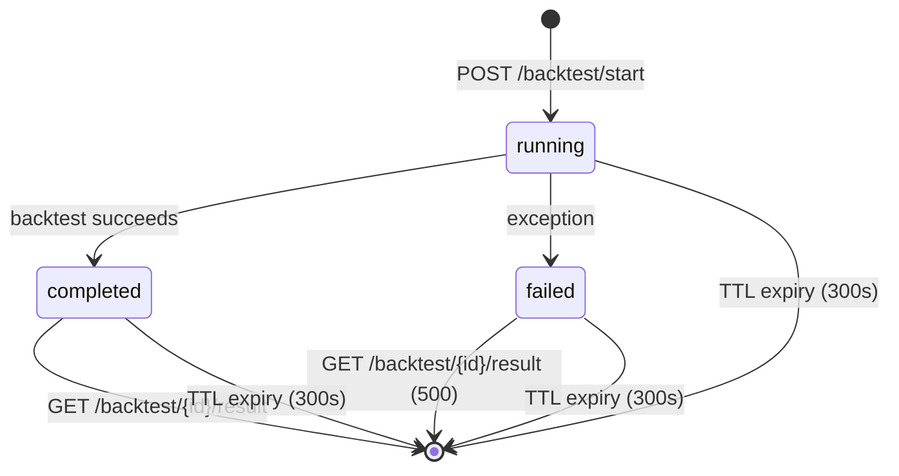

# digiquant API and Operations

digiquant exposes its quant pipeline over **HTTP** (port 8001), **MCP** (port 8767
or stdio), and an **orchestrator-invoke** surface consumed by digigraph. **Human
gate:** `digiquant/brokers/` live-trading paths must never be touched without
explicit human approval — this page describes the research/backtest surface only.

## HTTP endpoints

The FastAPI app (`digiquant.server:app`) runs under uvicorn with DigiAuth
middleware, request-id logging, OTEL tracing, CORS, and per-IP rate limiting.

### Pipeline endpoints

- **`POST /run_backtest`** → `BacktestResult` — requires `data_path` or
  `data_dir` (no defaults). Records Sharpe into ADDM history on success.
  Rate-limited to 10 req/min.
- **`POST /run_optimize`** → `OptimizeResult` — grid, bayesian, or random
  optimization over the strategy parameter spec. Also rate-limited to 10/min.
- **`POST /run_export`** → `ExportResult` — export strategy config to target
  artifact (nautilus, nautilus_bundle, tradingview, alpaca, quantconnect).
- **`POST /run_pipeline`** → full validate → backtest → (optional) optimize →
  (optional) export chain via internal LangGraph. Export can be gated by
  `DIGIQUANT_ALLOW_EXPORT`.
- **`GET /strategies`** → registered Nautilus strategies with aliases and
  default params.

### Async backtest jobs

For long-running backtests, submit jobs and poll for results:

- **`POST /backtest/start`** + **`GET /backtest/{job_id}/progress`** (SSE) +
  **`GET /backtest/{job_id}/result`** — original async path.
- **`POST /v1/jobs/backtest`** + **`GET /v1/jobs/{job_id}/status`** — versioned
  alias returning `running` | `completed` | `failed`.

Jobs live in an in-process `dict` with a 300-second TTL pruning
(`repo://digiquant/src/digiquant/backtest_jobs.py#L10`). Progress streams SSE
events (`start`, `done`, `error`) with 30-second hearbeat. The `/result`
endpoint returns 202 while the job runs and 500 on job failure.



*Async backtest job lifecycle. Jobs are pruned 300 seconds after creation.*

### v1 router

All `/v1/*` routes share an `APIRouter(prefix="/v1")`:

- **`POST /v1/orchestrator_tools`** → returns the complete digiquant
  orchestrator tool manifest (OpenAI-style function definitions) consumed by
  digigraph.
- **`POST /v1/orchestrator_invoke`** → dispatches a named tool with arguments.
  Supported tools include `digiquant_*` (backtest, optimize, export, pipeline,
  compile_research_portfolio, build_sdca_risk_index, fetch_bitview_series,
  get_trade_levels, fit_sdca_weights), `dashboard_*` (replay, comparison, gate
  evaluation), and the 33 `digifetch_*` tools. Each tool returns
  `{ok, service, tool, data}` or `{ok, error}`.
- **`POST /v1/workflow`** → same as `POST /run_pipeline` but on the v1 router.
- **`POST /v1/jobs/backtest`** + **`GET /v1/jobs/{job_id}/status`** → async
  job variants.

### Dashboard policy routes

- **`POST /v1/dashboard/policy_replay/run`** — register a replay run against a
  stored pair (content hash). Returns summary IDs/status only; never activates
  production policy.
- **`GET /v1/dashboard/policy_replay/{run_id}`** — fetch a replay run summary
  (fail closed).
- **`GET /v1/dashboard/policy_comparison/{comparison_id}`** — fetch a comparison
  summary (artifact IDs/status only).
- **`POST /v1/dashboard/policy_gate/evaluate`** — evaluate immutable gate
  criteria (eligibility only; never activates).
- **`GET /v1/dashboard/policy_gate/evaluations/{evaluation_id}`** — fetch a
  gate-evaluation summary.
- **`POST /v1/dashboard/policy_governance_decisions`** — record an authenticated
  human governance decision. Requires DigiAuth principal; no MCP path exists
  for this endpoint.

Legacy `/v1/olympus/*` aliases are registered (`include_in_schema=False`) for
backward compatibility.

### Rate limiting

Per-IP sliding-window enforcement
(`repo://digiquant/src/digiquant/server.py#L62-L116`):

| Path                          | Limit        |
|-------------------------------|--------------|
| `/run_backtest`               | 10 req / 60s |
| `/run_optimize`               | 10 req / 60s |
| `/run_pipeline`               | 10 req / 60s |
| `/v1/workflow`                | 10 req / 60s |
| `/v1/jobs/backtest`           | 10 req / 60s |
| `/v1/orchestrator_tools`      | 30 req / 60s |
| `/v1/orchestrator_invoke`     | 10 req / 60s |
| All others                    | 30 req / 60s |

Paths `/health` and `/healthz` are exempt. Rate limiting is disabled when
`DIGI_DISABLE_RATE_LIMIT=1`. Test client IPs (`testclient`) are also exempt.

## MCP server

The MCP server is built via `create_mcp_server(scope, host, port)` in
`repo://digiquant/src/digiquant/mcp_server.py` and exposes **50+ tools**
organized into two scopes:

- **`scope="full"`** (default) — all tools: backtest, optimize, export,
  pipeline, SDCA fitting, on-chain fetches, dashboard policy, data queries,
  trade levels, tearsheet/validation, Coinbase OHLCV, and the full digifetch x
  Gloomberb enrichment family.
- **`scope="read"`** — a restricted subset (`READ_SCOPE_TOOLS`) safe for the
  dashboard-chat surface: strategy listing, price technicals, macro series,
  trade levels, data queries, dashboard policy reads, and the 33 digifetch
  reads. No compute or mutate tools.

### Transport and invocation

Run with:

```bash
pip install -e "digiquant[mcp]"
python -m digiquant.mcp_server              # streamable-http on 127.0.0.1:8767
python -m digiquant.mcp_server --stdio      # stdio (Claude Desktop)
python -m digiquant.mcp_server --scope read # dashboard-chat surface
```

Environment controls: `DIGIQUANT_MCP_HOST`, `DIGIQUANT_MCP_PORT`,
`DIGIQUANT_MCP_SCOPE`.

### Tool categories

**Pipeline tools** (full scope only):

| Tool                              | Description                                              |
|-----------------------------------|----------------------------------------------------------|
| `digiquant_list_strategies`       | Registered Nautilus strategies with default params       |
| `digiquant_run_backtest`          | Run a Nautilus backtest (symbols via JSON array)         |
| `digiquant_run_optimize`          | Parameter optimization (grid/bayesian/random)            |
| `digiquant_export`                | Export strategy to target artifact                       |
| `digiquant_run_pipeline`          | Validate → backtest → optimize → export LangGraph chain  |
| `digiquant_fetch_coinbase_ohlcv`  | Fetch OHLCV from Coinbase (CCXT) into price-history cache|

**SDCA tools** (full scope only):

| Tool                                  | Description                                              |
|---------------------------------------|----------------------------------------------------------|
| `digiquant_fit_btc_power_law`         | Fit BTC power-law (RAQQR) rails from cached prices       |
| `digiquant_fit_sdca_weights`          | Stage A: fit composite weights, then regularize          |
| `digiquant_build_sdca_risk_index`     | Build date/risk parquet from RiskModel + cached prices   |
| `digiquant_fetch_bitview_series`      | Fetch Bitview/BRK on-chain series                        |
| `digiquant_fetch_bgeometrics_series`  | Fetch one Bitcoin metric from bitcoin-data.com           |
| `digiquant_fetch_coinmetrics_series`  | Fetch one on-chain metric from CoinMetrics Community API |
| `digiquant_list_coinmetrics_catalog`  | Discover available CoinMetrics metrics per asset         |

**Data tools** (read scope):

| Tool                              | Description                                              |
|-----------------------------------|----------------------------------------------------------|
| `digiquant_get_price_technicals`  | Technicals from versioned R2 history (Supabase retired)  |
| `digiquant_get_macro_series`      | Macro observations, Supabase or R2-backed                |
| `digiquant_get_trade_levels`      | Causal entry/stop/target levels (read-only, no orders)   |
| `digiquant_query_data`            | Read rows from whitelisted dashboard tables              |

**Validation/tools** (full scope only):

| Tool                                      | Description                                          |
|-------------------------------------------|------------------------------------------------------|
| `digiquant_generate_slapper_tearsheet`    | Nautilus backtest + TV-style tearsheet JSON          |
| `digiquant_validate_slapper_vs_tradingview`| Trade-level parity check against TradingView export |

**Digifetch x Gloomberb enrichment** (read scope, #4069, #4110): 33 tools
providing quotes, price history, financials, options chains, SEC filings,
holder records, analyst research, corporate actions, earnings calendar,
exchange rates, news, economic calendar/series, yield curve, CDS tape, research
search, Congress trades, transcripts, statements, tweets, venues, screener,
13F funds/holdings, Shiller data, proxy statements, filing events, risk reports,
short interest, equity diagnostic, and saved searches. Each tool returns a §7
attribution envelope. Anonymous tools work without credentials; session-gated
tools require `GLOOMBERB_SESSION_COOKIE` and answer typed `auth_required` or
`pro_required` errors when the session is missing or insufficient.

### Market-data backend

MCP data tools support two backends selected by `DIGIQUANT_MARKET_DATA_BACKEND`:

- **`supabase`** (default) — reads macro observations from the Supabase
  `macro_series_observations` table.
- **`r2`** — reads from versioned R2 history (`R2HistoryStore`) with
  SHA-verified generations, a live overlap window (30 days), settled-close
  semantics, and staleness gating (>5 trading days behind manifest seal).

The `digiquant_get_price_technicals` MCP tool is **R2-only** (#4053); the old
Supabase `price_technicals` table was retired in migration 127. Its envelope
carries `{as_of, rows, stale}` where `stale` can be true due to either a
manifest seal >5 trading days behind or a live-fetch error entry. Stale
payloads are never cached in the 900-second TTL.

The `digiquant_get_macro_series` MCP tool falls back to Supabase when R2 is
not enabled. Its R2 envelope is `{as_of, series, stale}`.

## Orchestrator tools

`POST /v1/orchestrator_tools` returns the full orchestrator manifest built by
`build_orchestrator_tool_manifest()`
(`repo://digiquant/src/digiquant/orchestrator_tools.py#L1536`). The manifest
contains ~55 OpenAI-style function definitions including all pipeline, SDCA,
dashboard, digifetch, and data tools. Every digifetch tool carries a top-level
`entitlement` declaration (`free`, `session`, `preview`, `pro`) and an
entitlement note in its description so the orchestrator and MCP surfaces cannot
drift.

`POST /v1/orchestrator_invoke` dispatches by tool name
(`repo://digiquant/src/digiquant/server.py#L405-L776`). Pipeline and dashboard
tools call the same `service_*` functions as the HTTP endpoints. Digifetch tools
share a single in-process dispatcher
(`digiquant.data.gloomberb.agent_tools`) with the MCP surface.

## SDCA MCP helpers

`repo://digiquant/src/digiquant/sdca_mcp.py` provides fail-soft JSON functions
shared by both `mcp_server.py` and the `orchestrator_invoke` dispatcher:

- `run_fetch_bitview_series` — Bitview/BRK on-chain day1 series
- `run_fetch_bgeometrics_series` — bitcoin-data.com single metric
- `run_fetch_coinmetrics_series` — CoinMetrics Community API single metric
- `run_list_coinmetrics_catalog` — discover available metrics per asset
- `run_fit_sdca_weights` — Stage A weight fitting with regularization
- `run_build_sdca_risk_index` — build date/risk parquet from RiskModel

All functions return JSON and never raise; errors surface as `{"error": ...}`.

## Tool-round budget

`repo://digiquant/src/digiquant/tool_rounds.py` wraps digigraph's
`run_research_agent` with a digiquant-specific tool-round cap. The default is
24 rounds (override via `DIGIQUANT_MAX_TOOL_ROUNDS`). This gives cheap-model
JSON enough room for data-tool grounding before Pydantic validation. Digigraph
chat keeps its own independent `max_tool_rounds=4` — do not reuse this value
there.

## Drift (ADDM)

`GET /check_drift` accepts `strategy_id`, `baseline_run_id`, and
`current_sharpe`; digiclaw's heartbeat polls it and triggers re-optimization on
`drift_detected`. Drift fires once Sharpe history holds enough observations.
History is an in-process deque today — not durable across restarts.

## Research sandbox image

`Dockerfile.sandbox` is a **separate** image from the HTTP service:
build-time-baked open-source quant stack (skfolio, riskfolio, TA-Lib with
bundled C wheels, `pandas_ta` shim and `yfinance_retry` on `PYTHONPATH`) for
research agents to execute paper-book code. No live trading, no broker
credentials, no order paths; optional outbound HTTPS for free data only. Never
`pip install` inside agent runs.

## Container

Loopback-bound `:8001`, `/healthz` healthcheck returning `{"ok": true}`,
uvicorn serving `digiquant.server:app`. Standard digibase middleware applies;
Linux hosts note the Nautilus SIGABRT caveat (#42) for in-process backtests.
The Dockerfile installs `digiquant[nautilus]` from source alongside digibase,
digikey, and digifetch peer packages, and ships sample market CSVs under
`digiquant/data/`.
