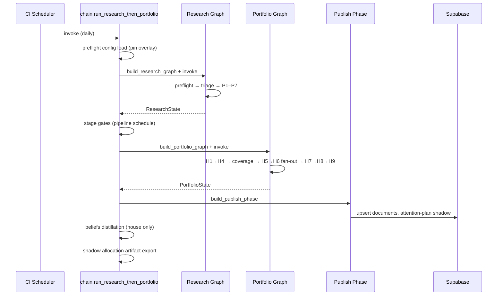

# digiquant Research and Portfolio

Beyond the deterministic backtest pipeline, digiquant runs two LangGraph
sub-graphs — **research** (daily thesis production) and **portfolio**
(thesis-to-allocation deliberation) — with a `dashboard/` backend serving
persisted state to the operator UI. Both graphs are orchestrated by the
**chain** in `digiquant.portfolio.chain`, which wires research →
portfolio → publish in a single daily cadence. There are no lite forks,
`run_type` graph forks, or `monthly` synthesis paths; cost control is
`DIGIQUANT_MODEL_TIER` plus per-artifact `skip`/`edit`/`full` edit modes.



*End-to-end research → portfolio → publish chain orchestrated by `digiquant.portfolio.chain`.*

## Research sub-graph

`digiquant.research.graph.build_research_graph` compiles the daily
research `StateGraph` from a sequence of `PipelinePhase` objects. The
caller supplies a `ResearchInput` (run date, cadence, refresh scope,
watchlist, optional custom prompt) and a `ResearchGraphDeps` carrying
preflight, publish, triage, and preflight-reflect dependencies.

### Phases (sequential)

| Phase | Node(s) | Responsibility |
|-------|---------|----------------|
| **preflight** | `preflight` | Config load, prior context, data-layer freshness probe. No LLM. |
| **preflight_reflect** | `preflight-reflect` | Resolve due `decision_log` rows and matured `forecast_outcomes`. Skipped when `preflight_reflect` deps are `None`. |
| **triage** | `triage` | Price-delta signal: decide which segments need regeneration. |
| **Phase 1** | `phase1_altdata` | Alternative data ingestion (news/sentiment/social). |
| **Phase 2** | `phase2_institutional` | Institutional flow, options sentiment, CTA/HF positioning. Circuit-breaker: skips when `institutional_absence_streak` exceeds threshold. |
| **Phase 3** | `phase3_macro` | Macro regime, rates, FX, commodity bias. |
| **Phase 4** | `phase4_assetclass` | Asset-class cross-section (equity, crypto, bond). |
| **Phase 5** | `phase5_equities` (fan-out) | Per-sector equity analysis. Fan-out width determined at compile time from the watchlist. |
| **Phase 6** | `phase6_consolidate` | Bias rows and consolidated daily cross-section. |
| **Phase 7** | `phase7_synthesis` (fan-out) | Digest subsection agents write markdown; the stitcher assembles the daily briefing. |
| **publish_phase** | `publish` | Upsert `documents` rows + attention-plan shadow. Optional: `None` skips publish (chain wires it after portfolio instead). |

The graph topology is compiled once from the phase list; per-artifact
`skip`/`edit`/`full` resolution happens **inside each node** via
`resolve_edit_mode`, not through separate graph paths.

### State model

`ResearchState` (Pydantic, per ADR-0008) carries:

- **`run_date`**, **`cadence`** (`"daily"` only), **`refresh_scope`**, **`run_type`** (derived `baseline`/`delta`/`monthly`)
- **`config`** (`ResearchConfigBundle`, frozen): watchlist, investment profile, hedge fund list, preferences, macro series, profile config pin, optional overlay `workspace_id`
- **`prior_context`** (`PriorContext`, frozen): latest segments, active theses, decision lessons, prior book, prior analyst/deliberation summaries, portfolio performance
- **`data_layer`** (`DataLayerSnapshot`): price freshness, macro freshness, market context, institutional availability streak, starvation flags
- **`phase_portfolio`** (`PhasePortfolioState`): focus roster, analyst payloads, deliberation summaries, PM direction memo, allocation bundle, risk report
- **Phase output slots**: each phase writes to `state.phase_N_outputs` via `SegmentPayload` (fresh) or `Carried` (explicit skip marker with baseline date and reason)

Parallel fan-out phases (Phase 5 sectors, Phase 7 digest subsections, H5
analysts, H6 deliberation) use typed reducers (`_merge_segment_dict`,
`_merge_right_wins_dict`, `_merge_specialist_dict`, `_merge_append_list`)
to combine concurrent writes without collision or silent data loss.

### Knowledge cutoff

`initial_state` pins `knowledge_cutoff_at` (UTC wall-clock) once per
invocation so every phase shares a single temporal boundary. On graph
resume from a checkpoint, the checkpointed cutoff is authoritative — the
caller must not re-pin.

### CLI entry point

`python -m digiquant.research.graph` supports standalone research runs
(without portfolio). The chain orchestrator is the production path and
passes `publish=None` so the publish phase runs only once after portfolio.

## Portfolio sub-graph (H1–H9)

`digiquant.portfolio.graph.build_portfolio_phases_thesis` assembles the
thesis-first portfolio phase list. `PortfolioState` is a re-export alias
of `ResearchState` — the two graphs share one state model (ADR-0015).

### Phases (sequential)

| Phase | Builder | Responsibility |
|-------|---------|----------------|
| **H1** | `build_h1_thesis_review` | Review active theses from prior context; flag stale/thesis-break conditions. |
| **H2** | `build_h2_market_thesis_exploration` | Market-thesis exploration with web grounding. |
| **H3** | `build_h3_thesis_vehicle_map` | Map theses to investable vehicles (tickers). |
| **H4** | `build_h4_opportunity_screener` | Deterministic focus roster: prior holdings + thesis-mapped vehicles + technical candidates. Budget-aware capping. |
| **coverage_director** | `build_coverage_director` | Pre-H5 coverage routing and budget allocation. |
| **H5** | `build_h5_from_state` (fan-out) | Per-ticker blinded analyst: evidence bundle store + research state store for context. |
| **H6** | `build_h6_from_state` (fan-out) | Cyclic PM↔analyst deliberation per ticker. H6 selection planner (`select_h6`) can carry low-value names with zero provider budget. Evidence amendment supports one validated missing-fact proposal per ticker. |
| **H7** | `build_h7_pm_direction` | PM direction memo: direction + rank + confidence per roster row. **No weights** — `PMDirectionMemo` only. Binds each row to the current run's effective forecast. |
| **H8** | `build_risk_sizing_phase` | Risk sizing: remaining-book sizing with calibration, cadence, backstop, grid, and final caps. |
| **H9** | `build_h9_commit_run` | Terminal persist: book portfolio, commit ledger, upsert NAV (provisional arithmetic-chain value later overwritten by Nautilus engine replay). |

### H7 constraint

`h7_pm_direction` must not emit weights — it produces a
`PMDirectionMemo` with direction, rank, and confidence in `[0, 1]`.
H8 scales each long by that confidence (cash-first). Rank is order,
not size.

### Grounding and phase blinding

`build_grounding` (from `_node_factory`) and `build_portfolio_phases_thesis`
wire grounding + phase blinding through the graph. Blinding rules
(`research_retrieval/blinding.py`) enforce that H5 and H6 prompts never
carry forbidden keys (ticker, weight, prior stance). The context compiler
(`context_wiring.py`) operates in `off`/`shadow`/`enforce` modes beside
incumbent provider inputs.

### Forecast outcomes

Typed `ForecastOutcome` rows are resolved in `preflight_reflect` via
`resolve_matured_forecast_outcomes`. Matured forecasts are evaluated
against realized prices; same-run forecasts are excluded so outcomes
cannot feed back into the run that produced them. Outcomes are
append-only to `forecast_outcomes`.

### Beliefs distillation

Phase 9 evolution LLM (9A–9C) is **not** on the daily portfolio graph.
Instead, `run_beliefs_distillation_if_triggered` runs after the chain
(publish → beliefs fold) on every house invocation:

- **`short`** (default daily): today's unfolded `decision_log` lessons +
  yesterday's beliefs body, cheap model, tight token budget (800 max).
  Empty-lesson days carry the prior body with a one-sentence header.
- **`full`**: triggered by `refresh_scope=beliefs` (operator override) or
  when the unfolded backlog exceeds `DIGIQUANT_BELIEFS_BACKLOG` (default 20).

Overlay workspaces skip beliefs distillation entirely — `decision_log`
has no `workspace_id` and folding would stamp house lessons.

## Dashboard backend

The dashboard backend (`digiquant.dashboard`) serves the operator UI
(`/dashboard/`, hosted from `cloudflare/dashboard`) with several
subsystems:

### Edit-mode continuity

Every research/portfolio node calls `resolve_edit_mode(artifact_key,
run_date, prior_loader, triage, force_full_rewrite)` at entry:

- **`skip`**: shallow-carry prior row (zero LLM cost). Assigned when
  triage marks the artifact `quiet`.
- **`edit`**: load a `*-edit.md` skill, expect a `DocumentPatch`, merge
  via `merge_document_patch`. Staleness measured from `content_date`
  (the date content materially changed, not the last publish date).
- **`full`**: load a `*-full.md` skill, produce a complete body. Forced
  when there is no prior, when `force_full_rewrite` is true, or when the
  stale gap exceeds `DIGIQUANT_STALE_FULL_DAYS` (env-configurable,
  default 7).

`ContentDate` (`unchanged_since` marker in `documents.payload`) ensures
that a no-op republish does not reset the staleness clock — the hard cap
fires based on when content last changed, not when a row was last written.

### Attention plans (shadow-only)

`digiquant.dashboard.attention_plan.plan_attention_shadow` produces a
typed `AttentionPlan` with stable refresh reason codes (`NO_PRIOR`,
`STALE_CONTENT`, `TRIAGE_STALE`, `TRIAGE_QUIET`, `FORCE_FULL`,
`INCUMBENT_EDIT`, `INCUMBENT_SKIP`, `INCUMBENT_FULL`) beside the
incumbent edit-mode path. Planner modes are `off` or `shadow` only —
`enforce` is intentionally absent. The planner cannot expand H4 roster
or rewrite H7/H8 authority.

`attention_plan_graph.maybe_publish_attention_plan_shadow` is called
from the research `publish_phase` and upserts a `document_key=attention-plan`
row when triage ran and `DIGIQUANT_PLANNER_MODE` is `shadow` (default).
Custom research runs and planner `off` skip the publish entirely. The
shadow plan never fabricates UI rows without a published document and
never actuates alternate routing.

### Research retrieval

`digiquant.dashboard.research_retrieval` is the unified research +
portfolio retrieval layer:

- **Models** (`models.py`): `TickerEvidenceBundle`, `TypedProvenance`,
  `H6Selection`, and other typed contracts.
- **Store** (`store.py`): `EvidenceBundleStore`, `ResearchStateStore`,
  `AttentionStore` — append-only storage for bundles, snapshots, and
  attention plans.
- **Planner** (`planner.py`): deterministic H6 deliberation selection
  with modes `shadow`/`enforce`/`off` (`DIGIQUANT_H6_SELECTION_MODE`).
  Low-value names carry with a recorded reason and zero provider budget.
- **Context compiler** (`context.py`, `context_wiring.py`):
  `ContextCapsule`/`ContextManifest` with role allowlists. Wired in H5,
  H6, and H7 via `wire_h*_phase_inputs`. Operates in `off`/`shadow`/`enforce`
  modes.
- **Blinding** (`blinding.py`): enforces prompt key allowlists per phase
  so H5/H6 providers never see ticker, weight, or prior stance.
- **Tools** (`tools.py`): LLM-callable `query_research` and
  `fetch_prior_document` function definitions (`RESEARCH_TOOLS`).

## Chain orchestrator

`digiquant.portfolio.chain.run_research_then_portfolio` is the
production entry point (cron + `pipeline-digiquant.yml`):

1. **Preflight config load**: resolve overlay workspace before graph
   invoke so beliefs fold sees the correct workspace.
2. **Research invoke**: `build_research_graph` + `ResearchInput` →
   `ResearchState`.
3. **Stage gates**: `resolve_pipeline_schedule` from the pinned profile
   determines which stages run today.
4. **Portfolio invoke**: `build_portfolio_graph` + the research state →
   `PortfolioState`.
5. **Publish**: `build_publish_phase` writes `documents` rows including
   the attention-plan shadow when applicable.
6. **Beliefs distillation**: `run_beliefs_distillation_if_triggered`
   folds resolved `decision_log` lessons into a `beliefs` document
   (house workspace only).
7. **Shadow allocation artifact**: `maybe_export_shadow_allocation_artifact`
   as a one-way file boundary (fail-soft).

Each graph can resume from its own LangGraph checkpoint when
`DIGI_CHECKPOINTER` is set (research and portfolio use distinct threads:
`{base}::research` and `{base}::portfolio`). The CI outer-retry loop
(up to 3 attempts) retries when the run is degraded and no book
committed.

### Stage gates

`plan_stage_gates` and `resolve_pipeline_schedule` read the pinned
`ProfileConfig` to determine which pipeline stages execute. Research-only,
portfolio-skip, and full-chain schedules are supported. The default
(house) runs all stages daily.

## Book scope (house / overlay)

Group A tables — `positions`, `nav_history`, `position_events`,
`portfolio_metrics` — are scoped to a `workspace_id`:

- **Omitted `workspace_id` means the house book.** Every Group A reader
  and writer must pin a workspace: `eq_house_workspace()` on the Python
  side, `houseBook()` on the TypeScript dashboard side. Date-only scans
  are forbidden.
- **Overlay** workspaces pass an explicit `workspace_id`. Overlay rows
  must not leak into house ops readers — `houseBook()` rejects them
  even when RLS would allow the JWT.
- **MCP `query_data`**: `HOUSE_BOOK_READ_TABLES` stamps house when the
  caller omits `workspace_id`.
- **NAV write order**: H9 `commit_io` writes a provisional arithmetic-chain
  NAV; `verify_nav_replay.py --write` later overwrites it with the
  Nautilus engine NAV (sole source of truth). Treat the arithmetic-chain
  value as provisional between those steps.

## Test commands

```bash
# Dashboard, research, and portfolio unit tests
pytest tests/dq/dashboard/ tests/dq/research/ tests/dq/portfolio/ -m unit -v
```
