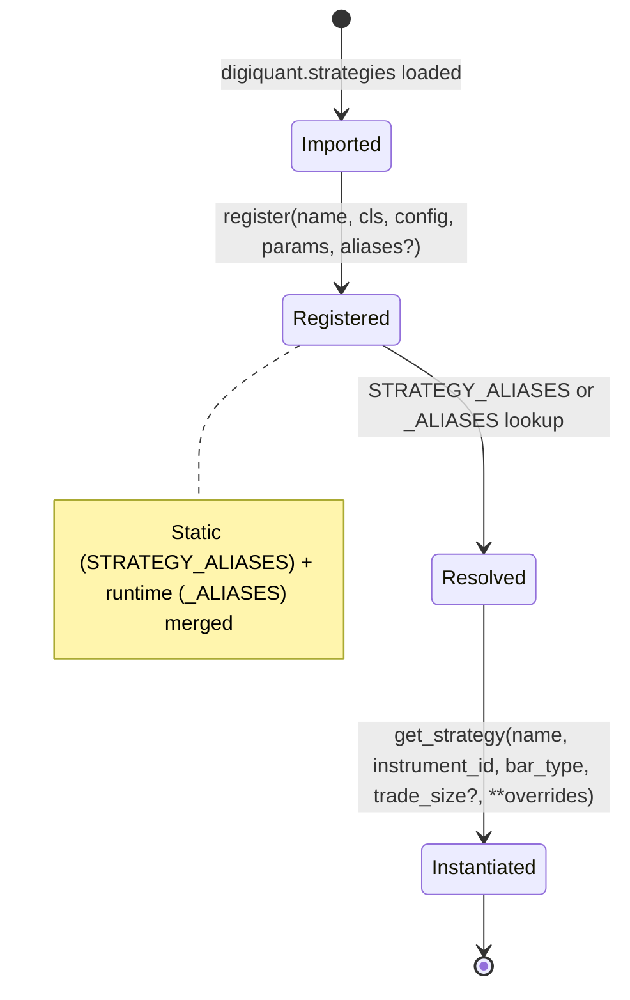
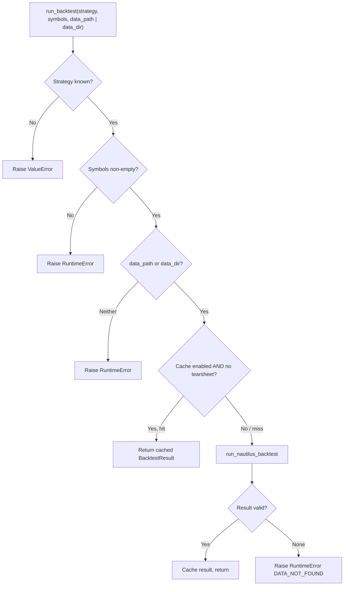

# digiquant Strategies and Backtest

Performance numbers come only from completed result models. This page
covers how strategies register, how names resolve, and what each pipeline
stage computes — the pipeline ordering itself lives in
[Architecture](/openwiki/digiquant/architecture.md).

## Strategy inventory

All strategies implement the Nautilus Actor/Strategy interface and register
themselves through `digiquant.strategies.registry.register(..., aliases=...)`.
Registration happens via side-effect imports when `digiquant.strategies` is
loaded and `nautilus_trader` is installed.

| Canonical | File | Description |
|---|---|---|
| `ema_cross` | `strategies/ema_cross.py` | Fast/slow EMA crossover, long and short (Nautilus EMACross wrapper) |
| `ema_cross_long` | `strategies/ema_cross_long.py` | EMA crossover, long-only |
| `ema_cross_trailing` | `strategies/ema_cross_trailing.py` | EMA crossover with ATR trailing stop |
| `rsi_momentum` | `strategies/rsi_momentum.py` | RSI overbought/oversold momentum |
| `bollinger_mr` | `strategies/bollinger_mr.py` | Bollinger Band mean reversion |
| `macd_trend` | `strategies/macd_trend.py` | MACD signal-line crossover trend |
| `btc_sdca` | `strategies/sdca/nautilus_strategy.py` | BTC-SDCA: composite valuation index → remaining-book curve |
| `btc_slapper` | `strategies/slapper.py` | BTC L/S: ADF+RSI+BB mean reversion + DPSD trend, with reversal stop |
| `eth_slapper` | `strategies/slapper.py` | ETH L/S: same Slapper engine, no reversal stop |
| `sol_slapper` | `strategies/slapper.py` | SOL L/S: same Slapper engine, no reversal stop |
| `rs_rotation` | `strategies/rotation/nautilus_strategy.py` | Long-only relative-strength asset rotator, precompute→drive pattern |

The `m2_liquidity` strategy (`strategies/m2_liquidity.py`) is imported as a
side-effect but does **not** call `register(…)`; it follows the same
precompute-then-drive pattern as SDCA and `rs_rotation` and is available for
direct instantiation only.

Slapper variants (`btc_slapper`, `eth_slapper`, `sol_slapper`) each register
under both a canonical name and a `*_mr_trend` alias:

```
register("btc_slapper", …, aliases=["btc_slapper_mr_trend"], …)
register("eth_slapper", …, aliases=["eth_slapper_mr_trend"], …)
register("sol_slapper", …, aliases=["sol_slapper_mr_trend"], …)
```

Per-coin calibrations are private (`calibrations.json`, gitignored) and fall
back to a public example template. Public structural settings (`trade_start`,
`initial_capital`, `size_pct_equity`) live in committed `settings.json`.



*Strategy lifecycle from import through registration to instantiation.*

## Registry and aliases

The canonical alias map lives in `digiquant.strategy_aliases`. There is exactly
one static `STRATEGY_ALIASES` dict plus runtime aliases collected by
`register(…, aliases=…)`. Resolution merges both sources:

- **Static** (`strategy_aliases.STRATEGY_ALIASES`):
  `ema` / `s` / `mean_reversion_tech` / `momentum_tech` → `ema_cross`;
  `mean_reversion_stat_arb` → `bollinger_mr`; `momentum_energy` →
  `rsi_momentum`; `sdca` → `btc_sdca`; `btc_slapper_mr_trend` → `btc_slapper`;
  `eth_slapper_mr_trend` → `eth_slapper`; `sol_slapper_mr_trend` → `sol_slapper`;
  `relative_strength_rotation` / `asset_rotation` → `rs_rotation`.

- **Runtime** (`strategies.registry._ALIASES`): collected from each
  `register(…, aliases=…)` call. Checked after the static map.

`PARAM_SPEC_NAMES` maps registry canonical names to `STRATEGY_PARAM_SPECS` keys
when they differ — currently only `btc_sdca` → `sdca`.

`resolve_strategy_name()` resolves any alias to the registry canonical.
`resolve_param_spec_name()` first resolves the alias, then remaps via
`PARAM_SPEC_NAMES` for optimize parameter lookup.

## Backtest

`run_backtest(strategy_name, symbols, data_path|data_dir, …)` is the sole
entrypoint, used by the HTTP API and MCP server. It requires:

- A recognized `strategy_name` — the known set is built lazily from
  `STRATEGY_PARAM_SPECS` keys, `STRATEGY_ALIASES` keys/values, and the runtime
  registry. Unknown strategies raise `ValueError`.
- A non-empty `symbols` list — raises `RuntimeError` otherwise.
- An explicit `data_path` (single OHLCV CSV) or `data_dir` (per-symbol CSVs) —
  no default; raises `RuntimeError` if both are `None`.

### Caching

Results are cached in-memory (`_backtest_cache` dict) keyed by SHA-256 of
`(strategy_name, sorted symbols, sorted params, data_path, data_dir)`. The
cache is an LRU with a configurable max size (`DIGIQUANT_BACKTEST_CACHE_MAX`,
default 128). Cache behavior:

- **Skipped** when `tearsheet_path` is set (tearsheets must be written to
  disk).
- **Disabled** globally with `DIGIQUANT_BACKTEST_CACHE=false` / `0` / `no`.
- `clear_backtest_cache()` removes all entries and returns the count removed.



*Control flow through `run_backtest`, including cache lookup and validation gates.*

### Sharpe recording (ADDM)

After each successful backtest through the HTTP `/run_backtest` endpoint, if
`BacktestResult.sharpe_ratio` is not `None`, the server calls
`addm.record_sharpe(strategy_name, result.sharpe_ratio)`. This appends the
Sharpe observation to a per-strategy rolling window (default length 30) used by
ADDM drift detection. Entries with no new observations for 7 days are pruned.

## Optimize

`run_optimize(strategy_name, symbols, …)` evaluates parameter sets subject to
`OptimizationConstraints`. Four methods are available:

| Method | Mechanism | Parallelism |
|---|---|---|
| `grid` | Cartesian product from `infer_param_grid()` or explicit `param_grid` | `ProcessPoolExecutor` |
| `random` | `sample_random_params()` → random draws from search space | `ProcessPoolExecutor` |
| `bayesian` | Optuna `TPESampler` (requires `digiquant[optimize]`) | Sequential (Optuna's trial loop) |
| explicit `param_grid` | Caller-supplied grid, method ignored | `ProcessPoolExecutor` |

Number of parallel workers defaults to `os.cpu_count()` (or 1), overridable via
`DIGIQUANT_OPTIMIZE_WORKERS`. Falls back to sequential execution on
multiprocessing failures (e.g. broken process pool, macOS spawn issues).

### Param specs and grid generation

Each strategy declares parameter ranges in `strategy_specs.STRATEGY_PARAM_SPECS`
as `(min, max, default, step_hint, type_str)` tuples. Additional specs can be
loaded from a YAML file at `DIGIQUANT_STRATEGY_SPECS_PATH`; YAML specs merge
over built-in values per param name. `trade_size` is excluded from auto-grids
by default.

`infer_param_grid()` samples linearly-spaced values per param (default 3 points
each). `generate_param_grid()` accepts explicit `(min, max, step)` tuples or
`{min, max, step}` dicts and produces the full Cartesian product. A hard cap of
`MAX_GRID_SIZE = 10,000` combinations guards against combinatorial explosion.

### Constraints

`OptimizationConstraints` filters candidates via `satisfies_constraints()`:

| Constraint | Semantics |
|---|---|
| `min_trades` | Minimum number of trades |
| `max_drawdown_pct` | Max drawdown (negative percent); Nautilus may emit positive magnitudes — normalized before comparison |
| `min_sharpe` | Minimum Sharpe ratio |
| `min_return_pct` | Minimum total return % |
| `max_trades_per_year` / `min_trades_per_year` | Trade-frequency band computed from `start_time` → `end_time` window |

When `objective="sharpe"`, trials with `sharpe_ratio=None` are additionally
excluded from candidates. Bayesian optimization raises `optuna.TrialPruned()`
for constraint violations or missing Sharpe.

### SDCA walk-forward

When `_resolve_strategy_name(strategy_name) == "sdca"`, `run_optimize`
dispatches to a dedicated walk-forward path. Key differences from the standard
path:

- **Objective**: `vs_flat_dca_pct` — did the SDCA signal beat blind
  dollar-cost averaging? Subject to `capital_deployed_floor_pct` (default 10%)
  and `max_drawdown_cap_pct` (default 50%) from `SdcaOptimizeObjective`.
  `vs_lump_pct` is reported but never optimized.
- **Rails protocol**: BTC power-law rails are refit per fold on the in-sample
  window only (never full-history), preventing leakage.
- **Grid reduction**: Auto-grid for SDCA drops curvature params and extra
  indicator weights (held at defaults: `valuation_weight=1`, extras=0).
  Random/bayesian or explicit `param_grid` searches the extra weights.
- **Folds**: Expanding-window folds plus a held-out tail (`holdout_frac=0.2`).
  Sensitivity check perturbs the winner ±5% and flags a spike if mean OOS
  `vs_flat_dca_pct` moves more than `SENSITIVITY_SPIKE_PCT` (2.0 pp).
- Returns a standard `OptimizeResult` via `walk_forward_to_optimize_result()`.

### Scoring and result

Trials are scored by `_score(bt, objective)`:
- `"sharpe"` → `bt.sharpe_ratio`
- `"return"` → `bt.total_return_pct`
- default → `bt.total_pnl`

The best trial is `max(valid, key=score)`. Results return `OptimizeResult` with
`best_params` and the winning trial's `BacktestResult` in `best_backtest`.
When all evaluations violate constraints, status is `"partial"`.

## Export

`run_export(strategy_name, params?, target="nautilus", output_dir?)` writes a
real JSON artifact. Five targets are supported:

| Target | Artifact | Status |
|---|---|---|
| `nautilus` | JSON config file | Written; no deployment |
| `nautilus_bundle` | ZIP with `manifest.json`, `params.json`, `README.txt` | `ema_cross` only |
| `tradingview` | JSON config file | Written; no Pine codegen |
| `alpaca` | JSON config file | Written; no broker wiring |
| `quantconnect` | JSON config file | Written; no QC deployment |

Output directories are confined under an allowed export root (`EXPORT_OUTPUT_DIR`
or `digiquant/results/exports`), rejecting path-traversal attempts. The
`nautilus_bundle` target is restricted to strategies whose canonical name
appears in `_BUNDLE_SUPPORTED_CANONICAL` (currently only `ema_cross`).

## Result models

### BacktestResult

Pydantic v2 model produced by every backtest. Fields:

| Field | Type | Description |
|---|---|---|
| `run_id` | `str` | Unique run identifier |
| `strategy_name` | `str` | Strategy or idea label |
| `symbols` | `list[str]` | Instruments used |
| `start_time` | `str` | Backtest start (ISO) |
| `end_time` | `str` | Backtest end (ISO) |
| `total_pnl` | `float` | Total PnL in account currency |
| `total_return_pct` | `float` | Total return percent |
| `sharpe_ratio` | `float \| None` | Sharpe ratio if computable |
| `max_drawdown_pct` | `float \| None` | Max drawdown as negative percent |
| `num_trades` | `int` | Number of trades |
| `per_symbol_pnl` | `dict[str, float]` | Per-symbol PnL breakdown |
| `status` | `str` | `ok`, `partial`, or `error` |
| `message` | `str` | Optional detail |

A computed `success` property returns `True` when `status != "error"` — so
`partial` (valid PnL with a missing optional metric) is still considered
successful.

### OptimizationConstraints

Hard limits for parameter optimization. All fields are optional; `None` means
no constraint. When a constraint is set, candidates violating it are rejected
by `satisfies_constraints()`.

| Constraint | Type | Description |
|---|---|---|
| `min_trades` | `int \| None` | Minimum trades required |
| `max_drawdown_pct` | `float \| None` | Max drawdown as negative percent |
| `min_sharpe` | `float \| None` | Minimum Sharpe ratio |
| `min_return_pct` | `float \| None` | Minimum total return % |
| `max_trades_per_year` | `float \| None` | Cap trade frequency |
| `min_trades_per_year` | `float \| None` | Ensure minimum activity |

### OptimizeResult

Carries the optimization outcome:

| Field | Type | Description |
|---|---|---|
| `run_id` | `str` | Optimization run identifier |
| `strategy_name` | `str` | Strategy label |
| `symbols` | `list[str]` | Instruments |
| `best_params` | `dict[str, float \| int \| str]` | Best parameter set found |
| `best_backtest` | `BacktestResult \| None` | Backtest for best params |
| `num_evaluations` | `int` | Number of param sets evaluated |
| `status` | `str` | `ok`, `partial`, or `error` |
| `message` | `str` | Optional detail |

### ExportResult

| Field | Type | Description |
|---|---|---|
| `run_id` | `str` | Export run identifier |
| `target` | `str` | `nautilus`, `tradingview`, `alpaca`, or `quantconnect` |
| `strategy_name` | `str` | Strategy label |
| `artifact_path` | `str \| None` | Path to exported artifact if written |
| `status` | `str` | `ok`, `partial`, or `error` |
| `message` | `str` | Optional detail |

## Human gate

Broker adapters and any order-submission path stay human-gated; no
automated caller may invoke them. Tearsheets and publish flows
(`--push-supabase`) are operator steps after real Nautilus runs — never
from agent environments, never with fabricated metrics.
