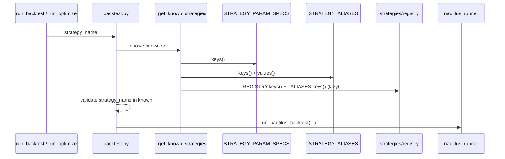

# digiquant Strategies and Backtest

This page covers how strategies register, how names resolve, and what each
backtest/optimize/export stage computes. The pipeline ordering itself lives in
[Architecture](/openwiki/digiquant/architecture.md);
the research and portfolio sub-graphs that consume these results live in
[Research and Portfolio](/openwiki/digiquant/research-and-portfolio.md).

## Strategy registry

Twelve Nautilus strategies are available, all registered via
`strategies/registry.py:register(name, strategy_cls, config_cls, default_params, *, aliases, description)`.
Each strategy module calls `register()` at import time; side-effect imports in
`strategies/__init__.py` gate on `find_spec("nautilus_trader")` so the package
stays importable without the optional Nautilus dependency.

| Canonical name | Description | Source |
|---|---|---|
| `ema_cross` | EMA crossover, market orders (Nautilus EMACross) | `strategies/ema_cross.py` |
| `ema_cross_long` | EMA crossover, long-only (Nautilus EMACrossLongOnly) | `strategies/ema_cross_long.py` |
| `ema_cross_trailing` | EMA crossover with trailing stop (Nautilus EMACrossTrailingStop) | `strategies/ema_cross_trailing.py` |
| `rsi_momentum` | RSI overbought/oversold momentum | `strategies/rsi_momentum.py` |
| `bollinger_mr` | Bollinger Bands mean reversion | `strategies/bollinger_mr.py` |
| `macd_trend` | MACD trend following | `strategies/macd_trend.py` |
| `btc_sdca` | BTC Strategic DCA via composite valuation index (power law + M2 + DXY + oscillators) | `strategies/sdca/nautilus_strategy.py` |
| `m2_liquidity` | 5-indicator voting system on global M2 money supply (no static registry default — `signal_df` injected at runtime) | `strategies/m2_liquidity.py` |
| `btc_slapper` | BTC L/S: ADF+RSI+BB mean reversion + DPSD trend, with reversal stop | `strategies/slapper.py` |
| `eth_slapper` | ETH L/S: same as BTC slapper minus reversal stop | `strategies/slapper.py` |
| `sol_slapper` | SOL L/S: same as BTC slapper minus reversal stop | `strategies/slapper.py` |
| `rs_rotation` | Relative-strength asset rotation across a configurable universe | `strategies/rotation/nautilus_strategy.py` |

*Strategy name resolution: the lazy `_KNOWN_STRATEGIES` set unites static specs,
static aliases, and runtime registry entries.*

### Aliases

The single canonical alias map `strategy_aliases.STRATEGY_ALIASES` folds
user-facing names into registry canonicals. A separate `PARAM_SPEC_NAMES` dict
maps only `btc_sdca → sdca` because the SDCA param-spec key differs from its
registry name.

| Alias | Canonical |
|---|---|
| `ema`, `s`, `mean_reversion_tech`, `momentum_tech` | `ema_cross` |
| `mean_reversion_stat_arb` | `bollinger_mr` |
| `momentum_energy` | `rsi_momentum` |
| `sdca` | `btc_sdca` |
| `btc_slapper_mr_trend` | `btc_slapper` |
| `eth_slapper_mr_trend` | `eth_slapper` |
| `sol_slapper_mr_trend` | `sol_slapper` |
| `relative_strength_rotation`, `asset_rotation` | `rs_rotation` |

Resolution chain: `resolve_strategy_name()` → registry canonical;
`resolve_param_spec_name()` additionally applies `PARAM_SPEC_NAMES`.
Runtime `register(..., aliases=...)` calls add aliases to `registry._ALIASES`,
merged at resolution time. No second private alias dict exists.

## Result models

All backtest/optimize/export data exchange uses the Pydantic models in
`digiquant.models`.

### BacktestResult

`repo://digiquant/src/digiquant/models.py#L8-L36`

| Field | Type | Description |
|---|---|---|
| `run_id` | `str` | Unique run identifier (`nautilus-` or `multi-` prefix) |
| `strategy_name` | `str` | Registry canonical strategy name |
| `symbols` | `list[str]` | Instruments used |
| `start_time` | `str` | Backtest start (ISO 8601 UTC) |
| `end_time` | `str` | Backtest end (ISO 8601 UTC) |
| `total_pnl` | `float` | Total PnL in account currency |
| `total_return_pct` | `float` | Total return as percent |
| `sharpe_ratio` | `float \| None` | Annualized Sharpe (252 days) if computable |
| `max_drawdown_pct` | `float \| None` | Max drawdown as negative percent (e.g. −15) |
| `num_trades` | `int` | Number of trades executed |
| `per_symbol_pnl` | `dict[str, float]` | Per-symbol PnL breakdown (multi-symbol only) |
| `status` | `str` | `ok` \| `partial` \| `error` |
| `message` | `str` | Human-readable detail |
| `success` | `bool` (computed) | `True` when `status != "error"` |

**Status semantics:**
- `ok`: every metric extracted cleanly.
- `partial`: one or more metrics missing or analyzer warnings — PnL is valid.
- `error`: fatal extraction failure (e.g. account report unavailable) — PnL
  may be `0.0` and must not be treated as a real result.

### OptimizationConstraints

`repo://digiquant/src/digiquant/models.py#L38-L49`

All fields are optional; absent constraints are skipped.

| Field | Type | Description |
|---|---|---|
| `min_trades` | `int \| None` | Minimum number of trades required |
| `max_drawdown_pct` | `float \| None` | Max drawdown cap (negative percent) |
| `min_sharpe` | `float \| None` | Minimum Sharpe ratio |
| `min_return_pct` | `float \| None` | Minimum total return % |
| `max_trades_per_year` | `float \| None` | Cap trade frequency (annualized) |
| `min_trades_per_year` | `float \| None` | Ensure minimum activity (annualized) |

Drawdown comparisons normalize both sides via `constraints.normalize_drawdown_pct`
(Nautilus may emit positive magnitudes). Trade frequency is computed from
`start_time` and `end_time` ISO strings.

### OptimizeResult

`repo://digiquant/src/digiquant/models.py#L52-L66`

| Field | Type | Description |
|---|---|---|
| `run_id` | `str` | Optimization run ID (`optimize-` prefix) |
| `strategy_name` | `str` | Strategy label |
| `symbols` | `list[str]` | Instruments |
| `best_params` | `dict[str, float\|int\|str]` | Best parameter set found |
| `best_backtest` | `BacktestResult \| None` | Backtest for best params (`None` for SDCA walk-forward) |
| `num_evaluations` | `int` | Number of param sets evaluated |
| `status` | `str` | `ok` \| `partial` \| `error` |
| `message` | `str` | Optional detail |

### ExportResult

`repo://digiquant/src/digiquant/models.py#L69-L77`

| Field | Type | Description |
|---|---|---|
| `run_id` | `str` | Export run ID (`export-` prefix) |
| `target` | `str` | `nautilus` \| `tradingview` \| `alpaca` \| `quantconnect` |
| `strategy_name` | `str` | Strategy label |
| `artifact_path` | `str \| None` | Path to exported artifact if written |
| `status` | `str` | `ok` \| `partial` \| `error` |
| `message` | `str` | Optional detail |

## Backtest

`repo://digiquant/src/digiquant/backtest.py#L107-L159`

`run_backtest(strategy_name, symbols, *, data_path, data_dir, tearsheet_path, strategy_params, full_tearsheet) → BacktestResult`

### Entry requirements
- **Explicit data source required**: either `data_path` (single CSV) or
  `data_dir` + `symbols`. No defaults — raises `RuntimeError` if neither
  provided.
- **Unknown strategy**: raises `ValueError` with sorted list of known names.
  Known set is the lazy union of `STRATEGY_PARAM_SPECS.keys()`,
  `STRATEGY_ALIASES.keys()`/`values()`, and (when Nautilus is importable)
  `registry._REGISTRY.keys()` and `registry._ALIASES.keys()`.
- **Empty symbols**: raises `RuntimeError`.

### In-memory cache

`repo://digiquant/src/digiquant/backtest.py#L54-L104`

Results are cached by SHA-256 hash of `(strategy_name, sorted(symbols),
sorted(params), data_path, data_dir)`. Cache behavior:
- **Enabled** by default, controlled by `DIGIQUANT_BACKTEST_CACHE` env var
  (`false` / `0` / `no` disables).
- **Skipped** when `tearsheet_path` is set (tearsheet must be written to disk).
- **LRU eviction**: `DIGIQUANT_BACKTEST_CACHE_MAX` (default 128 entries);
  oldest entries dropped first.
- `clear_backtest_cache()` empties the cache entirely.

### Nautilus runner internals

`repo://digiquant/src/digiquant/nautilus_runner.py`

The runner orchestrates five stages:

1. **Data loading**: `_load_ohlcv_for_backtest` (single symbol) or
   `_load_all_ohlcv_for_backtest` (multi-symbol). Resolution from
   `data_dir/{symbol}.csv` or `data_dir/{symbol}_ohlcv.csv` with path-traversal
   rejection.

2. **Bar preparation** (`_prepare_bar_data`): Polars OHLCV → pandas
   (documented boundary), `_infer_bar_period_nautilus` determines
   `1-MINUTE`/`1-HOUR`/`1-DAY`, `BarDataWrangler.process()` produces Nautilus
   bars.

3. **Engine build** (`_build_engine`): configures `BacktestEngine` with
   `SIM` venue, `NETTING` OMS, `CASH` account, `STARTING_BALANCE_USD = $1M`.
   Default trade size is notional-based: `floor($1M × 0.02 / first_price)`,
   minimum 1 unit — prevents over-leverage on high-priced instruments. An
   explicit caller `trade_size` always wins.

4. **Metric extraction**:
   - `_extract_pnl`: parses account report for `total`/`balance`/`equity`
     column, computes `final_balance − $1M` and return %.
   - `_extract_perf_stats`: Sharpe from
     `analyzer.get_performance_stats_returns()["Sharpe Ratio (252 days)"]`,
     max drawdown from `stats_pnls` with returns-series fallback via
     cumulative product peak-to-trough.

5. **Result assembly** (`_build_result`): `error` status for fatal extraction
   failures, `partial` for missing metrics or analyzer warnings, `ok` only
   when every metric was extracted cleanly. PnL errors are never silently
   fabricated as zero.

### Multi-symbol aggregation

`repo://digiquant/src/digiquant/nautilus_runner.py#L570-L698`

When `data_dir` is provided with multiple symbols, the runner loads all CSVs,
runs one backtest per symbol, and aggregates:
- `total_pnl` / `total_return_pct`: **average** across symbols.
- `sharpe_ratio`: **average Sharpe** across symbols (not a portfolio Sharpe;
  the message explicitly labels this).
- `max_drawdown_pct`: **worst** per-symbol drawdown.
- `per_symbol_pnl`: per-symbol breakdown dict.
- Symbols with `None` or `status="error"` results are **excluded** from
  aggregates and named in the message; no fabricated zeros.

### ADDM drift detection

`repo://digiquant/src/digiquant/addm.py`

On every successful backtest via the HTTP API, the server records the Sharpe
ratio via `record_sharpe(strategy_id, sharpe)`. A per-strategy rolling deque
(max `window=30` by default) feeds `check_drift()`, which computes a Z-score.
Drift is declared when `|z| ≥ z_threshold` (default 2.0), requiring at least 3
observations. History entries unaccessed for 7 days are pruned from memory.

### Tearsheet

When `tearsheet_path` is set, `digiquant.tearsheet.create_tearsheet` generates
an HTML tearsheet page from the backtest result, account report, fills report,
OHLCV DataFrame, and extracted performance stats. The path must resolve under
`BACKTEST_RESULTS_DIR` (path-traversal rejected). Multi-symbol backtests do not
yet support tearsheet generation.

## Optimize

`repo://digiquant/src/digiquant/optimize.py#L183-L294`

`run_optimize(strategy_name, symbols, *, param_grid, method, n_trials, objective, constraints, data_path, data_dir, base_params, max_workers) → OptimizeResult`

### Methods
- **`grid`** (default): auto-infers from `strategy_specs.infer_param_grid` or
  uses caller-supplied `param_grid`. Cartesian product capped at
  `MAX_GRID_SIZE = 10,000`.
- **`random`**: samples `n_trials` from `sample_random_params`.
- **`bayesian`**: delegates to `optimize_bayesian.py` using Optuna
  (`optuna.create_study(direction="maximize")`). Prunes trials that fail
  constraints or have `None` Sharpe.
- **Explicit `param_grid`**: method is ignored; the given list is used
  directly.

### Parallel execution
`_run_trials_parallel` uses `ProcessPoolExecutor` with
`DIGIQUANT_OPTIMIZE_WORKERS` workers (default `os.cpu_count()` or 1). Falls
back to sequential on `BrokenProcessPool`, `OSError`, or `RuntimeError`
(macOS spawn issues). Trials with `max_workers ≤ 1` or a single trial run
sequentially.

### Constraints and scoring
`repo://digiquant/src/digiquant/constraints.py#L19-L54`

`satisfies_constraints(bt, constraints)` checks all non-`None` constraint
fields including annualized trade frequency. Scoring is by `objective`:
`"sharpe"` (default), `"return"`, or total PnL. Only constrained-passing,
valid-Sharpe trials are eligible for `best`.

### SDCA walk-forward

`repo://digiquant/src/digiquant/optimize.py#L342-L382`

When `_resolve_strategy_name(strategy_name) == "sdca"`, optimize dispatches to
`_run_sdca_optimize`:
- Loads OHLCV date/close series and extra indicator sources (M2, DXY, ETH
  relative strength, etc.).
- Auto-grid drops extra-indicator weights and curvatures (held at defaults:
  `valuation=1`, `extras=0`) to keep the grid small; `random`/`bayesian` search
  the extra weights.
- Objective is `vs_flat_dca_pct` (did the signal beat blind dollar-cost
  averaging?) subject to a capital-deployed floor (10%) and drawdown cap
  (50%).
- Rails are refit per fold on the in-sample window only — never a full-history
  fit.
- Returns an `OptimizeResult` with `best_backtest=None` (SDCA uses its own
  metrics envelope).

### Param specs

`repo://digiquant/src/digiquant/strategy_specs.py`

`STRATEGY_PARAM_SPECS` defines per-strategy bounds for auto-inference:
`(min, max, default, step_hint, type_str)` tuples. Key functions:
- `get_param_specs(strategy_name)`: resolves via `resolve_param_spec_name`,
  merges with YAML overrides from `DIGIQUANT_STRATEGY_SPECS_PATH`.
- `infer_param_grid(strategy_name, num_points_per_param=3)`: linear spacing,
  excludes `trade_size` by default.
- `sample_random_params(strategy_name, n)`: uniform random within bounds.
- `get_search_space_for_optuna(strategy_name)`: Optuna-compatible `{name:
  (suggest_type, lo, hi, step)}`.

YAML specs from `DIGIQUANT_STRATEGY_SPECS_PATH` are cached by file mtime;
overlapping param names take precedence.

## Export

`repo://digiquant/src/digiquant/export.py`

`run_export(strategy_name, params, target, output_dir) → ExportResult`

Supported targets: `nautilus`, `nautilus_bundle`, `tradingview`, `alpaca`,
`quantconnect`.

- **`nautilus` / `tradingview` / `alpaca` / `quantconnect`**: writes a JSON
  config artifact (`{strategy_name}_{target}_{run_id}.json`).
- **`nautilus_bundle`**: writes a ZIP containing `params.json`, `manifest.json`,
  and `README.txt`. Only `ema_cross` is supported; other strategies raise
  `ValueError`.

Output directory is validated to stay within `EXPORT_OUTPUT_DIR` (default
`digiquant/results/exports`). Platform-specific deployment (TradingView,
Alpaca, QuantConnect) is not implemented — export writes the artifact only.

## Decision backtest (research)

`repo://digiquant/src/digiquant/research/backtest.py`

A separate, pure-functional system for Pillar 3C: replays the realized outcome
of each `decision_log` decision — the ticker's return over its holding window
vs the benchmark — into a decision-level tear sheet. This is a
*decision-sequence* tear sheet (each decision = one trade), not a daily NAV
simulation.

**Key types (dataclasses, not Pydantic):**
- `Trade`: one realized decision with `date`, `ticker`, `return_frac`,
  `benchmark_frac`, `conviction`, `stance`, `end_date`.
- `BacktestResult`: `n_trades`, `hit_rate`, `mean_alpha_pct`,
  `median_alpha_pct`, `total_return_pct`, `benchmark_total_return_pct`,
  `annualized_return_pct`, `max_drawdown_pct`, `information_ratio`,
  `sortino_ratio`, `conviction_buckets`.
- `BucketStat`: calibration stats per conviction bucket (`high` ≥ 4, `medium`
  ≥ 2, `low`, `unknown`).

`backtest_decisions(trades)` computes alpha as `return − benchmark`, compounds
returns, annualizes over the holding-window span (not entry-to-entry, which
would collapse to 0 days for same-run books), and reports Sortino with an
information-ratio fallback when downside deviation is zero. Conviction
calibration answers: do higher-conviction calls earn higher alpha?

## Portfolio model contracts

The portfolio sub-graph consumes strict Pydantic model contracts for
forecast calibration, cost/liquidity observation, and risk policy. These are
observational Phase 1 contracts — they do not yet veto or resize actions.

### Forecast calibration

`repo://digiquant/src/digiquant/portfolio/models/forecast_calibration.py`

- **Style**: frozen, `extra="forbid"`, UTC-only aware datetimes, Decimal
  economics, UUID5 idempotent identity, content hashes with canonical
  8-decimal-place spelling.
- **Key types**: `ForecastCalibrationModel` (base), `SessionPriceSnapshot`,
  `OutcomeStatus` (resolved/pending/unavailable),
  `CalibrationArtifactStatus` (available/unavailable).
- **Hash security**: canonical return-fraction spelling with
  `_RETURN_FRACTION_QUANTUM = Decimal("0.00000001")` ensures write-time and
  PostgREST float read-back digests agree despite JSON serialization loss.

### Cost and liquidity

`repo://digiquant/src/digiquant/portfolio/models/cost_liquidity.py`

- **Style**: frozen, `extra="forbid"`, UTC-only, Decimal economics, UUID5.
- **Key types**: `CostLiquidityModel` (base), `CostEstimateStatus`
  (available/degraded/unpriceable/unavailable), `CostComponentKind`
  (fee/spread_half/impact/total), `LiquiditySnapshot` (capacity evidence),
  `ActionCostEstimate` (prospective decomposed cost linked to order intent +
  policy), `ActionCostOutcome` (expected-vs-realized comparison).
- **Phase 1 only**: estimates do not veto or resize actions.

### Risk policy

`repo://digiquant/src/digiquant/portfolio/models/risk_policy.py`

- **Style**: frozen, `extra="forbid"`, UTC-only, deterministic hashes.
- **Key types**: `RiskPolicyModel` (base), `PolicyArtifactStatus`
  (available/degraded/unavailable), `ProvenanceSource` (explicit_config /
  normalized_config / code_default / derived_invariant), `CovarianceSnapshot`.
- Phase 1 versions incumbent behavior only.

### Pretrade risk

`repo://digiquant/src/digiquant/portfolio/allocation_contracts.py`

`PreTradeRiskReport` aggregates blocks for forecast quality, portfolio risk,
cost/liquidity, concentration, name/sector/factor scenarios, control outcomes,
and per-asset risk contributions. Built via `build_pretrade_risk_report()` in
`digiquant.portfolio.pretrade_risk` from `PreTradeRiskBuildRequest` inputs
including book weights, covariance snapshot, risk policy, cost/liquidity
scalars, and forecast quality scalars.

## Human gate

Broker adapters (`brokers/`) and any order-submission path remain human-gated;
no automated caller may invoke them. Tearsheets and publish flows
(`--push-supabase`) are operator steps after real Nautilus runs — never from
agent environments, never with fabricated metrics.
