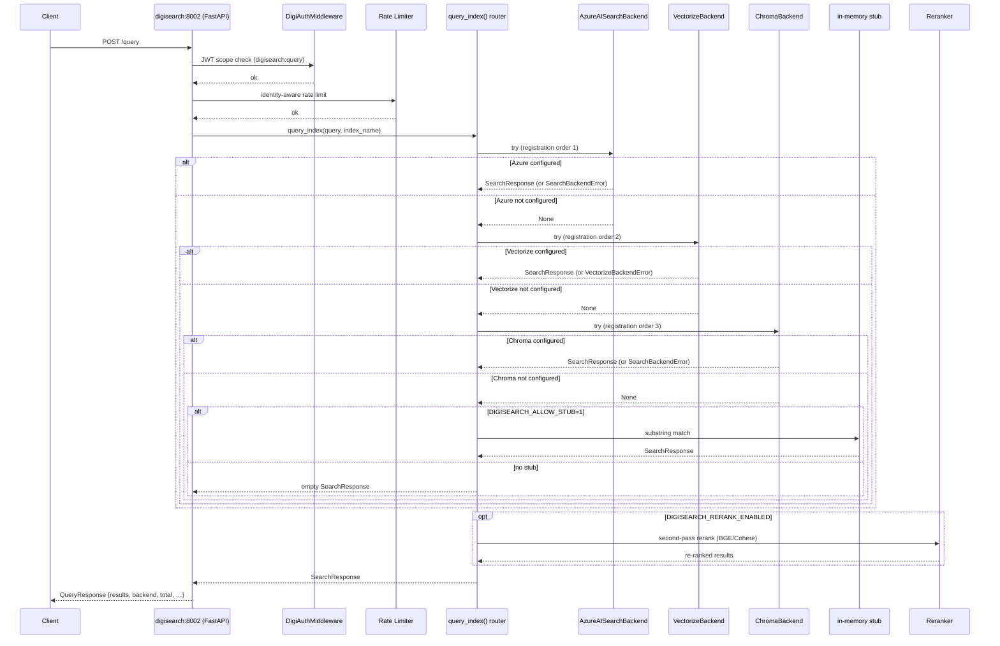

# digisearch Architecture

digisearch (port 8002 HTTP, 8765 MCP) is the centralized RAG vertical:
it owns ingest → parse → chunk → embed → index → query → rerank end to
end, and serves it over REST, MCP, CLI, and the orchestrator-tool
manifest digigraph consumes. Entity names drop the `Digi` prefix
(`Document`, `Chunk`, `Query`, `Result`).

## Pipeline

```
source → ParserRegistry → ChunkerBackend → EmbeddingCache/BatchEmbedder
 → DigiIndex.add() … query_index() router → normalize_query_hit()
 → optional rerank / RRF hybrid fusion → SearchResponse
```

Parsers cover PDF/DOCX/HTML/Markdown/CSV/text with OCR fallback;
chunking defaults to Chonkie semantic (`DIGISEARCH_CHUNKER` or per-index
config, segment-aware on ingest); embeddings fan out to OpenAI, Azure,
Cohere, HuggingFace, or Ollama behind cache + batching. The ingest
pipeline resolves embeddings through `digisearch.embedding.factory.resolve_embedding_pipeline`
(EmbeddingCache → BatchEmbedder → EmbeddingProvider);
set `DIGISEARCH_EMBED=0` to skip the pipeline-level embed step — backends
may still embed independently. A misconfigured explicit provider raises
rather than silently no-opping.

### RAG request flow



Configured backends that fail to serve a query raise `SearchBackendError`
(Azure, Chroma) or `VectorizeBackendError` (Vectorize) — neither type is
in the `_BACKEND_ERRORS` tuple that `query_index` catches to fall through.
This is a deliberate fail-closed design: a configured backend's failure
must surface to the caller rather than being silently answered from a
different corpus. "Not configured" / "missing dependency" paths still
return `None` so the router continues.

## Two retrieval seams

digisearch has two distinct retrieval abstractions:

| Seam | Role | Interface | Selection |
|------|------|-----------|-----------|
| `query_index` router | Chunk-level query (`POST /query`, MCP `semantic`) | `search/_stub.py` backend registry | Env vars per backend (AZURE_SEARCH_*, CLOUDFLARE_*, CHROMA_*) |
| `RetrievalBackend` | Document-level async retrieval (separate callers) | `retrieval/backend.py` Protocol | `DIGISEARCH_RETRIEVAL_BACKEND` (pgvector \| lightrag) |

`RetrievalBackend` is a `@runtime_checkable` Protocol with `index` /
`retrieve` / `delete` / `health`. Concrete backends (`PgvectorBackend`
default, `LightRAGBackend` upgrade) register in `retrieval/registry.py`
and callers depend only on the protocol. LightRAG embeddings default to
local Ollama `nomic-embed-text` or `DIGISEARCH_LIGHTRAG_EMBEDDING=minilm`
— not OpenAI. Without a database DSN, `PgvectorBackend` uses an in-memory
store for unit tests only.

## Backend registry

`search/_stub.py` routes `query_index()` across three real backends in
registration order — Azure AI Search (BM25 + vector, OData filters),
Cloudflare Vectorize v2 (cosine, remote-only), Chroma (cosine ANN,
where-clause filters) — plus an in-memory substring stub that runs
**only** when `DIGISEARCH_ALLOW_STUB=1` (unit tests;
`_require_real_search_backend` enforces this at startup). New backends
register here; no `if backend == "x"` dispatch in the query path. Every
`ChromaBackend` construction passes an explicit `embedding_provider`
(never Chroma's bundled ONNX default), and partial embedding batches
raise rather than dropping vectors.

The startup gate in `backend_require.py` is shared by both the HTTP
server (`server.py` lifespan) and the MCP server (`mcp_server.run_mcp`),
so the backend precedence can never drift between the two entrypoints.
Precedence: Cloudflare (canonical `CLOUDFLARE_ACCOUNT_ID` +
`CLOUDFLARE_API_TOKEN` with legacy `VECTORIZE_*`/`D1_*` fallback) →
Azure → Chroma → `RuntimeError`, unless `DIGISEARCH_ALLOW_STUB=1`.

Fail-closed error propagation:
- `SearchBackendError` (Azure/Chroma) and `VectorizeBackendError`
  (Vectorize) live outside `search/_stub.py` to avoid import cycles.
- `VectorizeBackendError` lives in its own module (`vectorize_errors.py`,
  decoupled from `vectorize.py`) so it stays importable even when the
  heavier `vectorize` module fails to import — covering the case where
  a missing optional dependency prevents `VectorizeBackend` construction.

## Vertical role

Under digigraph's federated hub, digisearch owns every tool schema and
dispatch. The orchestrator manifest (`POST /v1/orchestrator_tools`) and
invoke path (`POST /v1/orchestrator_invoke`) live in
`orchestrator_tools.py`; digigraph fetches the manifest via
`vertical_orchestrator/digisearch_hub.py` and forwards tool calls
without importing digisearch Python code.

Tool names registered: `digisearch`, `digisearch_fetch_all`,
`digisearch_research_delegate`, `web_search`, `digisearch_web_search`,
`digisearch_monitors_trigger`, `digisearch_monitors_runs`, and
`digisearch_websets_*` (create, get, add_search, list_items, events,
export). `digisearch_research_delegate` and `digisearch_web_search`
are conditional (agent extra, EXA_API_KEY respectively).

Direct consumers: digiflow via REST/MCP, CLI operators, digiclaw MCP
clients on `:8765/mcp`, and power users on `:8002`. The MCP server
(`FastMCP`) exposes `semantic`, `web_search`, `search_strategies`,
`research_turn`, `exa_web_search`, `monitors_*`, and `websets_*`.
digigraph prefixes the operator server id (`digisearch_`), so the model
calls `digisearch_semantic`, `digisearch_search_strategies`, etc.

## Module map (selected)

| Area | Role |
|------|------|
| `ingestion/` | `ParserRegistry`, parsers (PDF/DOCX/HTML/MD/CSV/text), OCR providers |
| `chunking/` | `ChunkerBackend` factory, Chonkie semantic/token, legacy chunkers |
| `embedding/` | `EmbeddingProvider` ABC, `BatchEmbedder`, `EmbeddingCache` |
| `embedding/providers/` | OpenAI, MiniLM (local ONNX 384-dim) |
| `embeddings/` | `EmbeddingModelSpec` versioning, config |
| `indexes/` | `DigiIndex` ABC, backend implementations |
| `indexes/backends/` | Azure AI Search, Cloudflare Vectorize v2, Chroma, error types |
| `search/` | `query_index` router, hybrid RRF, reranker, query transforms (HyDE, expansion) |
| `search/_stub.py` | Backend registry + stub guard |
| `core/` | Models (`Document`, `Chunk`, `Query`, `Result`, `SearchResponse`), config, filters, standard hits |
| `retrieval/` | `RetrievalBackend` Protocol, pgvector + LightRAG backends, registry |
| `agent/` | LangGraph research pipeline (`plan → retrieve → aggregate`), citations |
| `pipeline/` | Canonical filesystem ingest (`ingest_source`), URL ingest (SSRF-guarded) |
| `web_search/` | SearXNG → DDGS web search, fetch + extract enrichment |
| `web_exa.py` | EXA neural search (dormant without EXA_API_KEY) |
| `monitors/` | Scheduled web-search watches (create, trigger, runs, delivery, EXA adapter) |
| `websets/` | Verified + enriched dataset building (async driver, runner, store, events) |
| `orchestrator_tools.py` | OpenAI-style manifest digigraph fetches + invoke dispatch |
| `research_search.py` / `research_ingest.py` | Strategy-library search + ingest (date-ordinal filters) |
| `server.py` | FastAPI REST server (8002), rate limiter, auth middleware |
| `mcp_server.py` | FastMCP server (8765), tool definitions, shared backend gate |
| `cli.py` | Typer CLI (ingest, query, serve, mcp, index commands) |
| `backend_require.py` | Shared startup gate for HTTP + MCP entrypoints |
| `ingest_worker.py` | Bulk worker — logs and exits (stub until Phase 2) |

## Non-negotiable boundaries

Polars-only with no Nautilus exception; structured `filters: list[dict]`
over raw OData; ingest `source` is a validated server-side path (no raw
URLs, no traversal — URL ingest is the separate SSRF-guarded
`POST /ingest/url`); new endpoints carry `digisearch:query`/`ingest`
scopes; no prompt or chunk bodies in trace spans; bulk ingest worker
(`ingest_worker.py`) is a stub — do not add a queue consumer until
Phase 2; chunker selection is config-only via `DIGISEARCH_CHUNKER` or
per-index `chunker:`; single filesystem ingest path through
`pipeline.ingest.ingest_source`.
