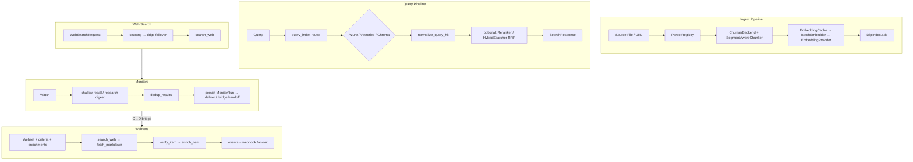
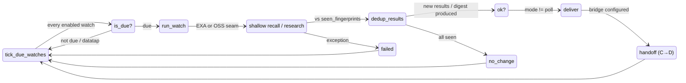
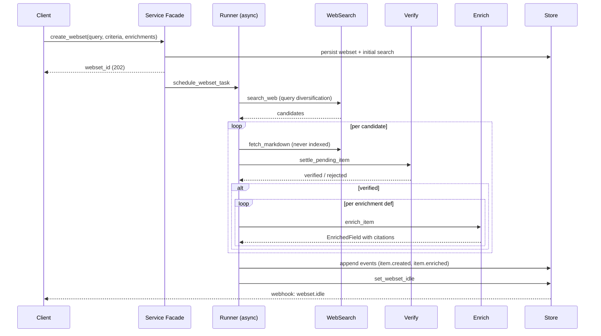

# digisearch Architecture

digisearch (port 8002 HTTP, 8765 MCP) is the centralized RAG vertical:
it owns ingest → parse → chunk → embed → index → query → rerank end to
end, and serves it over REST, MCP, CLI, and the orchestrator-tool
manifest digigraph consumes. Entity names drop the `Digi` prefix
(`Document`, `Chunk`, `Query`, `Result`).



*Overview of digisearch's four major pipelines: corpus RAG ingest/query, live web search, scheduled monitors, and async webset verification/enrichment.*

## RAG Pipeline

```
source → ParserRegistry → ChunkerBackend → EmbeddingCache/BatchEmbedder
 → DigiIndex.add() … query_index() router → normalize_query_hit()
 → optional rerank / RRF hybrid fusion → SearchResponse
```

Parsers cover PDF/DOCX/HTML/Markdown/CSV/text with OCR fallback;
chunking defaults to Chonkie semantic (`DIGISEARCH_CHUNKER` or per-index
config, segment-aware on ingest); embeddings fan out to OpenAI, Azure,
Cohere, HuggingFace, or Ollama behind cache + batching.

## Backend Registry

`search/_stub.py` routes `query_index()` across three real backends —
Azure AI Search (BM25 + vector, OData filters), Cloudflare Vectorize v2
(cosine, remote-only), Chroma (cosine ANN, where-clause filters) — plus
an in-memory substring stub that runs **only** when
`DIGISEARCH_ALLOW_STUB=1` (unit tests; `_require_real_search_backend`
enforces this at startup). Backends are registered as callables and tried
in registration order (Azure first, then Vectorize, then Chroma).
Returning `None` means "not configured here; try next." A configured
backend that errors raises `SearchBackendError` — it never silently falls
through to the next backend.

The ingest path (`route_add_chunks`) mirrors this: Vectorize first when
configured, then Chroma, stub last.

Every `ChromaBackend` construction passes an explicit
`embedding_provider` (never Chroma's bundled ONNX default), and partial
embedding batches raise rather than dropping vectors.

## Vertical Role

Under digigraph's federated hub, the `digisearch`,
`digisearch_fetch_all`, and `digisearch_research_delegate` tool schemas
and dispatch live entirely in digisearch — digigraph only forwards.
Direct consumers: digiflow via REST/MCP, CLI operators, digiclaw MCP
clients on `:8765/mcp`, and power users on `:8002`.

## web_search Subsystem

The `web_search/` package performs live public-web search with optional
page-fetch enrichment. It is the foundation for both the monitors and
websets subsystems.

### Provider failover

`service.py::search_web` resolves a `WebSearchRequest` through a
two-backend failover chain configured by `DIGISEARCH_WEB_SEARCH_BACKEND`:

| Mode | Order |
|------|-------|
| `auto` (default) | searxng → ddgs |
| `searxng` | searxng only |
| `ddgs` | ddgs only |

- **SearXNG** (`searxng_provider.py`): primary, JSON API at
  `DIGISEARCH_SEARXNG_URL` with time-range filtering, engine scoring,
  and domain filter support. Returns `WebSearchResponse` with
  `unresponsive_engines` diagnostics.
- **DDGS** (`ddgs_provider.py`): zero-infra secondary using the `ddgs`
  library. A zero-row result is a hard failure because ddgs ≥9.1 raises
  `DDGSException` for both empty sets and throttling — the library gives
  no way to distinguish the two.

Every backend failure is collected; `WebSearchProviderError` names each
backend and its actual error with `retryable`/`status_code` hints.

### Fetch enrichment

`run_web_search` extends `search_web` with optional page-fetch
enrichment: the top `fetch_max_pages` results are fetched through
digifetch's SSRF-guarded `HttpFetcher`, rate-limited by a process-wide
shared `RateLimiter`, and converted to markdown via
`extractor.py::extract_markdown` (trafilatura primary, readability
fallback). One hit's fetch failure never fails the whole search.

### Citation identity

`citation.py::Citation` and `normalize_url` provide a shared citation
atom used across monitors dedup, websets verification, and web research
turns. `normalize_url` lowercases the host, drops default ports
(80/443), strips the fragment, and trims trailing slashes — the query
string is preserved verbatim.

### Fetch without indexing

`fetch.py::fetch_markdown` downloads a single URL through digifetch's
SSRF guard and extracts markdown — the page is **never indexed**. This
is the dedicated non-corpus fetch seam used by monitors and websets.

## Monitors Subsystem (#4065 Phase C)

The `monitors/` package provides scheduled web-search watches with
dedup, delivery, and EXA remote-monitor adapter support. A `Watch`
defines a query, schedule (cron or interval), dedup rule, delivery
configuration, and optional bridge to a webset.



*Monitor turn lifecycle: tick evaluation, recall, dedup, delivery, and C→D bridge to websets.*

### Recall backends

A watch runs with `backend="oss"` (default) or `backend="exa"`:

- **OSS path**: calls `web_search/service.py::search_web` in-process
  with `recency_days=None` (R5 — monitors never inherit the 7-day
  default) and `max_results` clamped to 10. Results are adapted to
  `WebSearchData`.
- **EXA path**: calls `web_exa.exa_search` with the full 1-100
  `num_results` cap, `search_type`, and `category`. EXA watches are
  remote monitors whose webhook deliveries are translated into
  `MonitorRun` rows by `exa_adapter.py`.

Answer mode selects the turn: `recall` (default) is the shallow-recall
leg; `research` runs the full Phase B research turn and stores a cited
`MonitorDigest`.

### Dedup

`dedup.py::dedup_results` implements changedetection.io + Huginn
semantics. A fingerprint is `normalized_title + \x1f + sha256(title +
text)`. The store's `seen_fingerprints` recomputes fingerprints from
stored `results_all` using `result_fingerprint` (multi-key extraction:
text → EXA highlights → snippet). `dedup_results` splits incoming
results into `results_new` and `dedup_stats` by URL identity
(`normalize_url`) and optional near-duplicate title matching.

### Delivery

`delivery.py::deliver` fans a `MonitorRun` to the watch's
`DeliveryTarget` list (webhook/slack/email). Webhook POSTs carry
`X-digi-signature: sha256=<hmac>`; two attempts with linear backoff.
Email uses stdlib `smtplib` with STARTTLS — credentials never cross
cleartext. Every target yields one `DeliveryReceipt`; one bad target
never aborts the others.

### EXA adapter

`exa_adapter.py` wraps EXA's remote monitor API: create, get, trigger,
list runs, delete, and webhook delivery translation. Fail-closed:
missing key, remote failure, or untranslatable payload raises
`ExaAdapterError` with a stable `code`. The inbound
`POST /v1/monitors/exa_webhook` route verifies deliveries with the
per-monitor `webhookSecret` using a Stripe-style timestamped HMAC.

### C→D bridge (#4249)

A watch carrying `bridge.webset_id` hands each `ok` run to that webset
via `handoff_from_watch`. The websets store's
`(watch_id, run_id, webset_id)` ledger makes repeat deliveries
idempotent. The next `ok` run retries a failed handoff — a bridge
failure never flips the run's status.

### Storage

`store.py` uses stdlib `sqlite3` with WAL mode and a 5s busy timeout.
Tables: `watches`, `runs` (append-only). `watch_id` is a
Crockford-base32 ULID. The delivery secret lives in a dedicated nullable
column, never in the watch body.

### Scheduling

`tick_due_watches` evaluates every enabled watch (cron or interval),
runs the due ones, and isolates per-watch failures. Cron uses
`digiclaw.cron` grammar; cron watches fire once per matching minute.
Interval watches fire when `last_run_at + interval <= now`. Datatap-
scoped watches are skipped.

## Websets Subsystem (#4066 Phase D)

The `websets/` package builds verified, enriched, citable datasets
asynchronously. A caller submits a query + 1-5 verification criteria +
up to 10 enrichment definitions. The runner recalls candidates,
verifies each against every rule, and enriches admitted items
field-by-field with per-field citations.



*Webset lifecycle: async create → recall → verify → enrich → events + webhook delivery.*

### Verification engine

`verify.py` evaluates each candidate page against every
`VerificationCriterion`:

- **`llm` mode** (default): one digillm structured completion per
  candidate. Markdown is truncated to 6000 characters. Verdicts carry
  `references: list[Citation]`. A payload missing exactly one verdict
  per criterion raises `VerificationUnavailableError`.
- **`rules` mode** (deterministic, offline): a compact DSL with three
  kinds — `domain:` (host allowlist), `keyword:` (comma-separated
  terms, all must match case-insensitively), `recency:` (newest ISO
  date on page within N days). Unknown kinds raise `ValueError`.

`settle_pending_item` maps verdicts to `WebsetItem.verification`;
`settlement_results` provides synthetic fail-closed results for errored
or never-attempted criteria. An item is `verified` only when every rule
passes.

### Enrichment engine

`enrich.py` resolves each `EnrichmentDef` to one `EnrichedField` per
item with mandatory `citations`. Types: `text`, `number`, `date`, `url`,
`email`, `phone`, `options`, and `company_profile`.

Company-profile enrichment includes cross-page funding history
reconciliation: `reconcile_funding_history` normalizes rounds, merges
by `(name, date)`, and admits on quorum (≥2 independent citations or 1
from the company's own domain). `merge_company_entities` groups
candidates by domain + name similarity, records alternatives, and
reconciles funding evidence.

### Runner

`runner.py` drives one webset to `idle` asynchronously with a
semaphore-4 fetch/verify/enrich boundary, per-item fault containment,
and a dedicated single-worker store thread (`run_in_executor`). Startup
resume re-drives incompletely settled websets and searches. Cancellation
flips the row and settles searches `cancelled` without mid-LLM
`task.cancel()`.

### Events and webhooks

`events.py` is the single append-only event writer. Every stored event
fans out through `deliver_webhook`, signing with
`X-digi-signature` (same HMAC core as monitors delivery). The
`webhook_deliveries` ledger makes redelivery idempotent. A
re-delivery loop (`websets/driver.py`) retries failed deliveries with
bounded attempts and exponential backoff.

### Driver

`driver.py::webset_task_lifespan` is shared by the FastAPI and FastMCP
server lifespans. It installs a `WebsetTaskScheduler`, resumes
incomplete websets, runs the scheduled monitor-tick loop, and runs the
webhook re-delivery loop — all within one `asyncio.TaskGroup`.

### EXA websets shim

`providers/exa_websets.py` is a dormant paid alternative (EXA's websets
API is Pro-gated). It translates OSS webset requests into EXA calls and
normalizes responses back into the OSS model shapes. Fail-closed: raises
`ExaNotConfiguredError` without a key.

## Module Map

| Area | Role |
|------|------|
| `ingestion/` + `chunking/` | Parsers, `ChunkerBackend` factory |
| `embedding/` + `embeddings/` | Providers, cache, batch embedder |
| `indexes/` | `DigiIndex`, backend implementations |
| `search/` | Router, hybrid RRF, reranker, stub guard |
| `agent/` | Research pipeline (citations, models) |
| `web_search/` | searxng + ddgs failover, fetch enrichment, citation atom |
| `web_exa.py` | Optional EXA neural search provider |
| `monitors/` | Scheduled watches, dedup, delivery, EXA adapter, C→D bridge |
| `websets/` | Async verify + enrich datasets, events, webhooks, EXA shim |
| `ingest_worker.py` | Bulk worker — logs and exits (stub until Phase 2) |
| `server.py`, `mcp_server.py`, `cli.py` | REST, MCP, Typer CLI |
| `orchestrator_tools.py` | Manifest digigraph fetches |

## Non-Negotiable Boundaries

Polars-only with no Nautilus exception; structured `filters: list[dict]`
over raw OData; ingest `source` is a validated server-side path (no raw
URLs, no traversal); new endpoints carry `digisearch:query`/`ingest`
scopes; no prompt or chunk bodies in trace spans.
