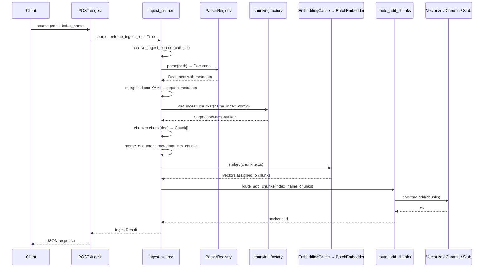

# digisearch Ingest and Index

Ingest turns a document into searchable chunks with embeddings. Every stage is
config-selected through factories — new parsers register in the
`ParserRegistry`, new chunkers go through the chunking factory, and new index
backends register through `search/_stub.py`. There are two ingest entry points:
a **filesystem** path (`POST /ingest` / CLI) and an **SSRF-guarded URL fetch**
(`POST /ingest/url` / `digisearch ingest-url`).

## Ingest pipeline flow

*Canonical ingest sequence: parse → sidecar → chunk → embed → index.*

## Parsing

`ingestion/registry.py` (the `ParserRegistry`) auto-selects a parser by file
extension or MIME type. It tries PDF, DOCX, HTML, Markdown, and CSV parsers
(lazy-imported inside `_default_parsers()` so missing optional dependencies
don't block other formats), then falls back to `PlainTextParser` which always
succeeds.

Registry construction is cheap — it builds the parser list once per
`ParserRegistry()` instance. Each parser implements the `Parser` protocol
(`can_parse` + `parse`) from `ingestion/base.py`.

OCR fallback (Tesseract / Azure DI / AWS Textract) lives in `ingestion/ocr/`
and is invoked by `PDFParser` when a PDF has no extractable text layer.

## Chunker selection

`chunking/factory.py` resolves one key — explicit `name` → per-index
`chunker:` → `DIGISEARCH_CHUNKER` → default `semantic` — through three
entry points:

- `get_chunker_backend()` — `ChonkieSemanticChunker` (default) or
  `ChonkieTokenChunker`; unknown names raise `ValueError`.
- `get_document_chunker()` — backend plus legacy `recursive`/`fixed`
  names for rollback and characterization.
- `get_ingest_chunker()` — the ingest default: `SegmentAwareChunker`
  wrapping the selected backend so structural segments never cross chunk
  boundaries; research flat payloads use the document chunker without the
  segment wrapper.

Backends and derived chunkers cache per key at process level because Chonkie
`SemanticChunker` construction loads embedding weights (~200ms+ after first
download). `clear_chunker_cache()` drops all caches for tests that
monkeypatch constructors.

Use `token` for short news-wire latency, `semantic` (default) for long
filings and reports.

## Embeddings

The embedding stack wraps a raw `EmbeddingProvider` in
`BatchEmbedder` (batching + retry) inside `EmbeddingCache`
(SQLite, model-namespaced, content-hashed). Configuration sources, highest
precedence first:

1. `DIGISEARCH_EMBEDDING_PROVIDER` (+ optional `DIGISEARCH_EMBEDDING_MODEL`)
2. Non-empty `embedding:` block in `DigiSearchConfig`
3. Default `minilm` when a vector backend (Chroma / Vectorize) is configured

`DIGISEARCH_EMBED=0` disables the pipeline-level embed step; backends may
still embed via their own injected providers. Explicit provider config that
cannot load raises `EmbeddingConfigError` — never a silent no-op.

`EmbeddingCache` hashes `{model_namespace}\0{text}` with SHA-256 and
batches cache lookups with a single `SELECT WHERE hash IN (...)` query.
`EmbeddingCache.embed()` returns a list of the same length as the input,
filling cache hits in-place and raising `ValueError` if any slot remains
`None` after computing misses — partial results are never returned.

`BatchEmbedder` splits texts into sub-batches of `DIGISEARCH_EMBED_BATCH_SIZE`
(default 100), retrying each batch up to `max_retries` (3) with exponential
backoff. If the last attempt fails, the error propagates — no partial vector
list is ever returned.

## Index writes

### DigiIndex interface

`indexes/base.py` defines `DigiIndex` (ABC) with six abstract methods:

| Method | Purpose |
|--------|---------|
| `add(chunks)` | Persist chunks + embeddings |
| `query(query)` | Search, returns ranked `Result` list |
| `delete(ids)` | Delete chunks by id |
| `update(chunks)` | Upsert chunks |
| `list_collections()` | List index/collection names |
| `snapshot(path)` | Export snapshot to path |

Concrete backends are `ChromaBackend`, `VectorizeBackend`, and
`AzureAISearchBackend` (query only, ingest writes to Chroma/Vectorize).

### Ingest routing: route_add_chunks

Ingest writes go through `search/_stub.py`'s `route_add_chunks` (not the
query-time backend registry). Routing order:

1. **Vectorize** — when `CLOUDFLARE_ACCOUNT_ID` + `CLOUDFLARE_API_TOKEN`
   are set (falls back to legacy `VECTORIZE_*` / `D1_*` env vars).
2. **Chroma HTTP** (`CHROMA_HOST` set, no `CHROMA_PATH`).
3. **Chroma disk** (`CHROMA_PATH` set).
4. **In-memory stub** — only when `DIGISEARCH_ALLOW_STUB=1` (tests).
5. **RuntimeError** — no backend available.

Returns the backend id (`vectorize` / `chroma` / `stub`). Every backend
construction passes an explicit `embedding_provider` from
`resolve_backend_embedding_provider()`; the stub never activates in
production.

### Query-time backend registry

The query path uses a separate **backend registry** pattern in the same
`search/_stub.py` file. Backends register as callables
`(Query, index_name) -> SearchResponse | None` via the `@register_backend`
decorator. `query_index()` tries them in registration order (Azure,
Vectorize, Chroma). Returning `None` means "not configured; try next."
Exceptions wrapped in `SearchBackendError`/`VectorizeBackendError`
propagate without falling through.

## Filesystem ingest path

`pipeline/ingest.py` provides the canonical filesystem ingest sequence used
by `POST /ingest`, the CLI, and tests:

- `ingest_source(source, ...)` — parse one file, chunk, optionally embed,
  and index. Returns `IngestResult`.
- `ingest_paths(paths, ...)` — batch wrapper with `skip_errors` for CLI.
- `index_chunks(index_name, chunks, ...)` — embed hook + backend write,
  shared with `research_ingest.py`.
- `apply_embeddings(chunks, provider)` — fills `chunk.embedding` for chunks
  that lack vectors. Raises `IngestError` when only some chunks have
  embeddings (partial batches are refused).

`POST /ingest` sets `enforce_ingest_root=True`, which resolves the source
path through `ingest_paths.resolve_ingest_source` — the path must be under
`DIGISEARCH_INGEST_ROOT` (defaults to cwd) with no traversal escapes. CLI
calls leave this `False`.

Sidecar YAML (`{stem}.yaml` or `{stem}.yml`) metadata is loaded and merged
before any request-body metadata, so request-body keys win.

## URL ingest path

`pipeline/url_ingest.py` provides `ingest_url(url, ...)` — a separate,
SSRF-guarded ingest path distinct from the filesystem `POST /ingest`:

1. **SSRF validation**: `digifetch.ssrf.validate_fetch_url` checks the URL
   against allowed hosts (explicit arg or `web_search` config's
   `fetch_allowed_hosts`).
2. **Fetch**: `HttpFetcher` downloads the URL (timeout from
   `WebSearchConfig.fetch_timeout`, default 15s). `UrlFetchError` maps
   blocked URLs (400), oversized downloads (413), and unsupported content
   types (415).
3. **Content type gate**: only `text/*` and `application/xhtml+xml` are
   accepted; everything else fails closed with 415.
4. **Extraction**: `trafilatura` extracts markdown via the shared
   `web_search.extractor.extract_markdown`.
5. **Stage and ingest**: markdown is written as `page.md` into a locked
   `0o700` temp dir, then `ingest_source` indexes it through the
   filesystem pipeline. Metadata is merged with `source_url` (final
   redirect URL) and `evidence_tier: web`. The temp dir is removed in a
   `finally` block.

`digifetch` is imported lazily so importing `url_ingest` never requires the
`[web-search]` extra. Exposed via `POST /ingest/url` and
`digisearch ingest-url`.

## Bulk ingest worker

`ingest_worker.py` is a Phase-2 stub. It logs a placeholder message and
exits with code 0. Operators can extend it with a queue consumer without
changing the synchronous `POST /ingest` path. Entry: `digisearch-worker` or
`python -m digisearch.ingest_worker`.

## Extension points

- **New parser**: implement `Parser` protocol, add to `_default_parsers()`
  in `ingestion/registry.py`.
- **New chunker**: implement `ChunkerBackend` protocol, register in
  `chunking/factory.py`'s aliases.
- **New embedding provider**: implement `EmbeddingProvider`, register in
  `_build_raw_provider` in `embedding/factory.py`.
- **New index backend**: register via `search/_stub.py` returning `None`
  when not configured; never add `if backend == "x":` dispatch logic
  directly in the query path.
- **In all cases**: do not bypass the factory/registry pattern —
  hardcoding a parser, chunker, or backend into `server.py` or `cli.py` is
  prohibited.
