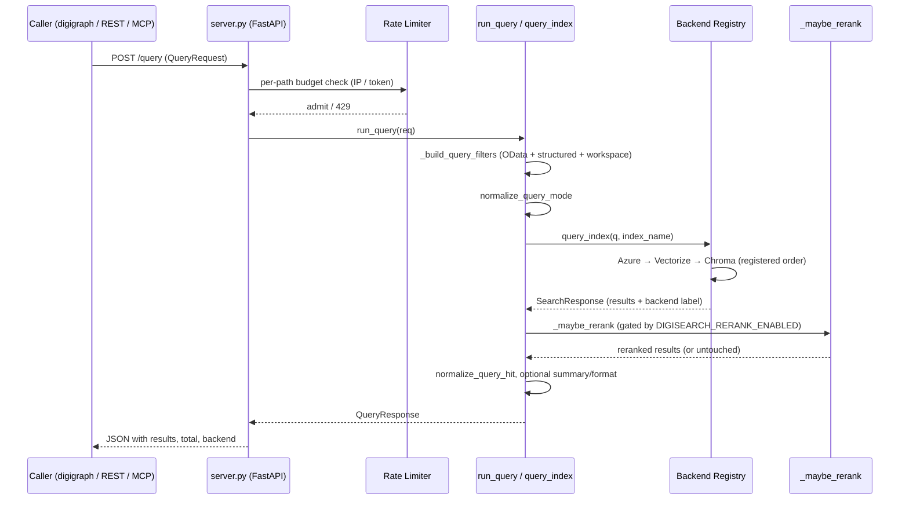
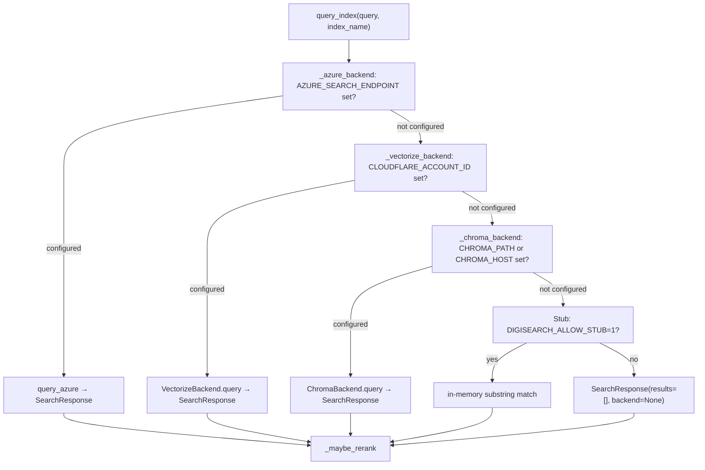
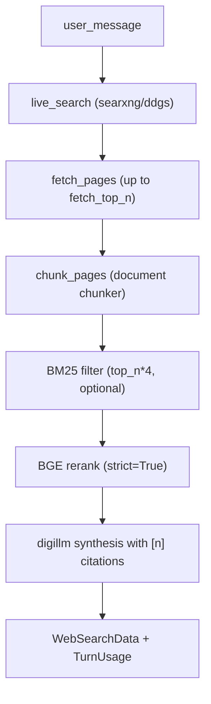

# digisearch Query and Operations

Queries flow through the backend router into normalized hits, with
optional hybrid fusion and reranking before the response. The same
retrieval backs REST, the orchestrator manifest, and MCP.

## Request flow

*Figure: POST /query lifecycle — rate limit, filter build, backend routing, optional rerank, response normalization.*

## Endpoints

- `GET /health` / `GET /healthz` — legacy (returns `{"status":"ok","service":"digisearch"}`) and preferred liveness (`{"ok":true}`), auth-exempt, rate-limit-exempt.
- `GET /azure_status` — Azure AI Search reachability probe; behind `digisearch:query` scope.
- `POST /query` → `QueryResponse` — the core retrieval entry point.
- `POST /ingest`, `POST /ingest/url`, `GET /indexes`, `GET /indexes/{name}`, `DELETE /indexes/{name}/documents/{doc_id}` — writes and index admin.
- `POST /v1/orchestrator_tools` — returns the OpenAI-style tool manifest for digigraph orchestration. Accepts an optional `index_config` to specialize schema descriptions with filterable/result-metadata fields from the deployed index.
- `POST /v1/orchestrator_invoke` — dispatch one of 13 tools by name: `digisearch`, `digisearch_fetch_all`, `digisearch_research_delegate`, `web_search`, `digisearch_web_search`, `digisearch_monitors_trigger`, `digisearch_monitors_runs`, and six `digisearch_websets_*` tools. Each tool is owned and served by digisearch.
- `POST /v1/research_turn` — composite research pipeline (plan → retrieve → aggregate) via LangGraph; supports `source: corpus | web | auto` to optionally route through the web branch.
- `POST /v1/web_search` — first-party web search (searxng → ddgs fallback with fetch + extract enrichment).
- `POST /v1/digisearch_web_search` — EXA-backed live web search (optional; requires `EXA_API_KEY`).
- `POST /v1/web_contents`, `POST /v1/web_answer` — EXA page fetch and grounded answer (optional).
- Monitor and webset routes under `/v1/monitors/*` and `/v1/websets/*`.

## Retrieval behavior

`query_index()` (`search/_stub.py`) routes through registered backends in
order: Azure AI Search, then Cloudflare Vectorize, then ChromaDB. A
configured backend that fails mid-query raises `SearchBackendError` (or
`VectorizeBackendError` for Vectorize); the router does not silently fall
through to a different backend/corpus. Backend-not-configured and missing-dependency
cases return `None`, allowing the router to continue.

The `Query` model accepts three modes — `keyword`, `vector`, `hybrid` —
but Chroma, Vectorize, and the stub coerce `keyword` and `hybrid` to
`vector`-only ANN. `effective_query_mode()` records the coercion in
structured logs and `run_query` logs a warning so callers can detect it.

### Backend routing

*Figure: backend registration order and dispatch. Configured backends that fail propagate errors (no silent fallthrough).*

### Hybrid fusion

`HybridSearcher` (`search/hybrid.py`) runs keyword and vector searches
independently with `top_k * 2` expansion, then fuses results via
Reciprocal Rank Fusion (RRF, k=60). Each chunk's fused score is an
alpha-weighted sum: `alpha * rrf(vec_rank) + (1 - alpha) * rrf(kw_rank)`,
default `alpha=0.6` (vector-biased). The fused list is sorted descending
and truncated to `top_k`.

Note: `HybridSearcher` is a standalone search module; the backend path
(`query_index → Backend.query`) is the primary retrieval pipeline used
by `POST /query` and the orchestrator invoke paths. HybridSearcher
services callers that compose keyword + vector results themselves.

### Reranker

The `Reranker` (`search/reranker.py`) provides an optional cross-encoder
second pass, gated behind `DIGISEARCH_RERANK_ENABLED=1` in `_maybe_rerank()`
(`search/_stub.py`). It is off by default. When enabled:

- **Provider `cohere`**: calls the Cohere `rerank-multilingual-v3.0` model.
  Requires `COHERE_API_KEY`. Failures fall back to the original order.
- **Provider `bge`**: loads `BAAI/bge-reranker-v2-m3` via
  `sentence_transformers.CrossEncoder`. The model is cached per-process
  in `_reranker_by_provider` so it is never reloaded per query. In normal
  (non-strict) mode, failures fall back to the original order. With
  `strict=True`, used by the web-branch ranking path, failures re-raise —
  the web synthesis path refuses to return an unranked cited set.

`Query.skip_rerank` suppresses reranking even when the env flag is on;
`digisearch_fetch_all` sets this so exhaustively paginated partial pages
are never reordered across pages.

The default provider when `DIGISEARCH_RERANK_ENABLED=1` and
`DIGISEARCH_RERANK_PROVIDER` is unset is `bge`.

### Keyword searchers

`search/keyword.py` provides `BM25Searcher` (using `rank_bm25`) and
`TFIDFSearcher` for keyword scoring over a corpus. The web branch uses
`BM25Searcher` as an optional pre-filter before BGE reranking; if
`rank_bm25` is not installed, the filter is skipped and all chunks
pass through to reranking.

## Query request schema

`POST /query` accepts a `QueryRequest` with these key fields:

| Field | Type | Default | Notes |
|-------|------|---------|-------|
| `text` | `str` (min 1) | required | Search query |
| `index_name` | `str` | `"default"` | Index/collection |
| `top_k` | `int` | `10` | 1–100 |
| `mode` | `str` | `"hybrid"` | `keyword` \| `vector` \| `hybrid` |
| `filters` | `list[dict]` | `None` | Structured: `[{field, op, value}]` |
| `filter` | `str` | `None` | Raw OData (gated by `allow_raw_filter`) |
| `columns` | `list[str]` | `None` | Metadata columns |
| `facets` | `list[str]` | `None` | Azure facet expressions |
| `include_facets` | `bool` | `False` | Populate `response.facets` (Azure) |
| `highlight_fields` | `list[str]` | `None` | Azure hit highlighting |
| `highlight_pre_tag` / `_post_tag` | `str` | `None` | Emphasis tags |
| `order_by` | `list[str]` | `None` | Azure sort clauses |
| `skip` | `int` | `0` | Pagination offset |
| `include_total_count` | `bool` | `False` | Full match count |
| `workspace_id` | `str` | `None` | Tenant isolation |
| `skip_rerank` | `bool` | `False` | Suppress optional rerank |
| `format` | `str` | `"default"` | `default` \| `table` |
| `response_mode` | `str` | `"full"` | `full` \| `summary` |
| `summarize_if_over` | `int` | `None` | Auto-summary threshold |

## Filters

Structured filters use `[{field, op, value}]` with operators
`eq`, `ne`, `gt`, `ge`, `lt`, `le`, `in`. They are AND-combined across
clauses. The `filter_validator` module validates OData syntax when the
raw `filter` string path is used. Raw OData is opt-in per index: the
server rejects it upfront with HTTP 400 unless the index config declares
`allow_raw_filter=true` (`_reject_raw_filter_if_disallowed`).

`build_query_filters()` (`core/workspace_filter.py`) merges raw OData,
structured clauses, and an optional `workspace_id` into one filter dict.
When `workspace_id` is set, it is injected as a mandatory structured
`{field: "workspace_id", op: "eq", value: <id>}` clause.

## Orchestrator tool manifest

`POST /v1/orchestrator_tools` returns the tool manifest built by
`build_orchestrator_tool_manifest()` (`orchestrator_tools.py`). It always
includes:

| Tool name | Maps to |
|-----------|---------|
| `digisearch` | `POST /query` corpus search |
| `digisearch_fetch_all` | Exhaustive paginated search |
| `web_search` | First-party `POST /v1/web_search` (searxng/ddgs) |
| `digisearch_monitors_trigger` | Run one monitor watch turn |
| `digisearch_monitors_runs` | List stored monitor run history |
| `digisearch_websets_create` | Create a verified+enriched webset |
| `digisearch_websets_get` | Read webset status + counts |
| `digisearch_websets_add_search` | Add search round to a webset |
| `digisearch_websets_list_items` | Paginated webset items |
| `digisearch_websets_events` | Paginated webset event log |
| `digisearch_websets_export` | Export webset as CSV/JSON |

Additional tools are included conditionally:

- `digisearch_research_delegate` — when `digisearch[agent]` is installed.
- `digisearch_web_search` — when `EXA_API_KEY` is configured (EXA-backed
  live web search with `category`, `output_schema`, offset paging).

Each tool's JSON schema is self-describing and includes filterable field
hints, facet information, and OData guidance from the index config when
provided.

## Web search

### First-party web search (`POST /v1/web_search`)

The first-party web search at `POST /v1/web_search` (`web_search/service.py`)
performs a search with searxng → ddgs fallback, then optionally fetches
and extracts up to `fetch_max_pages` (default 3) pages via `digifetch`.
Configured via:

- `DIGISEARCH_WEB_SEARCH_BACKEND`: `auto` (default), `searxng`, or `ddgs`
- `DIGISEARCH_SEARXNG_URL`: searxng instance URL (default `http://127.0.0.1:8080`)
- `DIGISEARCH_FETCH_ALLOWED_HOSTS`: comma-separated operator-trusted hosts
  exempted from SSRF refusal

Fetch is process-wide rate-limited via a shared `digifetch.RateLimiter`
(default 1s min interval). Provider failures (429, 5xx, timeouts) return
HTTP 200 with a soft `{"ok": false, ...}` envelope (carrying `retryable`
and `status_code` hints) rather than 5xx, so a provider outage cannot
cancel a caller's run.

The `search_web()` public wrapper runs search-only (no fetch enrichment);
it is used by the web branch's live-search seam.

### EXA-backed web search (`POST /v1/digisearch_web_search`)

An alternative live web search via EXA, dormant when `EXA_API_KEY` is not
set. Supports `search_type` (instant, fast, auto, deep-lite, deep,
deep-reasoning), `category` filtering (company, people, publication, news,
etc.), `include_domains`/`exclude_domains`, `output_schema` for structured
synthesis, and client-side offset paging over one enlarged window (EXA
caps at 100 results; a page past the cap is rejected, never silently
truncated).

## Research turn and web branch

`POST /v1/research_turn` and `digisearch_research_delegate` run a LangGraph
pipeline: `plan → route → retrieve|web_retrieve → aggregate|web_aggregate`.

When `source` is `corpus` (default), the pipeline runs corpus retrieval
through `query_index` and aggregates results into RAG-formatted context
with `rag_sources_from_hits()`.

When `source` is `web` or `auto`, the web branch (`agent/web_branch.py`)
executes one round of:

*Figure: web branch retrieve→synthesize. Exactly one search/fetch/rank round per turn. Fail-hard: any error or zero cited pages raises WebResearchError.*

Effort presets (`fast` / `thorough`) control `live_top_n`, `fetch_top_n`,
`cited_top_n`, and `max_synthesis_chars`. An explicit `cited_top_n`
wins over the preset. Fetched pages are never indexed into the corpus.

## MCP server

The MCP server (`mcp_server.py`) runs via `FastMCP` on
`127.0.0.1:8765/mcp` (streamable HTTP by default; port configurable via
`DIGISEARCH_MCP_PORT` or `--port`). It exposes:

- `semantic` — corpus search via `query_index` (or wired client)
- `web_search` — first-party web search via `run_web_search`
- `search_strategies` — typed research-library queries with date/doc_type filters
- `research_turn` — composite LangGraph turn (when `[agent]` installed)
- `exa_web_search` — EXA-backed live search (when `EXA_API_KEY` set)
- `monitors_create_watch`, `monitors_list_watches`, `monitors_trigger_watch`,
  `monitors_list_runs` — web-monitor management (store-backed)
- `websets_create`, `websets_get`, `websets_add_search`, `websets_list_items`,
  `websets_events`, `websets_export` — webset lifecycle

The MCP server fails fast at startup when no real backend is configured
(`DIGISEARCH_ALLOW_STUB` only permits the stub in tests). The `create_mcp_with_indexes`
seam allows wiring a digisearch client for tool calls.

## Rate limiting and auth

A per-path in-memory rate limiter (`server.py`, `rate_limit` middleware)
runs before `DigiAuthMiddleware` and is the outermost application
middleware. Budgets:

| Path | Budget |
|------|--------|
| `/query` | 10 req / 60s |
| `/ingest` | 30 req / 60s |
| `/v1/research_turn` | 10 req / 60s |
| `/v1/orchestrator_tools` | 30 req / 60s |
| `/v1/orchestrator_invoke` | 10 req / 60s |
| Per-watch triggers (e.g. `/v1/monitors/{id}/trigger`) | 10 req / 60s |
| Per-watch reads | 30 req / 60s |
| Webset creation/refresh paths | 10 req / 60s |
| Other webset paths | 30 req / 60s |
| Unknown paths | 30 req / 60s |

Callers presenting a bearer token get a 6× budget multiplier (keyed on
the SHA-256 hash of the token, not the raw credential), plus a per-IP
ceiling at the same multiplier to bound token-rotating clients. Both
multipliers are env-configurable via `DIGISEARCH_AUTH_RATE_LIMIT_MULTIPLIER`
and `DIGISEARCH_IP_CEILING_MULTIPLIER`. The limiter can be disabled with
`DIGI_DISABLE_RATE_LIMIT=1`.

`DigiAuthMiddleware` enforces `digisearch:query` or `digisearch:ingest`
scopes on new endpoints. `POST /v1/monitors/exa_webhook` is the single
auth-exempt route (EXA authenticates via per-watch stored secret).

## Container and operations

The Compose service binds `127.0.0.1:8002` with a `/healthz` healthcheck.
The MCP profile serves `:8765/mcp`. Key environment variables:

- `DIGISEARCH_CHUNKER`, `DIGISEARCH_INDEX` — chunker selection, default index name
- `CHROMA_PATH`, `CHROMA_HOST`, `CHROMA_PORT` — ChromaDB connection
- `AZURE_SEARCH_ENDPOINT`, `AZURE_SEARCH_API_KEY`, `AZURE_SEARCH_INDEX_NAME` — Azure AI Search
- `CLOUDFLARE_ACCOUNT_ID`, `CLOUDFLARE_API_TOKEN` — Cloudflare Vectorize (shared account/token with D1; legacy `VECTORIZE_*` env names still accepted)
- `DIGISEARCH_EMBEDDING_PROVIDER`, `DIGISEARCH_EMBEDDING_MODEL` — embedding provider/model selection
- `DIGISEARCH_RERANK_ENABLED`, `DIGISEARCH_RERANK_PROVIDER` — optional rerank gate (off by default)
- `COHERE_API_KEY` — required for Cohere rerank provider
- `DIGISEARCH_WEB_SEARCH_BACKEND`, `DIGISEARCH_SEARXNG_URL` — first-party web search config
- `EXA_API_KEY` — EXA-backed web search (optional)
- `DIGISEARCH_SYNTHESIS_MODEL` — digillm model for grounded web synthesis
- `DIGISEARCH_FETCH_ALL_DEFAULT_MAX`, `DIGISEARCH_FETCH_ALL_HARD_CEILING` — fetch-all result caps (default 2000, max 10000)
- `DIGISEARCH_MONITORS_DB` — monitor store path
- `DIGI_DISABLE_RATE_LIMIT` — set to `1`/`true`/`yes` to disable rate limiting
- `DIGISEARCH_ALLOW_STUB` — `1` to enable in-memory stub (tests only)

Standard digibase middleware (metrics at `/metrics`, CORS, request-ID,
structured error envelopes, optional OTel) applies to the FastAPI app.
