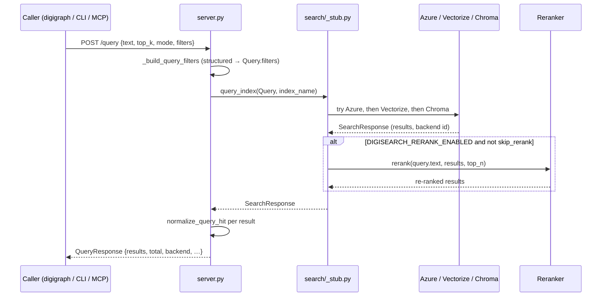
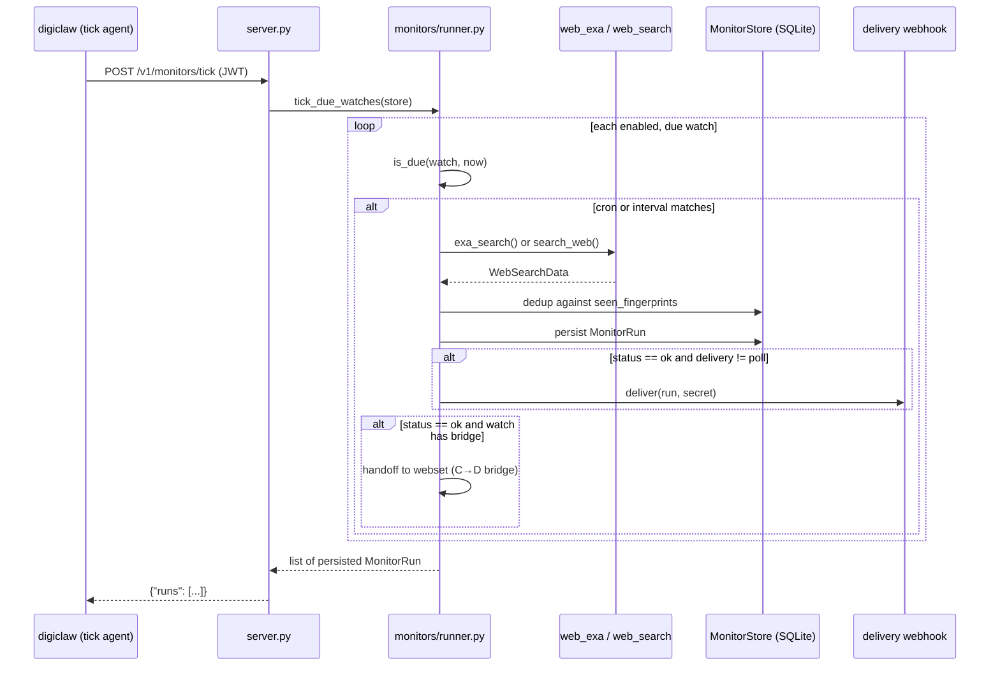

# digisearch Query and Operations

Queries flow through the backend router into normalized hits, with optional
hybrid fusion and reranking before the response. The same retrieval backs REST,
the orchestrator manifest, and MCP. Monitors, websets, and web search are
first-party surfaces served by the same FastAPI process.

## Query flow



*Query request through backend registry and optional rerank second pass.*

## Endpoints

### Health and diagnostics

- `GET /health` — legacy liveness, returns `{"status":"ok","service":"digisearch"}`.
- `GET /healthz` — preferred liveness probe, returns `{"ok":true}`. Auth-exempt and
  rate-limit-exempt.
- `GET /azure_status` — Azure AI Search config and reachability probe. Calls
  `get_document_count()` to verify the connection. Stays behind `digisearch:query`
  scope via `DigiAuthMiddleware`.

### Retrieval

- `POST /query` → `QueryResponse` — the retrieval entry point. Accepts
  `QueryRequest` with `text`, `top_k` (1–100), `mode` (keyword|vector|hybrid),
  structured `filters`, optional raw `filter` (OData, gated per-index via
  `allow_raw_filter`), `facets`, `columns`, `order_by`, `skip`/`include_total_count`
  for pagination, `response_mode` (full|summary), `format` (default|table), and
  `workspace_id` for tenant isolation. Rate limit: 10 req/min per IP.

- `POST /v1/research_turn` → `ResearchTurnOutput` — composite LangGraph research
  turn (`plan → retrieve → aggregate`, or `plan → web_retrieve → web_aggregate`
  when `source` is `web`|`auto`). Requires `digisearch[agent]`. Supports
  `effort` (fast|thorough) and `output_schema` for structured synthesis on the
  web branch. Rate limit: 10 req/min.

### Orchestrator tools (digigraph federated surface)

- `POST /v1/orchestrator_tools` → `OrchestratorToolsResponse` — returns
  OpenAI-style tool definitions owned by digisearch. Tools included depend on
  available extras: `digisearch_research_delegate` when `[agent]` is installed,
  `digisearch_web_search` when `EXA_API_KEY` is set. Rate limit: 30 req/min.

- `POST /v1/orchestrator_invoke` → `OrchestratorInvokeResponse` — dispatches
  one named tool. Supported tools: `digisearch`, `digisearch_fetch_all`,
  `digisearch_research_delegate`, `web_search`, `digisearch_web_search`,
  `digisearch_monitors_trigger`, `digisearch_monitors_runs`, and six
  `digisearch_websets_*` tools. Rate limit: 10 req/min.

### Web search

- `POST /v1/web_search` → `WebSearchResponse | WebSearchErrorResponse` — first-party
  web search via SearXNG→DuckDuckGo with fetch+extract enrichment. Backend order
  controlled by `DIGISEARCH_WEB_SEARCH_BACKEND` (auto|searxng|ddgs). Provider
  failures return HTTP 200 with a soft `{ok: false, error, retryable, status_code}`
  envelope. Rate limit: 30 req/min (default).

- `POST /v1/digisearch_web_search` → `WebSearchData` — EXA live web search
  (dormant without `EXA_API_KEY`). Supports `search_type` (instant|fast|auto|
  deep-lite|deep|deep-reasoning), client-side `offset` paging, `output_schema`,
  and domain filtering. Rate limit: 30 req/min (default).

- `POST /v1/web_contents` — fetch known URLs via EXA contents. Dormant without
  `EXA_API_KEY`.

- `POST /v1/web_answer` — grounded answer from the live web via EXA. Dormant
  without `EXA_API_KEY`.

### Ingest and index admin

- `POST /ingest`, `POST /ingest/url`, `GET /indexes`, `GET /indexes/{name}`,
  `DELETE /indexes/{name}/documents/{doc_id}`. Documented on the ingest page.

## Retrieval behavior

### Backend routing

`query_index()` in `search/_stub.py` routes queries through registered backends
in order: **Azure AI Search**, then **Cloudflare Vectorize**, then **ChromaDB**.
Each backend returns `SearchResponse | None` — `None` means "not configured,
try next." A configured backend that fails raises `SearchBackendError` or
`VectorizeBackendError`, which propagates to the caller instead of silently
falling through to a different corpus.

The in-memory stub runs only when `DIGISEARCH_ALLOW_STUB=1` (tests only).

### Hit normalization

`normalize_query_hit()` maps every backend's result shape to the standard JSON
form with evidence metadata, content preview (capped at 500 characters), and
backend attribution.

### Hybrid fusion (RRF, k=60)

`HybridSearcher` fuses keyword and vector rankings with Reciprocal Rank
Fusion (`k=60`). It expands each search to `top_k * 2` candidates, scores
each result with `alpha` weighting (default 0.6 for vector), merges, and
returns the top `k` ranked hits. This is available as a composable searcher
but the production query path uses backend-native retrieval — `mode=hybrid`
on Chroma or Vectorize is coerced to vector-only ANN.

### Reranker second pass

`Reranker` reorders initial results with a cross-encoder, wired into
`query_index()` behind `DIGISEARCH_RERANK_ENABLED` (default off). Providers:

- **bge** (default) — `BAAI/bge-reranker-v2-m3` via `sentence_transformers.CrossEncoder`.
  Installed with `digisearch[rerank]`.
- **cohere** — `rerank-multilingual-v3.0` via the Cohere SDK. Requires
  `COHERE_API_KEY`.

Set `DIGISEARCH_RERANK_PROVIDER=bge|cohere` to choose. `digisearch_fetch_all`
sets `Query.skip_rerank=True` on every page so partial pages are never
reordered.

### Filters

Callers pass structured `filters: list[dict]` with `[{field, op, value}]`.
Raw OData `filter` strings require the `allow_raw_filter` flag on the target
index — the server rejects it upfront with HTTP 400 otherwise.
`workspace_id` is injected as a mandatory structured filter for tenant isolation.

### Query mode coercion

Chroma and Vectorize do not support BM25 natively. When `mode=keyword` or
`mode=hybrid` is requested against those backends, the effective mode is
coerced to vector-only ANN and logged.

## Rate limiting

Identity-aware rate limiting runs as FastAPI middleware before
`DigiAuthMiddleware`. Per-path budgets:

| Path | Anonymous | Token-bearing (×6) |
|------|-----------|-------------------|
| `/query` | 10/60s | 60/60s |
| `/ingest` | 30/60s | 180/60s |
| `/v1/research_turn` | 10/60s | 60/60s |
| `/v1/orchestrator_tools` | 30/60s | 180/60s |
| `/v1/orchestrator_invoke` | 10/60s | 60/60s |
| `/v1/monitors` statics | 30/60s | 180/60s |
| `/v1/monitors/tick` | 10/60s | 60/60s |
| `/v1/monitors/exa_webhook` | 10/60s | 60/60s |
| `/v1/websets` | 10/60s | 60/60s |

Per-watch routes (`/v1/monitors/{watch_id}/trigger`, `/runs`, etc.) and
per-webset routes are matched by regex patterns with two-tier budgets:
trigger/tick/webhook and creation surfaces 10/min, CRUD and read surfaces
30/min.

Anonymous callers are limited per IP. Token-bearing callers get a larger budget
keyed on the SHA-256-hashed bearer token (the raw token is never stored).
A coarse per-IP ceiling (`DIGISEARCH_IP_CEILING_MULTIPLIER`, default 6)
prevents token-rotation abuse. `/health` and `/healthz` are exempt. Set
`DIGI_DISABLE_RATE_LIMIT=1` to disable (tests only). The `testclient` IP is
also exempt.

## Monitors API

Monitors (Phase C, #4065) are scheduled web-search watches with recall, dedup,
persist, delivery, and optional bridge handoff to websets.

### Core flow



*Scheduled monitor turn: recall, dedup, persist, deliver, bridge.*

### Watch lifecycle

- **`POST /v1/monitors`** — create a watch. `backend="exa"` provisions a remote
  EXA monitor first and persists the EXA-returned `webhookSecret` as the delivery
  secret; `backend="oss"` mints a local secret. The response carries the one-time
  delivery secret.
- **`GET /v1/monitors`** — list watches newest-updated first, optionally scoped
  by `workspace_id`.
- **`GET /v1/monitors/{watch_id}`** — load one watch. The delivery secret is
  never part of a watch body.
- **`PATCH /v1/monitors/{watch_id}`** — partial update. `backend` and
  `exa_monitor_id` are immutable. `{"rotate_delivery_secret": true}` mints a new
  secret (refused for EXA-backed watches, whose secret is EXA's `webhookSecret`).
- **`DELETE /v1/monitors/{watch_id}`** — delete a watch; run history is retained.
  EXA-backed watches trigger best-effort remote monitor teardown.

### Trigger and runs

- **`POST /v1/monitors/{watch_id}/trigger`** — run one watch turn now
  (`mode: manual|poll`). A failed turn is persisted and returned with 201.
- **`GET /v1/monitors/{watch_id}/runs`** — page run history newest-first
  (`limit`, `cursor`).
- **`GET /v1/monitors/{watch_id}/runs/{run_id}`** — load one stored run.

### Scheduled tick

- **`POST /v1/monitors/tick`** — evaluates every enabled watch (cron or interval)
  with `is_due` and runs the due ones. Per-watch failures are isolated so one
  broken watch never aborts the tick. Datatap-scoped watches are skipped. Called
  by digiclaw's `web-watch-tick` agent (continuous, 60s).

### EXA webhook

- **`POST /v1/monitors/exa_webhook`** — auth-exempt but per-watch-secret-gated.
  Resolves the watch by matching the nested envelope's `data.monitorId` against
  stored `Watch.exa_monitor_id`. Verifies `exa-signature: t=<unix>,v1=<hex>`
  (HMAC-SHA256 with ±300s tolerance). Non-terminal deliveries are acked 200
  without persisting; terminal deliveries are translated into `MonitorRun` and
  persisted (201 on first store, idempotent 200 on redelivery).

### Runner internals

`run_watch` runs in-process (no loopback HTTP): `web_exa.exa_search` when
`EXA_API_KEY` is configured, else `web_search/service.py::search_web` with
`recency_days=None` (monitors must not inherit the default 7-day window) and
`max_results` clamped to 10. Results are deduped against
`MonitorStore.seen_fingerprints`, the run is persisted append-only, and delivery
fans out only for `ok` runs with `delivery_mode != poll`. Research mode
(`answer_mode="research"`) runs the full Phase B research turn and stores a
`MonitorDigest`.

Fail-hard: any recall exception persists `status="failed"` and re-raises
`MonitorRunError`. A delivery-enabled watch with a missing secret fails just
as loudly — never a silent skip.

## Websets API

Websets (Phase D, #4066) are verified + enriched datasets built from web search
results. All routes are thin handlers over the `digisearch.websets.service`
facade.

- **`POST /v1/websets`** — create a webset with initial search generation.
  Returns 202; the run is scheduled asynchronously.
- **`GET /v1/websets/{webset_id}`** — load one webset (status, search
  generations, enrichment defs).
- **`POST /v1/websets/{webset_id}/searches`** — attach a follow-up search
  generation (202, async).
- **`GET /v1/websets/{webset_id}/items`** — page items newest-first
  (`verification`, `limit`, `cursor`).
- **`POST /v1/websets/{webset_id}/enrichments`** — attach an enrichment def
  (max 10 active). Returns 201.
- **`DELETE /v1/websets/{webset_id}/enrichments/{enrichment_id}`** — detach
  an enrichment (204).
- **`POST /v1/websets/{webset_id}/monitors`** — record a tick-driven refresh
  cadence (201).
- **`GET /v1/websets/{webset_id}/monitors`** — list monitors newest-created
  first.
- **`PATCH /v1/websets/{webset_id}/monitors/{monitor_id}`** — pause or resume
  scheduled refreshes.
- **`POST /v1/websets/{webset_id}/monitors/{monitor_id}/trigger`** — manual
  refresh (202).
- **`GET /v1/websets/{webset_id}/events`** — page the append-only event log
  oldest-first.
- **`POST /v1/websets/{webset_id}/webhooks`** — register a webhook; the
  server-generated secret appears in this response only (201).
- **`POST /v1/websets/{webset_id}/webhooks/{webhook_id}/rotate`** — rotate
  the webhook secret with a 24h overlap.
- **`POST /v1/websets/{webset_id}/cancel`** — cancel a webset; the runner
  settles every non-terminal search as `cancelled`.
- **`GET /v1/websets/{webset_id}/export`** — export verified items as CSV (via
  polars) or JSON (with per-field citations).

The webset task driver is installed as the FastAPI lifespan (`webset_task_lifespan`)
and shared with the MCP server. The driver's `TaskGroup` wraps the HTTP serving
window so scheduled runs and backfills are cancelable at shutdown. Routes return
immediately (202/201); the runner executes asynchronously.

Stable error codes include `webset_not_found` (404), `invalid_criteria` (422),
`enrichment_limit_exceeded` (400), `webset_terminal` (409), and others.
Store-internal invariants map to `internal_error` (500) and are never surfaced
to callers.

## Web search service

`POST /v1/web_search` and the orchestrator `web_search` tool share
`run_web_search()` in `web_search/service.py`. The flow:

1. **Search** — `_search_only()` tries backends in order. `auto` tries SearXNG
   first, then DuckDuckGo. Explicit `searxng`/`ddgs` runs only that backend and
   fails closed. Every backend failure is collected so the raised
   `WebSearchProviderError` names each backend and its error.

2. **Fetch enrichment** — up to `fetch_max_pages` (default 3) hits are fetched
   via digifetch (`HttpFetcher` + `with_retry` + `RateLimiter`) and extracted to
   markdown (trafilatura primary, readability fallback). The fetch is
   SSRF-guarded: only http/https, internal/metadata addresses refused, redirect
   hops re-validated. Operator allowlist via `DIGISEARCH_FETCH_ALLOWED_HOSTS`.

3. **Response** — fetch/extract failures keep the original search snippet and
   are logged; enrichment never fails the whole response.

The process-wide fetch throttle serializes on `RateLimiter.acquire()` with a
configurable `min_interval_s` (default 1.0s).

## MCP server

The MCP server (`mcp_server.py`) exposes digisearch tools via FastMCP on
`streamable-http` transport at `127.0.0.1:8765` (Docker profile
`digisearch-mcp`, or `digisearch mcp` CLI).

### Tools

| Tool | Description | Requires |
|------|-------------|----------|
| `semantic` | Document search over the corpus | — |
| `web_search` | First-party web search (SearXNG→DDGS) | `digisearch[web-search]` |
| `search_strategies` | Research-library search with date/doc_type filters | — |
| `research_turn` | Composite research turn with citations | `digisearch[agent]` |
| `exa_web_search` | EXA live web search with client-side paging | `EXA_API_KEY` |
| `monitors_create_watch` | Create a scheduled web-search watch | Monitor store |
| `monitors_list_watches` | List scheduled watches | Monitor store |
| `monitors_trigger_watch` | Run one watch turn now | Monitor store |
| `monitors_get_runs` | List stored runs for one watch | Monitor store |
| `websets_create` | Create a verified + enriched dataset | Webset store |
| `websets_get` | Webset status + item counts | Webset store |
| `websets_add_search` | Attach a follow-up search generation | Webset store |
| `websets_list_items` | List webset items as text | Webset store |
| `websets_events` | Tail the webset event log | Webset store |
| `websets_export` | Export verified items as CSV/JSON | Webset store |

The MCP server shares the webset task driver with the HTTP lifespan: concurrent
streamable-http MCP client sessions share one per-process install,
reference-counted across invocations.

### Transport

Default transport is `streamable-http` on `127.0.0.1:8765`. Override with
`DIGISEARCH_MCP_HOST` and `DIGISEARCH_MCP_PORT`. The server fails closed at
startup if no real search backend is configured (calls
`require_real_search_backend()`).

## Operations

### Container

The Dockerfile exposes port `8002` and runs uvicorn:
```dockerfile
CMD ["uvicorn", "digisearch.server:app", "--host", "0.0.0.0", "--port", "8002"]
```

In Docker Compose, the service binds the internal network at
`http://digisearch:8002`. The `/healthz` endpoint serves as the healthcheck.

### Key environment variables

| Variable | Purpose |
|----------|---------|
| `DIGISEARCH_INDEX` | Default index/collection name (default: `default`) |
| `DIGISEARCH_CHUNKER` | Chunker selection: `semantic` (default), `recursive`, etc. |
| `AZURE_SEARCH_ENDPOINT` | Azure AI Search service URL |
| `AZURE_SEARCH_API_KEY` | Azure AI Search admin key |
| `AZURE_SEARCH_INDEX_NAME` | Azure index name |
| `CHROMA_PATH` | ChromaDB persistence directory |
| `CHROMA_HOST` | ChromaDB HTTP host (server mode) |
| `CHROMA_PORT` | ChromaDB HTTP port (default: `8000`) |
| `CLOUDFLARE_ACCOUNT_ID` | Cloudflare account (Vectorize, canonical name) |
| `CLOUDFLARE_API_TOKEN` | Cloudflare API token (Vectorize, canonical name) |
| `DIGISEARCH_RERANK_ENABLED` | Enable reranker second pass (default: off) |
| `DIGISEARCH_RERANK_PROVIDER` | `bge` (default) or `cohere` |
| `COHERE_API_KEY` | Cohere API key for cohere reranker |
| `DIGISEARCH_ALLOW_STUB` | Enable in-memory stub (tests only) |
| `DIGISEARCH_WEB_SEARCH_BACKEND` | `auto` (default), `searxng`, or `ddgs` |
| `DIGISEARCH_SEARXNG_URL` | SearXNG sidecar URL (default: `http://127.0.0.1:8080`) |
| `DIGISEARCH_FETCH_ALLOWED_HOSTS` | Operator allowlist for web fetch SSRF guard |
| `DIGISEARCH_FETCH_ALL_DEFAULT_MAX` | Default max results for fetch_all (default: `2000`) |
| `DIGISEARCH_FETCH_ALL_HARD_CEILING` | Hard ceiling for fetch_all (default: `10000`) |
| `DIGISEARCH_MONITORS_DB` | Monitor store path (falls back to `{DIGI_WORKSPACE}/.digisearch/monitors.sqlite3`) |
| `DIGISEARCH_WEBSETS_DB` | Webset store path (falls back to `{DIGI_WORKSPACE}/.digisearch/websets.sqlite3`) |
| `DIGISEARCH_CACHE_PATH` | Embedding cache SQLite path (default: `.digisearch_embed_cache.db`) |
| `DIGISEARCH_MCP_HOST` | MCP server bind host (default: `127.0.0.1`) |
| `DIGISEARCH_MCP_PORT` | MCP server bind port (default: `8765`) |
| `EXA_API_KEY` | EXA API key for live web search and EXA-backed monitors |
| `DIGI_WORKSPACE` | Workspace root for store path resolution |
| `DIGI_DISABLE_RATE_LIMIT` | Set `1` to disable rate limiting (tests only) |

Embedding provider keys (`OPENAI_API_KEY` etc.) are documented on the ingest
page. Standard digibase middleware (metrics, CORS, request-ID, error envelopes,
optional OTel) applies to all routes.
