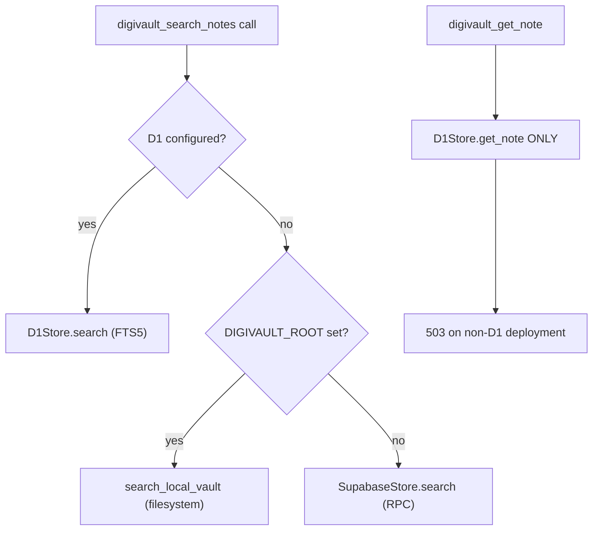

# digivault Architecture

digivault (port 8004) manages an Obsidian-style markdown vault —
frontmatter, `[[wikilinks]]`, backlinks, tags, folder taxonomy — first
consumed by the project's own `docs/vision/`. It splits into a
**pure-Python core library** (no FastAPI, side-effect-free on import) and
a thin **service layer** (FastAPI + MCP + CLI) behind the `[service]`
extra. The core depends only on `pydantic>=2` and `pyyaml>=6`; the
service reuses `digikey` and `digibase` without modifying them.

An import-cost guard test enforces this boundary: `import digivault` must
never pull FastAPI, uvicorn, mcp, or typer into `sys.modules`. Service
deps live in the `[service]` extra (FastAPI, uvicorn, mcp `<2`, typer,
httpx); the `[supabase]` extra gates that backend. Auth, tracing, metrics,
and error envelopes reuse `digikey` + `digibase`.

## Module map

| Module | Responsibility |
|--------|----------------|
| `models.py` | Pydantic v2 result types: `Note`, `LinkRef`, `NoteRow`, `NoteDetail`, `VaultSearchHit`, `LintReport`, `VaultConfig`, `ValidationIssue` — never bare dicts |
| `vault.py` | `Vault` / `FilesystemStore`: in-memory index over a directory of `*.md` notes — link graph, backlinks, tag index; maintenance ops: `create_note`, `write_note` (upsert), `rename` with inbound-`[[wikilink]]` rewrite, `set_frontmatter`, `reindex`, `lint(scope=…)`, `prune_children`, `neighbors`; `from_sources` builds a read-only vault from `(rel_path, text)` pairs |
| `store.py` | `VaultStore` protocol (`list_notes`, `read_text`, `backlinks`, `search_by_tag`, `neighbors`, `reindex`, `create_note`, `set_frontmatter`, `rename`) — implemented by `FilesystemStore` and `PostgresStore` |
| `postgres_store.py` | `PostgresStore` — read/write `knowledge_notes` filtered by a `vault` namespace column; backlinks/tags from dedicated columns, no markdown parse at serve time; `reindex` pages with `.range()` to avoid PostgREST's max-rows cap |
| `frontmatter.py` | Round-trip-safe YAML `split_frontmatter` / `dump_frontmatter` / `set_keys` using PyYAML; `split(dump(fm, body)) == (fm, body)` exactly |
| `wikilinks.py` | Parse `[[note]]` / `[[note#heading\|alias]]` / `![[embed]]`; `rewrite_target` and `map_targets` rewrite links while masking code spans and fenced code blocks |
| `local_search.py` | Filesystem keyword search with English stopword filtering; returns `VaultSearchHit` rows; no network dependency |
| `supabase_store.py` | `SupabaseStore` — reconstruct vault from Supabase rows via `Vault.from_sources`; FTS search via RPC |
| `d1_store.py` | `D1Store` — read-only Cloudflare D1 REST client: FTS5 `search`, `get_note` (by exact `vault_path`), paginated `list_notes`; one database per corpus; `query()` retries up to 3 attempts with exponential backoff + jitter on 429/5xx/401; `resolve_path_prefix` is public (shared with `server.py`) |
| `d1_errors.py` | `D1StoreError(RuntimeError)` — isolated so it stays importable even when `d1_store.py` fails to import |
| `tool_dispatch.py` | **Canonical vault tool routing.** Owns every tool name (`DISPATCH_TOOL_NAMES`), the vault-local handler table (`VAULT_HANDLERS`), and MCP registration (`register_mcp_tools`); runtime-only tools register via `register_runtime_handler` from `server.py` |
| `orchestrator_tools.py` | OpenAI-style tool manifest fetched by digigraph; tool names re-exported from `tool_dispatch.py` |
| `path_scopes.py` | digikey scope policy: `digivault:read` for reads and `orchestrator_invoke` (one mutating tool, `create_note`, enforces `digivault:write` itself); `POST /v1/notes/by-path` is read-scoped despite being POST |
| `tenant_scope.py` | Binds a caller-supplied `path_prefix` to the tenant named in their verified JWT via `DIGI_TENANT_CORPUS_MAP`; complementary to digigraph's own fix — closes the direct-API bypass leg |
| `mcp_server.py` | Thin transport wrapper; tools register exclusively via `tool_dispatch.register_mcp_tools`; dedicated `Dockerfile.mcp` |
| `server.py` | FastAPI app: health, status, note CRUD, lint, backlinks, tags, orchestrator endpoints, `POST /v1/notes/by-path` |
| `cli.py` | `digivault init|lint|reindex|new-note` |

## Core library public API

```python
from digivault import (
    Vault, FilesystemStore, VaultStore, VaultError, VaultConfig,
    Note, LinkRef, LintReport, ValidationIssue,
    parse_links, rewrite_target,
    split_frontmatter, dump_frontmatter, set_keys,
)
```

The `__init__.py` re-exports exactly these symbols; importing `digivault`
pulls in only `pydantic` and `pyyaml`.

## Safety invariants

**Write-path sandboxing.** Every write goes through `Vault._safe_path`,
which resolves the relative path under `self.root` and refuses any
candidate that escapes the vault root (path traversal or absolute
escapes). `PostgresStore` uses a `vault` namespace column for equivalent
isolation. `tool_dispatch.resolve_vault_prefix` provides an additional
defense-in-depth layer: `..`, `.`, and leading-dot components are refused
at the prefix level before they reach `_safe_path`.

**Frontmatter round-trip.** `split_frontmatter(dump_frontmatter(fm, body))`
produces an identical `(fm, body)` pair — the serializer places no extra
newline after the closing `---` fence, so the body is appended verbatim and
the split/parse sees exactly the original.

**Wikilink code masking.** `rewrite_target` and `map_targets` blank out
fenced code blocks and inline code spans (length-preserving) before
matching `[[...]]` patterns, so example wikilinks in documentation are
never rewritten.

**Single tool registry.** All digivault tool names live in
`tool_dispatch.DISPATCH_TOOL_NAMES`. Vault-local handlers are in
`VAULT_HANDLERS`; runtime-only tools (`digivault_search_notes`,
`digivault_get_note`) register via `register_runtime_handler` from
`server.py`. Both `mcp_server` and `server.orchestrator_invoke` route
through `dispatch_vault_tool` / `register_mcp_tools` — no duplicate
handler tables. `register_mcp_tools` returns `mcp_tool_names()`, and tests
assert the MCP and orchestrator surfaces stay aligned.

**Scoped reads and writes.** `Vault.lint(scope=…)` restricts duplicate-stem
detection to in-scope paths only — a caller scoped to one corpus cannot
learn of a note's existence in another corpus. `create_note` passes
`scope` to bind the collision check, so a stem that exists only outside
the prefix neither blocks the write nor leaks its existence.

## Store precedence

Search and by-path fetch follow a strict precedence chain:



*D1 configured* means the Cloudflare credential pair
(`CLOUDFLARE_ACCOUNT_ID`/`CLOUDFLARE_API_TOKEN`, with legacy fallback
names) plus `D1_DATABASE_MAP` are all present. When any are missing but
not all, `_d1_configured()` raises `D1StoreError` — partial config is
treated as an unambiguous operator error, never silently falling through to
a lower tier.

D1 **wins even when `DIGIVAULT_ROOT` is also set**, because the D1 check
runs first. The local filesystem path is only reached when D1 is genuinely
unconfigured (zero D1-related env vars set).

`digivault_get_note` (and `POST /v1/notes/by-path`) is D1-only with no
local or Supabase fallback — a by-path fetch only makes sense against the
corpus that owns the path, and each corpus is a separate D1 database.

## Tool dispatch model

```mermaid
sequenceDiagram
    participant D as digigraph
    participant S as server.orchestrator_invoke
    participant TD as tool_dispatch
    participant V as Vault

    Note over D, V: Orchestrator invoke (HTTP)
    D->>S: POST /v1/orchestrator_invoke {tool, args}
    S->>TD: dispatch_vault_tool(tool, args, vault)
    alt vault-local tool (tag/backlinks/lint/create_note)
        TD->>V: handler(vault, args)
        V-->>TD: ToolDispatchResult
    else runtime tool (search_notes/get_note)
<!-- openwiki: broken internal link [args, request] file "args, request" does not exist. Fix the href or restore the target, then delete this comment. -->
        S->>S: _RUNTIME_HANDLERS[tool](args, request)
    end
    S-->>D: OrchestratorInvokeResponse

    Note over D, V: MCP (streamable HTTP)
    D->>TD: register_mcp_tools(mcp, open_vault)
    TD->>TD: wraps each VAULT_HANDLERS entry as @mcp.tool
    TD-->>D: mcp_tool_names()
```

**Vault-local tools** (`digivault_search_tag`, `digivault_backlinks`,
`digivault_lint`, `digivault_create_note`) operate on an open `Vault`
instance. Their handlers live in `VAULT_HANDLERS` in `tool_dispatch.py`.
MCP registration wraps each handler as a `@mcp.tool` with a clean surface
name (`search_tag`, `backlinks`, `lint`, `create_note`) — digigraph
prefixes the operator server id to get `digivault_search_tag`.

**Runtime-only tools** (`digivault_search_notes`, `digivault_get_note`)
need D1/HTTP/tenant context and are registered by `server.py` at import
time via `register_runtime_handler`. They are not MCP-exposed (except
`search_notes` which has its own MCP surface in `register_mcp_tools`).

**Path prefix scoping.** Vault-local handlers honour an optional
`path_prefix` argument (injected by digigraph's MCP client as
`setup.path_prefix`, or passed by a direct caller): reads are filtered
beneath that subdirectory, `create_note` writes beneath it, and `lint`
scopes duplicate detection inside it. `resolve_vault_prefix` normalizes
the prefix and refuses `..`/leading-dot components.

**Orchestrator tool manifest.** `orchestrator_tools.py` builds the
OpenAI-style manifest that digigraph fetches via
`POST /v1/orchestrator_tools`. Tool names are re-exported from
`tool_dispatch.py` (canonical source), never redefined as string literals.

## Tenant scoping

digivault enforces tenant isolation at two independent layers:

**Layer 1: `tenant_scope.enforce_tenant_path_prefix`.** Binds a
caller-supplied `path_prefix` to the tenant named in their verified JWT
(`request.state.digi_auth.tenant_slug`) via `DIGI_TENANT_CORPUS_MAP`. A
mismatch → 403. This is complementary to digigraph's own overwrite of
model-supplied `path_prefix` — it protects the direct-API call leg where a
caller talks to digivault without going through digigraph.

**Layer 2: Filesystem tenant isolation (`_open_scoped_vault`).**
Filesystem note routes carry no caller-supplied `path_prefix`, so the
tenant's own mapped prefix is resolved from `DIGI_TENANT_CORPUS_MAP` and
the vault is opened at `<DIGIVAULT_ROOT>/<tenant prefix>` — the filesystem
analogue of D1's one-database-per-corpus isolation. Writes cannot escape
the tenant subtree because it *is* the vault root.

**Failure modes.** When `DIGI_TENANT_CORPUS_MAP` is genuinely unset,
tenant binding is a no-op (single-tenant deployments are unchanged). Once
set, enforcement fails closed:
- Tenant not in the map → 403.
- Map set but unusable (bad JSON, zero usable entries) → 503 — a broken
  multi-tenant config is never silently treated as "no config was
  requested."
- A prefix that would resolve outside `DIGIVAULT_ROOT` → 503.

**Known residual dependency.** `tenant_slug` is only as trustworthy as
`DigiAuthMiddleware` makes it — today, an empty JWT `tenant_slug` claim
falls back to an unsigned `X-Digi-Tenant` header with no signal
distinguishing a verified claim from a header override. This is not
reachable through digikey's issuance API (both grant types require a
non-empty `tenant_slug`), but a CLI-issued key with `--tenant ""` could
create it. Tracked as #2303; digivault's enforcement is only as strong as
an invariant it cannot itself verify.

## Service topology

- **Port 8004**, host-loopback-bound, under the dedicated `digivault`
  Compose profile.
- **Auth:** digikey JWT via `DigiAuthMiddleware`; `digivault:read` for
  reads and `orchestrator_invoke` (except `create_note` which enforces
  `digivault:write` in the handler); `digivault:write` for mutating
  routes. `/healthz`, `/v1/status`, `/metrics`, OpenAPI are auth-exempt.
- **Rate limiting:** per-IP sliding window — `orchestrator_invoke` 10/min,
  `orchestrator_tools` 30/min, other routes 30/min. Disable with
  `DIGI_DISABLE_RATE_LIMIT=1`.
- **Vault root:** `DIGIVAULT_ROOT` required for filesystem-backed routes
  (503 when unset). `POST /v1/notes/by-path` is D1-only and needs no
  `DIGIVAULT_ROOT`. Single HTTP requests build a fresh vault for
  cross-process correctness; `POST /v1/notes/batch` opens it once for
  linear bulk ingest.
- **MCP transport:** `python -m digivault.mcp_server` — streamable HTTP
  (default `127.0.0.1:8769`) or stdio. Requires `DIGIVAULT_ROOT`.
  Write tools are gated behind `DIGIVAULT_MCP_WRITE=1`.

## Extension points

- **New vault store:** implement the `VaultStore` protocol in `store.py`
  and add it to both `FilesystemStore` and `PostgresStore` callers.
- **New vault-local tool:** add a `TOOL_VAULT_*` constant, put the name in
  `DISPATCH_TOOL_NAMES` and `VAULT_TOOL_NAMES`, implement a handler in
  `VAULT_HANDLERS`, and extend `register_mcp_tools`. The orchestrator
  manifest in `orchestrator_tools.py` picks up the re-exported name.
- **New runtime tool:** add the name to `RUNTIME_ONLY_TOOL_NAMES`, call
  `register_runtime_handler(name, handler)` from `server.py`, and add the
  OpenAI schema to `build_orchestrator_tool_manifest`.
- **New tenant or corpus:** add the prefix→database mapping to
  `D1_DATABASE_MAP` and the tenant→prefix mapping to
  `DIGI_TENANT_CORPUS_MAP`. No code change required for a new corpus
  whose schema is already applied.
