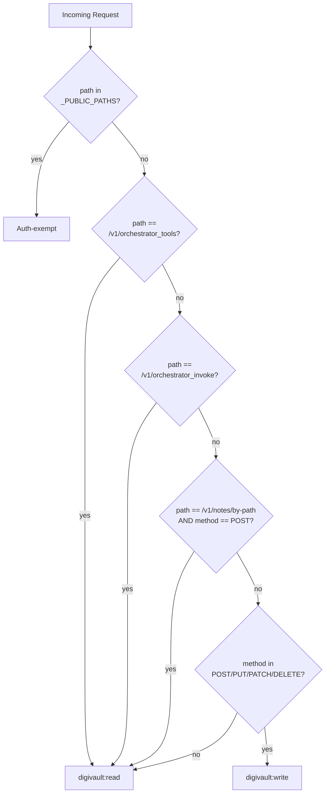
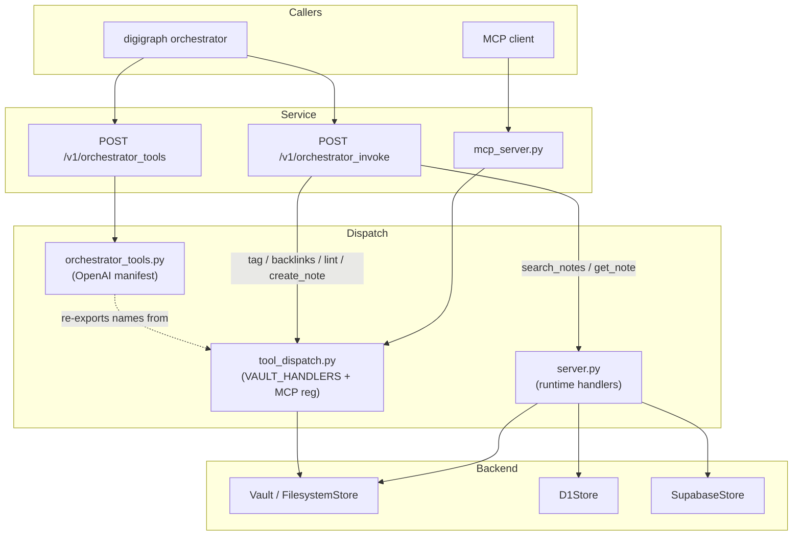

# digivault Service and Operations

digivault is split into a pure-Python core library and a thin **service layer**
(FastAPI + MCP + CLI) behind the `[service]` extra. The FastAPI app listens on
**port 8004**, host-loopback-bound, under the dedicated `digivault` Compose
profile — not part of the always-on `core` stack.

## Routes

Every filesystem-backed note route is now tenant-scoped. `_open_scoped_vault`
narrows `DIGIVAULT_ROOT` to the caller's corpus subdirectory when
`DIGI_TENANT_CORPUS_MAP` is configured; when the map is unset it opens the
shared root as before, so single-tenant deployments are unchanged.

| Method | Path | Auth | Notes |
|--------|------|------|-------|
| `GET` | `/healthz` | exempt | `{"ok": true}` — no downstream checks |
| `GET` | `/v1/status` | exempt | Reports `vault_configured` / `d1_configured` booleans, never secrets |
| `GET` | `/v1/notes` | `digivault:read` | List every note in the scoped vault |
| `GET` | `/v1/notes/{name}` | `digivault:read` | One note by filename stem; `404` if missing |
| `POST` | `/v1/notes` | `digivault:write` | Create a note (`overwrite: false` default); `overwrite: true` for idempotent upsert |
| `POST` | `/v1/notes/batch` | `digivault:write` | Bulk upsert + prune under one index load for linear ingest |
| `POST` | `/v1/notes/by-path` | `digivault:read` (POST, method-gated) | D1-only; loads one `NoteDetail` by exact `vault_path` with `path_prefix` enforcement |
| `POST` | `/v1/notes/prune-children` | `digivault:write` | Remove stale `{parent_doc}__*` segment notes in a subdirectory |
| `PATCH` | `/v1/notes/{name}/frontmatter` | `digivault:write` | Merge frontmatter keys |
| `POST` | `/v1/notes/{name}/rename` | `digivault:write` | Rename + inbound-link rewrite |
| `GET` | `/v1/notes/{name}/backlinks` | `digivault:read` | `{"name": …, "backlinks": […]}` |
| `GET` | `/v1/tags/{tag}` | `digivault:read` | Notes bearing that tag |
| `GET` | `/v1/lint` | `digivault:read` | Full `LintReport` (unresolved links, orphans, missing frontmatter, duplicate stems) |
| `POST` | `/v1/orchestrator_tools` | `digivault:read` | OpenAI-style tool manifest for digigraph |
| `POST` | `/v1/orchestrator_invoke` | `digivault:read` (gated; `create_note` enforces `digivault:write` itself) | Execute one tool by name |

### Notes on specific routes

**`POST /v1/notes/by-path`** is D1-only — no filesystem/Supabase fallback. The
request body carries `vault_path` (required) and `path_prefix` (required, `422`
if omitted). `path_prefix` is an **enforced authorization boundary**: a caller
gets `403` if `vault_path` falls outside the prefix, and `404` if the note
doesn't exist. `path_prefix` resolution uses `resolve_path_prefix` — a
present-but-normalizes-to-empty prefix (`""`, `"/"`, `" "`, `".md"`) returns
`400`, not silently treated as unscoped. Scoped `digivault:read` despite being
POST, and the scope carve-out checks method too (a hypothetical future
non-POST verb on the same path is not widened).

**`POST /v1/orchestrator_invoke`** uses a single handler table: vault-local
tools (`search_tag`, `backlinks`, `lint`, `create_note`) route through
`dispatch_vault_tool` in `tool_dispatch.py`, while `digivault_search_notes`
and `digivault_get_note` are dispatched inline in `server.py` with their D1 /
tenant / HTTPException logic and registered into the canonical dispatch table
via `register_runtime_handler`. The route itself requires `digivault:read`;
`create_note` enforces `digivault:write` in the handler via `_require_tool_scope`.

**`digivault_get_note`** (orchestrator-invoke only, not MCP-exposed) supports
both a singular `vault_path` (returns `NoteDetail` directly, byte-identical to
the non-batch shape) and plural `vault_paths` (max 20 after dedup; returns
`{"notes": […], "errors": {…}}`). Batch is `ok=True` even when every path
failed — per-path errors carry the reason.

## Scopes

`digivault_path_scopes` is defined in `digivault/path_scopes.py` — never in
`digikey` — so the auth plane stays untouched. The middleware accepts any
`(method, path) -> scopes | None` function.

- **Public paths** (auth-exempt): `/health`, `/healthz`, `/metrics`, `/docs`,
  `/redoc`, `/openapi.json`, `/v1/status`
- **`digivault:read`**: `GET` routes, `/v1/orchestrator_tools`,
  `/v1/orchestrator_invoke`, and `POST /v1/notes/by-path` (method-gated)
- **`digivault:write`**: `POST`, `PUT`, `PATCH`, `DELETE` on all other paths
- **`orchestrator_invoke` gap**: the one mutating tool (`create_note`) enforces
  `digivault:write` in the handler via `_require_tool_scope`, keyed on the
  requested tool name

## Tenant binding

`digivault/tenant_scope.py` closes a gap found in CodeRabbit's review of PR
#2293: `digivault:read`/`digivault:write` prove only that a caller may use
these routes at all — the scopes carry no tenant identity. Without this module,
any caller holding a valid scope could name *any* prefix in `D1_DATABASE_MAP`,
not just the corpus their own token was issued for.

**Two independent enforcement layers now cover `path_prefix`:**

1. **digigraph side** (#2240): `_handle_digivault_search` and
   `_handle_digivault_get_note` overwrite `path_prefix` from
   `ToolContext.vault_path_prefix` unconditionally, discarding whatever the
   model supplied — protects the model → digigraph leg.

2. **digivault side** (this module): `enforce_tenant_path_prefix` checks
   `request.state.digi_auth.tenant_slug` against `DIGI_TENANT_CORPUS_MAP`
   — protects a caller that talks to digivault directly, bypassing digigraph
   entirely.

`DIGI_TENANT_CORPUS_MAP` is the same env var digigraph's own `corpus_routing.py`
reads, parsed independently here so digivault stays installable standalone.

### Behavior matrix

| Map state | Effect |
|-----------|--------|
| Genuinely unset (empty) | No-op; all tenant checks pass through. Single-tenant deployments unchanged. |
| Set and valid | `enforce_tenant_path_prefix` rejects a mismatched `path_prefix` with `403`. `mapped_tenant_path_prefix` resolves a tenant's own prefix for filesystem routes. |
| Set but broken (invalid JSON, non-object, or every entry individually dropped) | `TenantCorpusMapError` → `503`. Never silently treated as "unset" — an operator who turned multi-tenant on and typo'd it must hear about it. |

### `enforce_tenant_path_prefix`

Raise `HTTPException` if the caller-supplied `path_prefix` doesn't match the
map's entry for `tenant_slug`. No-op when the requested prefix is `None`/empty
or the map is genuinely unset. Comparison normalizes both sides through
`normalize_vault_path` so `"clients/digithings/"` and `"clients/digithings"`
count as the same prefix.

### `mapped_tenant_path_prefix`

Return the tenant's own prefix from the map, used by `_open_scoped_vault` to
narrow filesystem routes to the caller's corpus subdirectory. Returns `None`
when the map is unset (single-tenant). Fails closed: `403` for an unmapped
tenant, `503` for a broken map.

### Enforcement points

`enforce_tenant_path_prefix` is wired into:
- `_fetch_note_by_path` (shared by `POST /v1/notes/by-path` and
  `digivault_get_note`)
- `orchestrator_invoke`'s `digivault_search_notes` branch (checked before
  backend selection, so it applies uniformly to D1, local-vault, and Supabase)
- `_open_scoped_vault` (via `mapped_tenant_path_prefix`) for all filesystem
  note routes

## Search precedence (`digivault_search_notes`)

`POST /v1/orchestrator_invoke` with tool `digivault_search_notes` follows a
strict backend precedence:

1. **D1** — if `CLOUDFLARE_ACCOUNT_ID`, `CLOUDFLARE_API_TOKEN`, and
   `D1_DATABASE_MAP` are all set. D1 wins even when `DIGIVAULT_ROOT` is also
   set — production sets `DIGIVAULT_ROOT` to baked seed stubs that must never
   shadow the real corpus. `_d1_configured()` raises `D1StoreError` for a
   partial config (some but not all vars set) → loud `503`, not a silent
   fall-through to `DIGIVAULT_ROOT`.

2. **Local filesystem** — if `DIGIVAULT_ROOT` is set. Optional `path_prefix`
   isolates client subdirectories.

3. **Supabase FTS** — fallback via `search_architecture_notes` RPC (anon-key,
   read-only). Returns `503` if `CORE_SUPABASE_URL`/`CORE_SUPABASE_ANON_KEY`
   are unset.

`limit` is clamped to `[1, 50]` regardless of caller input. A present
`path_prefix` that normalizes to empty returns `ok=False` (`400` on the local
path) — omitting the key (or sending `null`) is the only way to search without
a prefix.

## Tool dispatch and MCP

`tool_dispatch.py` is the **canonical tool routing** module (#1188). It owns
every digivault tool name (`DISPATCH_TOOL_NAMES`), the vault-local handler
table (`VAULT_HANDLERS`), and MCP registration (`register_mcp_tools`). Both
`mcp_server` and `server.orchestrator_invoke` route vault-local tools through
`dispatch_vault_tool` — no duplicate handler tables.

### Canonical tool names

| Constant | Tool | Surface |
|----------|------|---------|
| `TOOL_VAULT_SEARCH_TAG` | `digivault_search_tag` | Vault-local (MCP + orchestrator) |
| `TOOL_VAULT_BACKLINKS` | `digivault_backlinks` | Vault-local (MCP + orchestrator) |
| `TOOL_VAULT_LINT` | `digivault_lint` | Vault-local (MCP + orchestrator) |
| `TOOL_VAULT_CREATE_NOTE` | `digivault_create_note` | Vault-local (MCP + orchestrator; MCP requires `DIGIVAULT_MCP_WRITE=1`) |
| `TOOL_VAULT_SEARCH_NOTES` | `digivault_search_notes` | Runtime-only (MCP `search_notes` + orchestrator) |
| `TOOL_VAULT_GET_NOTE` | `digivault_get_note` | Runtime-only (orchestrator only) |

`DISPATCH_TOOL_NAMES` asserts `VAULT_TOOL_NAMES | RUNTIME_ONLY_TOOL_NAMES ==
DISPATCH_TOOL_NAMES` and the two subsets are disjoint. Runtime-only tools claim
into the same table via `register_runtime_handler` from `server.py` at import
time, so `dispatch_tool_names()` equals the full canonical set once the HTTP
app loads.

Vault-local handlers honour an optional `path_prefix` (the operator
`setup.path_prefix` digigraph injects): reads are filtered beneath that
subdirectory and `create_note` writes beneath it, with `..`/leading-dot
components refused. An absent or blank prefix keeps whole-vault behaviour.
Duplicate-stem handling is scope-aware: `lint(scope=…)` and
`create_note(scope=…)` prevent cross-corpus path leakage.

### MCP server

`python -m digivault.mcp_server` is a thin transport wrapper over FastMCP
(default `127.0.0.1:8769`). Tool registration is owned by `tool_dispatch.py`
— do not add `@mcp.tool` handlers in `mcp_server.py`. MCP discovery
(`mcp_tool_names()`) advertises the MCP surface name of every vault-local
handler (`search_tag`, `backlinks`, `lint`, `create_note` — digigraph prefixes
the server id to get `digivault_search_tag`) plus the runtime-backed
`search_notes` (required `path_prefix`). `get_note` stays orchestrator-only.
Vault-local MCP tools carry no JWT check — treat a wider bind like a network
API with gateway auth.

Dedicated image: `digivault/Dockerfile.mcp` (`digi-digivault-mcp`, repo-root
context, `digivault[service]` extra, no `[supabase]`). Compose profile
`digivault-mcp`, loopback `127.0.0.1:8769:8769`, `DIGIVAULT_ROOT` volume-mounted
at `/data/vault`.

## Rate limiting

Per-IP sliding window (in-process `deque` + lock), mirrors `digisearch`:

| Path | Limit | Window |
|------|-------|--------|
| `/v1/orchestrator_invoke` | 10 req | 60 s |
| `/v1/orchestrator_tools` | 30 req | 60 s |
| All other paths (except `/healthz`) | 30 req | 60 s |

IP is read from `X-Forwarded-For` (first hop) or `request.client.host`.
`DIGI_DISABLE_RATE_LIMIT=1` disables it (tests). TestClient traffic
(`client.host == "testclient"`) is exempt. Exceeding the limit returns `429`
with `code: rate_limit_exceeded` and a `Retry-After` header.

## Container

### digivault (HTTP API)

- **Image**: `digi-digivault:latest` from `digivault/Dockerfile` (repo-root context)
- **Compose profile**: `digivault` (opt-in, not `core`)
- **Port**: `127.0.0.1:8004:8004`
- **Extras**: `[service,supabase]`
- **Volumes**: `digivault_data:/data/vault`
- **Healthcheck**: `curl -f http://127.0.0.1:8004/healthz` (interval 15 s, timeout 5 s, retries 3, start period 10 s)
- **Depends on**: `digikey` (service_healthy)
- **Key env vars**: `DIGIVAULT_ROOT`, `DIGIKEY_JWKS_URL`, `DIGIKEY_ISSUER`,
  `DIGIKEY_AUDIENCE`, `DIGIKEY_PUBLIC_KEY_PEM`, `DIGI_OTEL_ENDPOINT`,
  `OTEL_EXPORTER_OTLP_ENDPOINT`

Standard digibase middleware applies: `DigiAuthMiddleware` (with
`digivault_path_scopes`), request-id, CORS, metrics, OpenTelemetry, and
FastAPI error handlers.

### digivault-mcp (MCP sidecar)

- **Image**: `digi-digivault-mcp:latest` from `digivault/Dockerfile.mcp`
- **Compose profile**: `digivault-mcp`
- **Port**: `127.0.0.1:8769:8769`
- **Extra**: `[service]` only (no `[supabase]`)
- **Volumes**: `digivault_data:/data/vault`
- **Entrypoint**: `python -m digivault.mcp_server` (streamable HTTP on `0.0.0.0:8769`, loopback binding by compose)
- **Host override**: set `DIGIVAULT_MCP_HOST` at deploy time for published-port access

## Environment variable reference

| Variable | Required | Purpose |
|----------|----------|---------|
| `DIGIVAULT_ROOT` | For filesystem routes | Vault directory path; `503` when unset on filesystem-backed endpoints |
| `CLOUDFLARE_ACCOUNT_ID` | For D1 | Canonical Cloudflare account ID (falls back to `VECTORIZE_ACCOUNT_ID` then `D1_ACCOUNT_ID`) |
| `CLOUDFLARE_API_TOKEN` | For D1 | Canonical Cloudflare API token (falls back to `VECTORIZE_API_TOKEN` then `D1_API_TOKEN`) |
| `D1_DATABASE_MAP` | For D1 | JSON object `{"<prefix>": "<database-id>", …}` — must not contain a `""` key |
| `DIGI_TENANT_CORPUS_MAP` | For multi-tenant | JSON object `{"<tenant>": {"vaultPathPrefix": "…", …}, …}` — parsed independently in digivault |
| `DIGI_DISABLE_RATE_LIMIT` | No | Set `1` to disable rate limiting |
| `DIGIVAULT_MCP_WRITE` | For MCP writes | Set `1` to allow `create_note` via MCP |
| `DIGIVAULT_MCP_HOST` | No | MCP bind host (default `127.0.0.1`) |
| `CORE_SUPABASE_URL` | For Supabase fallback | Supabase project URL |
| `CORE_SUPABASE_ANON_KEY` | For Supabase fallback | Supabase anon key |
