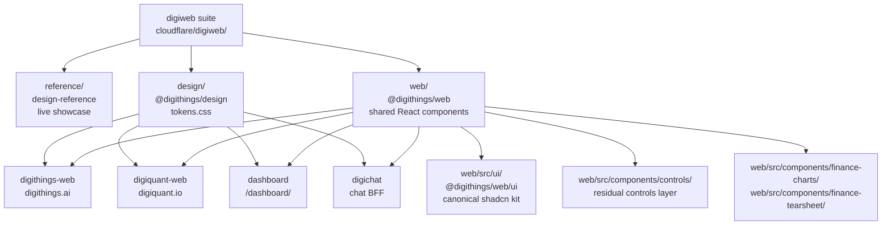

# Design System and Marketing Sites

The digithings ecosystem shares one central design suite, `cloudflare/digiweb/`,
that every product frontend consumes. Two public marketing sites —
**digithings-web** (`digithings.ai`) and **digiquant-web** (`digiquant.io`) —
assemble their pages from that suite, alongside the digichat BFF and the
digiquant operator dashboard.

## The digiweb suite

digiweb is not a runtime service — it ships no server, no auth, and no
live-trading surface. Its job is to make frontend work consistent by giving
people and coding agents one place to discover, copy, and extend standardized
components. The suite has three parts, all under `cloudflare/digiweb/`:

| Part | Location | Package | Role |
| ---- | -------- | ------- | ---- |
| **reference app** | `reference/` | `design-reference` | Live, browsable Next.js 16 showcase at `http://127.0.0.1:4013`. Every reusable pattern rendered as working code. The first place to check before building anything. |
| **design tokens** | `design/` | `@digithings/design` | Single `tokens.css` defining colours, type scale, spacing, and motion easings. Every surface imports this; no ad-hoc hex/rgb values in product code. |
| **shared components** | `web/` | `@digithings/web` | React 19 component layer: ThemeProvider, MotionProvider, Terminal, emblems, NavShell, Footer, AuthCard, DigichatLauncher, the finance and tearsheet chart families, the canonical shadcn `ui/` kit, and more. |

The token and component packages are consumed **by package name** everywhere, so
their on-disk location is irrelevant to resolution and digiweb can move without
breaking consumers.

## The pass-through rule

Before building any frontend surface for digithings or digiquant:

1. Open the reference app. Find the closest existing pattern and copy its grammar.
2. If nothing fits, **build the new pattern in digiweb first**, then consume it.
3. Never invent one-off components in a product app.

This rule is enforced culturally via the `digiweb` skill (see below) and
technically via the `frontend-canon` CI guard.

## Agent-oriented design model

digiweb is built to be read by coding agents, not just people. Three artifacts
bridge the gap:

- **`MANIFEST.json`** — A machine-readable index of every reference component
  plus the vendored shadcn `ui` kit. Each entry has `name`, `id`, `path`,
  `summary` (from the component's JSDoc block), and `family`. Regenerate with
  `node scripts/build-manifest.mjs` after adding a component.

- **`ASSISTANT_UI_ELEMENTS.md`** — The full assistant-ui elements catalog
  (slug, purpose, fetch command, digichat attach kind). Not part of
  `MANIFEST.json`; fetch from the registry on demand when a deploy needs a card.
  Style pin: `base-nova`.

- **The `digiweb` skill** — A Claude Code skill (authored at
  `agents/sources/skills/digiweb/SKILL.md`, generated to `.claude/skills/` by
  `make agents-init`) that routes any agent doing digithings/digiquant frontend
  work through the suite: consult the manifest, reuse a component, or add a new
  one to the reference first.

## Suite architecture



*Every product surface imports `@digithings/design/tokens.css` for the palette
and `@digithings/web` for shared React components. The `ui/` subpath
(`@digithings/web/ui`) provides the canonical shadcn kit.*

## Shared wiring

Every consuming app follows the same CSS import order:

```css
@import "tailwindcss";
@import "@digithings/design/tokens.css";
@import "@digithings/web/styles/web-theme.css"; /* THE single @theme inline bridge */
```

Three load-bearing rules:

1. **One bridge.** `web-theme.css` is the only `@theme` block. No app may
   declare its own.
2. **`@theme inline`.** Utilities emit `var(--token)` at the use site, so
   scoped liveries (e.g. `.accent-digiquant`) stay live inside utilities.
3. **`@source` per family.** Tailwind never scans package sources, so each
   consuming app must add `@source` lines pointing at the shared component
   directories it imports.

The full adoption playbook lives at `cloudflare/digiweb/MIGRATION.md`; the CI
guard is `scripts/check_frontend_canon.py`.

## Design conventions

The canon lives in `reference/README.md`. In short:

- **Tokens, never literals.** Colours come from `@digithings/design/tokens.css`.
- **Monochrome default livery.** Colour is opt-in per product.
- **Money colours** (`--up` / `--down`) are P&L-only and never follow a livery.
- **One motion moment per surface**, always honouring `prefers-reduced-motion`.
- **Token-backed Tailwind utilities + semantic classes** preferred over ad-hoc CSS.

## Marketing sites

### digithings-web — digithings.ai

**Package:** `digithings-web` at `cloudflare/digithings-web/`

The public marketing site for the open-core agentic stack. It is a Next.js 16
+ React 19 static export (`output: 'export'`) with `trailingSlash: true`,
deployed to Cloudflare Pages via `wrangler.toml`.

The landing page (`app/page.tsx`) is a server component that composes
`@digithings/web` primitives: `HeroMesh`, `OdometerStrip`, `TerminalManifest`,
`NumberedStages`, `RepoActivity`, `WordReveal`, `StackRow`, `SocialRow`,
`Colophon`, and `ContactMailto`. The shadcn kit is consumed via
`@digithings/web/ui` for `buttonVariants`.

Local components (`components/landing/HeroMesh.tsx`, `HeroGraph.tsx`,
`ModuleManifest.tsx`) are site-specific creative pieces, not reusable primitives
— they live in the site, not in digiweb. The site also owns a `ChatEmbedShell`
for embedding digichat.

Dependencies: `@digithings/design`, `@digithings/web`, `@digithings/digichat-ui`,
`motion`, `geist`, `simple-icons`, `tw-animate-css`.

### digiquant-web — digiquant.io

**Package:** `digiquant-web` at `cloudflare/digiquant-web/`

The public marketing site for the quant product. Same Next.js 16 + React 19
static-export shape and Cloudflare Pages deployment.

The landing page (`app/page.tsx`) composes the same `@digithings/web` primitives
— `HeroMesh`, `OdometerStrip` via `MetricsOdometer`, `WordReveal`,
`PricingTierCard`, `Colophon`, `Footer`, `ContactMailto`, `Reveal` — plus
finance-specific components: `LiveTickerRow`, `LivePortfolioPanel`,
`ResearchPipeline`, `PipelineScene`, `StrategySuite`. These live in
`components/landing/` and are site-specific.

digiquant-web also owns a `components/tearsheet/` directory, but the
print-grade SVG tearsheet grammar was **reverse-promoted** into
`@digithings/web` as the `finance-tearsheet` family, so the site now consumes
the shared version.

Dependencies: `@digithings/design`, `@digithings/web`, `@supabase/supabase-js`,
`motion`, `geist`, `simple-icons`, `tw-animate-css`.

### Both sites share

| Aspect | Value |
| ------ | ----- |
| Framework | Next.js 16 + React 19 |
| Build | `output: 'export'`, `trailingSlash: true`, `transpilePackages: ["@digithings/web"]` |
| Styling | Tailwind v4, single `web-theme.css` bridge |
| Motion | `motion` (formerly framer-motion), `prefers-reduced-motion` honours |
| Font | Geist (Sans + Mono) |
| Icons | `simple-icons` for vendor logos, shared `StackLogo` / `StackRow` primitives |
| Design system packages | `@digithings/design` and `@digithings/web`, both resolved by name |

## The other consumers

Two additional frontends consume the same design system:

- **Dashboard** (`cloudflare/dashboard/`) — the digiquant operator surface at
  `/dashboard/`. Uses the shared `AuthCard` for login, the finance charts
  and tearsheet families, the shadcn kit, and the controls layer. See
  [Dashboard Architecture](/openwiki/dashboard/architecture.md).

- **digichat** (`cloudflare/digichat/`) — the chat BFF. Consumes the shared
  tokens and the `@digithings/web` chat family (`DigichatLauncher`,
  `DigichatThread`, `ChatMarkdown`, etc.) plus the assistant-ui element
  registry. See [digichat Architecture](/openwiki/digichat/architecture.md).

## Key reference documents

digiweb has its own rich docs inside the suite directory. Route agents there
rather than duplicating content:

| Document | Covers |
| -------- | ------ |
| `cloudflare/digiweb/README.md` | Suite overview, pass-through rule, conventions, adding a component |
| `cloudflare/digiweb/ARCHITECTURE.md` | Module map, package structure, families, brand identity, CI posture |
| `cloudflare/digiweb/DESIGN.md` | Agent-readable design system (Stitch / Refero shape) |
| `cloudflare/digiweb/MIGRATION.md` | The canon adoption playbook and frontend-canon CI guard |
| `cloudflare/digiweb/CHARTS.md` | Finance chart house rules — canvas for screen, SVG for PDF |
| `cloudflare/digiweb/CHAT_THEME.md` | First-party digichat skin on the `/chatbot` reference page |
| `cloudflare/digiweb/ASSISTANT_UI_ELEMENTS.md` | Full assistant-ui elements catalog |
| `cloudflare/digiweb/MANIFEST.json` | Machine-readable component index |
| `cloudflare/digiweb/reference/README.md` | Reference app canon: page map, type system, livery, motion laws |
