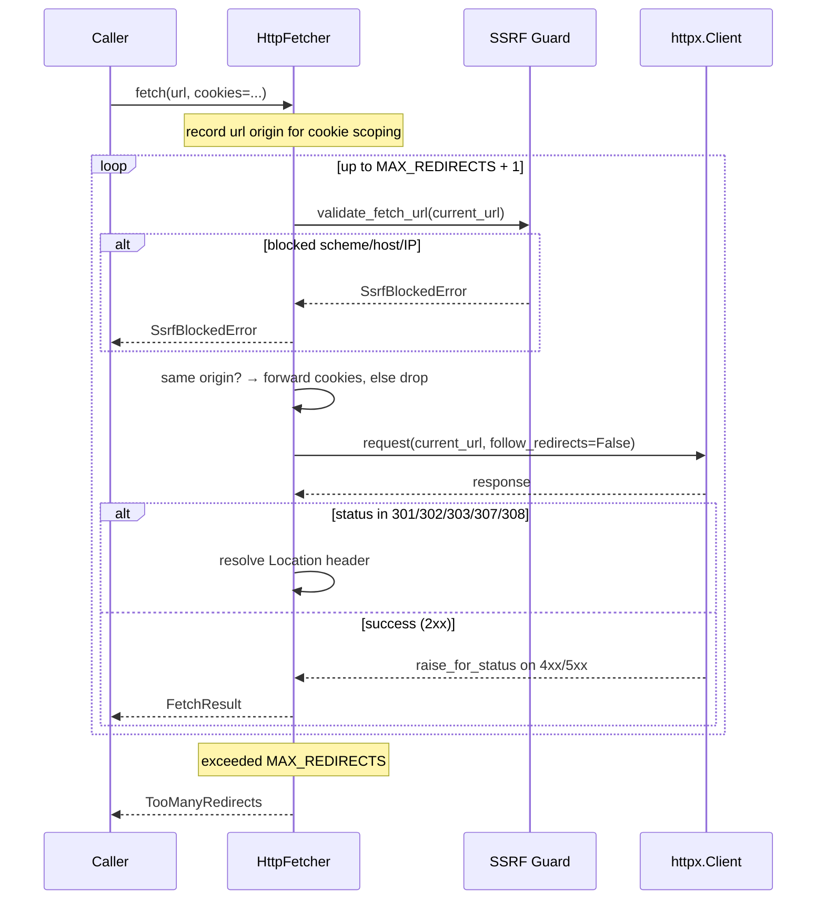

# digifetch Library

digifetch is the shared web-fetch engine: a standalone **library** (no FastAPI,
no port, no service coupling) extracting reusable scraping mechanics from the
twelve-x consumer — HTTP fetch, composable retry/backoff, polite rate limiting,
headless-browser session lifecycle, and a Playwright→HTTP cookie hand-off. Hard
deps are `pydantic>=2` + `httpx>=0.27`; Playwright rides the `[browser]` extra.

The library reads **no environment variables**. All configuration — timeouts,
rate limits, user-agents, and the SSRF `allowed_hosts` allowlist — is passed in
by the caller.

## Module map

| Module | Responsibility |
|---|---|
| `digifetch/http.py` | `HttpFetcher` over `httpx` — `fetch()` → `FetchResult`, `download()` → `DownloadResult` with byte cap, plus `cookies_from_playwright` for the Playwright→HTTP cookie hand-off. Redirects are followed **manually** with per-hop SSRF re-validation. |
| `digifetch/ssrf.py` | `validate_fetch_url` / `is_blocked_ip` / `SsrfBlockedError` — the SSRF guard: http/https only; loopback, link-local, RFC1918, CGNAT (`100.64.0.0/10`), unspecified, multicast, reserved, and metadata IPs (`169.254.169.254`, `100.100.100.200`) refused. `allowed_hosts` is the operator escape hatch. |
| `digifetch/retry.py` | `RetryPolicy` (exponential backoff + full jitter, selective `retry_on`, **injectable** `sleep`/`rand`) and `with_retry(func, policy)` — a *composable* wrapper, not baked into any fetch primitive. |
| `digifetch/ratelimit.py` | `RateLimiter` — single-process min-interval gate (injectable `clock`/`sleep`). Thread-safe; steady-state cadence does not drift. Not a token bucket, not Redis-backed. |
| `digifetch/browser.py` | `browser_session(...)` context manager yielding the live `(page, context)`; `BrowserConfig`; `Page`/`BrowserContext` structural Protocols; `BrowserNotAvailableError`. Requires `digifetch[browser]`. |
| `digifetch/__init__.py` | Public API surface. Eager re-exports of light seams (`HttpFetcher`, `RetryPolicy`, `RateLimiter`, `SsrfBlockedError`); lazy PEP 562 `__getattr__` re-exports of browser symbols. |

## Public API

```python
from digifetch import (
    # retry/backoff
    RetryPolicy, with_retry,
    # rate limiting
    RateLimiter,
    # HTTP fetch/download seam
    HttpFetcher, FetchResult, DownloadResult, DownloadTooLargeError,
    SsrfBlockedError, cookies_from_playwright, DEFAULT_TIMEOUT,
    # headless-browser seam (needs digifetch[browser])
    browser_session, BrowserConfig, Page, BrowserContext, BrowserNotAvailableError,
)
```

## HTTP fetch path (SSRF-guarded)

`HttpFetcher` is the non-browser HTTP seam over `httpx` — no `requests`
anywhere. It is a context manager wrapping a reusable `httpx.Client`. Key
behaviors:

- **`fetch()`** issues an HTTP request and returns a frozen `FetchResult`
  (`status_code`, `url`, `text`, `content_type`). Raises
  `httpx.HTTPStatusError` on 4xx/5xx (`raise_for_status` semantics).
- **`download()`** streams binary content with a hard `max_bytes` cap (default
  32 MiB). Exceeding it raises `DownloadTooLargeError` *before* buffering the
  whole payload. Returns `DownloadResult` (`status_code`, `url`, `content`,
  `content_type`, `size`).
- **`DEFAULT_TIMEOUT`** mirrors `digibase.http_client.DEFAULT_TIMEOUT`: connect
  5 s, read 30 s, write 10 s, pool 5 s.
- **`cookies_from_playwright(context.cookies())`** flattens Playwright's list
  of cookie dicts to a plain `{name: value}` dict — the exact hand-off the
  twelve-x consumer performs before its AJAX calls.

### SSRF guard

The fetch path is reachable from user-influenced URLs (search results, scraped
links). Neither `fetch()` nor `download()` auto-follows redirects; every URL —
the original and each redirect hop — passes through
`validate_fetch_url` before a request is sent. Hops are capped at
`MAX_REDIRECTS` (5).

The guard (`digifetch/ssrf.py`) enforces:

- **Scheme**: `http`/`https` only.
- **Hostname blocks**: literal internal addresses (`127.0.0.1`, `::1`,
  `0.0.0.0`), metadata hosts (`169.254.169.254`, `100.100.100.200`,
  `metadata.google.internal`), `.local`/`.internal`/`.localhost` suffixes, and
  DNS-rebind domains (`.nip.io`, `.sslip.io`, `xip.io`, etc.).
- **IP blocks**: after DNS resolution, every resolved address must be globally
  routable — loopback, link-local, private (RFC1918), CGNAT (`100.64.0.0/10`),
  unspecified, reserved, and multicast addresses are refused. IPv4-mapped IPv6
  is unwrapped and checked.
- **Operator escape hatch**: `allowed_hosts` (exact, case-insensitive hostnames)
  bypasses the IP-address refusal. Consumers read operator env vars (e.g.
  `digisearch` from `DIGISEARCH_FETCH_ALLOWED_HOSTS`) and pass the value in;
  digifetch itself reads no env.

**Residual limitation**: DNS is resolved for validation and again by `httpx` at
connect time, so a hostile resolver racing the two lookups can still win. The
guard closes the practical vectors — literal internal addresses, internal
hostnames, and redirects into either — without pinning sockets.

### Redirect cookie scoping

Per-call `cookies=` (the Playwright hand-off seam) are host-agnostic, so
redirect handling forwards them **only while the hop stays on the original
origin**. A cross-origin redirect drops them rather than leaking a session
credential across hosts. A client-level cookie jar (passed via constructor
`cookies=` or the Playwright context) keeps httpx's own domain-scoped rules.

### Fetch flow

The diagram below shows the SSRF-guarded fetch lifecycle with manual redirect
handling:



## Retry and rate limiting

`RetryPolicy` + `with_retry()` compose backoff around **any** zero-arg callable.
Backoff is `base_delay * factor**(attempt-1)` capped at `max_delay`, with
optional full jitter (injectable `rand`). `retry_on` narrows which exception
types are retried; anything else propagates immediately. `sleep` is injected
(defaults to `time.sleep`), so tests run instantly and no bare blocking
`time.sleep(<literal>)` appears in source.

`RateLimiter` enforces a minimum wall-clock interval between successive
`acquire()` calls. Thread-safe; cadence advances from the scheduled slot (not
the post-sleep clock), so steady-state pacing does not drift. `min_interval=0`
disables throttling. `clock` and `sleep` are injected for deterministic tests.

Both are composable — usable without the fetcher, and applied by wrapping
rather than via flags:

```python
# Retry a fetch with backoff
result = with_retry(lambda: fetcher.fetch(url), RetryPolicy(attempts=3))

# Pace repeated operations
limiter = RateLimiter(min_interval=2.0)
for url in urls:
    limiter.acquire()
    fetcher.fetch(url)
```

## Browser seam

`browser_session()` is a context manager that launches a headless Playwright
session and yields the live `(page, context)` pair. The caller drives the page
(navigate, fill selectors, click, read `content()`) — that logic is
site-specific and stays in the consumer. The `context` is yielded so callers
can pull `context.cookies()` for the HTTP hand-off.

`BrowserConfig` carries the knobs that vary across consumers: `headless`,
`user_agent`, `default_timeout_ms`, `browser` (chromium/firefox/webkit),
`viewport`, and `launch_args`.

Playwright is imported **lazily** at `browser_session` call time. Public
browser symbols (`browser_session`, `BrowserConfig`, `Page`, `BrowserContext`,
`BrowserNotAvailableError`) resolve through a PEP 562 `__getattr__` shim in
`__init__.py`, so `import digifetch` succeeds on a machine with no browser
installed. A missing Playwright raises `BrowserNotAvailableError` with an
actionable install hint.

`Page` and `BrowserContext` are structural `Protocol` types (runtime-checkable)
so callers get real type hints even when playwright is absent — mirroring
`digibase`'s `SupabaseClient` Protocol. Teardown is guaranteed: `browser.close()`
runs in the `finally` block even if the caller's body raises.

## Composition patterns

The library's primitives compose with each other and with consumer code:

| Consumer need | digifetch composition |
|---|---|
| Authenticated AJAX after browser login | `browser_session()` → login on page → `cookies_from_playwright(ctx.cookies())` → `HttpFetcher.fetch(url, cookies=...)` |
| Download PDF with retry | `with_retry(lambda: fetcher.download(url), RetryPolicy(attempts=3))` |
| Paced "show more" clicking | `limiter.acquire()` between `page.click()` calls inside `browser_session()` |
| Retry entire multi-step page interaction | `with_retry(lambda: do_login_and_navigate(page), policy)` |

## Testing

All tests mock the network and browser — they never launch a real browser or
hit a live site, and pass without `digifetch[browser]` installed:

- **http**: `httpx.MockTransport` drives the real `httpx.Client` in-process.
- **ssrf**: internal IPs/hosts are refused without the handler being called;
  legitimate public redirects are followed; the hop cap breaks redirect loops.
- **retry / ratelimit**: injected recording `sleep` and fake `clock` assert
  exact backoff/cadence schedules.
- **browser**: injected fake `sync_playwright` factory asserts lifecycle,
  UA/timeout wiring, and teardown-on-exception.
- **package**: asserts `import digifetch` does **not** import playwright
  and the lazy `__getattr__` resolves browser symbols on demand.

## Provisional status

Built ahead of the YAGNI trigger for twelve-x, the single consumer as of
0.1.0 — treat the interface as provisional until a second consumer arrives.
No `import fastapi`, no `Request` objects, no service coupling. The companion
follow-up (wiring twelve-x onto digifetch) is deliberately deferred and tracked
separately.
