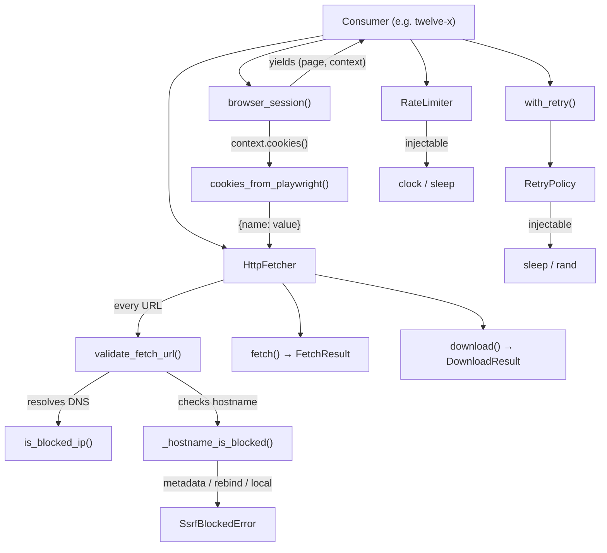

# digifetch Library

digifetch is the shared web-fetch engine: a standalone library (no
FastAPI, no port) extracting reusable scraping mechanics — HTTP
fetch/download with SSRF protection, composable retry/backoff, polite
rate limiting, and a headless-browser session lifecycle with a
Playwright→HTTP cookie hand-off. Hard deps are `pydantic>=2` +
`httpx>=0.27`; Playwright rides the `[browser]` extra.

*High-level architecture: the consumer composes browser sessions, HTTP fetch/download, retry, and rate limiting. The SSRF guard validates every URL before dialling.*

## HTTP path

`HttpFetcher` (context-managed, wrapping a reusable `httpx.Client`) offers
`fetch()` returning `FetchResult` and `download()` returning
`DownloadResult` with a byte cap (`DownloadTooLargeError` beyond it).
`cookies_from_playwright()` flattens Playwright `context.cookies()` into a
`{name: value}` dict so authenticated browser sessions continue over plain
HTTP without re-login. The monorepo convention is httpx throughout — no
`requests`.

### Redirect handling

Neither `fetch()` nor `download()` auto-follows redirects via httpx.
Instead, every hop is driven manually: the response status is checked
against `{301, 302, 303, 307, 308}`, the `Location` header is resolved
against the current URL via `urljoin`, and the new target is re-validated
by the SSRF guard before the next request. Hops are capped at
`MAX_REDIRECTS` (5); exceeding it raises `httpx.TooManyRedirects`.

Per-call cookies (the Playwright hand-off seam) are host-agnostic, so they
are forwarded only to same-origin hops. A cross-origin redirect drops them
to prevent leaking a session credential to an unrelated host. The
client-level httpx cookie jar, if any, follows its own domain-scoped
rules independently.

### Download streaming

`download()` streams the response body via `response.iter_bytes()`,
accumulating chunks while checking total size against the configured
`max_bytes` cap (default 32 MiB). An oversized response is aborted mid-stream
— the payload is never fully buffered, preventing memory exhaustion from a
misbehaving or poisoned URL.

## SSRF guard

The fetch path is reachable from user-influenced URLs (search results,
scraped links), so `validate_fetch_url()` in `digifetch.ssrf` is the single
guard applied before **every** request — initial URL and each redirect hop.

**Policy:**

- Only `http` / `https` URLs with a host are accepted.
- The host is checked against blocked literal hostnames before any DNS
  lookup: cloud metadata (`169.254.169.254`, `100.100.100.200`,
  `metadata.google.internal`), loopback (`localhost`), rebind/suffix
  services (`.nip.io`, `.sslip.io`, `.xip.io`, `.localtest.me`, `.lvh.me`,
  `.vcap.me`), and local/container suffixes (`.local`, `.internal`,
  `.localhost`).
- IPv4 shorthand (`127.1`, `0x7f.0.0.1`) is coerced via WHATWG-style
  parsing before the address check — `ipaddress` alone does not catch these.
- DNS is resolved and **every** returned address must be globally routable.
  `is_blocked_ip()` refuses loopback, link-local, unspecified, multicast,
  reserved, private (RFC1918), CGNAT (`100.64.0.0/10`), and the known
  metadata addresses. IPv4-mapped IPv6 addresses are unwrapped and checked
  as IPv4.
- An operator-supplied `allowed_hosts` set (exact, case-insensitive
  hostnames) bypasses the address refusal for that host only. The library
  reads no environment variables — consumers pass the value in (e.g.
  `digisearch` sources it from `DIGISEARCH_FETCH_ALLOWED_HOSTS`).

A resolution failure returns an empty address list (not an error) — if DNS
cannot resolve the host, the subsequent `httpx` connection will also fail,
so blocking a successfully resolved internal address is what matters.

**Residual limitation:** validation resolves DNS, then `httpx` resolves
again when it connects. A hostile resolver that changes its answer between
the two lookups can still win the race. This guard closes the practical
SSRF vectors without pinning sockets.

## Retry and rate limiting

`RetryPolicy` + `with_retry()` compose exponential backoff around fallible
calls. Sleep and RNG are constructor-injected (`time.sleep` and
`random.random` by default) so tests run instantly with no-op injections and
no bare `time.sleep(<literal>)` appears in engine source. Backoff follows
`delay = base_delay × factor^(n-1)`, capped at `max_delay`, with optional
full jitter. `retry_on` narrows which exception types trigger a retry;
non-matching exceptions propagate immediately.

`RateLimiter` enforces a minimum wall-clock interval between successive
`acquire()` calls. A lock serializes the read-modify-write of the last
timestamp, making it thread-safe. The clock and sleep are injected so tests
are deterministic. The steady-state cadence advances from the scheduled
slot (not the post-sleep clock), preventing drift from sleep latency. Both
components are standalone — usable without the fetcher.

## Browser seam

`browser_session()` launches Playwright headless sessions via a context
manager that handles the full lifecycle (launch, context creation with
optional user-agent/viewport, page with default timeout) and guarantees
teardown — `browser.close()` runs even if the caller's body raises. The
caller drives the page (navigation, selectors, clicks, `content()`) because
that logic is site-specific.

`BrowserConfig` carries the knobs both twelve-x scrapers vary: `headless`
(default `True`), `user_agent`, `default_timeout_ms` (TE uses 45 000),
`browser` (both use `chromium`), `viewport`, and `launch_args`.

`Page` and `BrowserContext` are `@runtime_checkable` structural Protocols
(not Playwright imports), so consumers get real type hints even when
Playwright is absent. The real Playwright objects satisfy them structurally
— the same technique as `digibase`'s `SupabaseClient` Protocol.

Playwright imports only at `browser_session` call time: public browser
symbols resolve via a PEP 562 `__getattr__` shim in `__init__.py`, so
`import digifetch` is side-effect-free and browser-free on machines with no
browser installed. A missing dependency raises `BrowserNotAvailableError`
with an actionable `pip install 'digifetch[browser]' && playwright install`
message.

## Provisional status

Built ahead of the YAGNI trigger for twelve-x, the single consumer as of
0.1.0 — treat the interface as provisional until a second consumer arrives.
No `import fastapi`, no `Request` objects, no service coupling.
