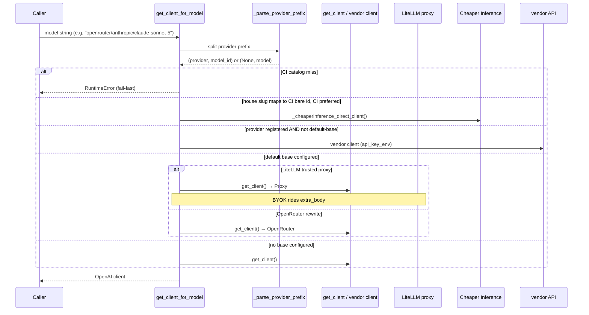

# digillm Library

digillm is the single home for LLM client code: a standalone,
provider-agnostic library speaking to any OpenAI-compatible endpoint.
**House default** when `CHEAPERINFERENCE_API_KEY` is set is
[Cheaper Inference](../../docs/providers/cheaperinference.md) (LiteLLM overlay /
CLI rewrite); otherwise OpenRouter. Force OpenRouter with
`DIGI_HOUSE_UPSTREAM=openrouter`. LiteLLM remains the local swap layer via
`OPENAI_API_BASE`. No FastAPI; no hard dependency on digismith.
Hard deps are `openai>=1.0` + `pydantic>=2`; mode resolution, tracing,
and dev tools ride extras. Consumers: twelve-x now; digigraph and
digisearch migrate later.

## Module map

| Module | Responsibility |
|--------|----------------|
| `digillm/types.py` | Shared TypedDict shapes for chat messages, tool calls, tool definitions, and JSON-schema response descriptors. |
| `digillm/overrides.py` | Per-request proxy-key and BYOK contextvars, reset helpers, and context managers (`proxy_key`, `byok`). |
| `digillm/cache.py` | SHA-256 response-cache keying, TTL/eviction, and cache clearing. |
| `digillm/client.py` | Provider registry/routing, retry/backoff, completion, telemetry runtime, and the tool-calling loop. |
| `digillm/structured.py` | `structured_completion` (json_schema → validated Pydantic) and opt-in `resolve_model`. |
| `digillm/telemetry.py` | Strict provider-agnostic records for node runs, logical calls, physical attempts, and fail-soft observer delivery. |
| `digillm/mcp_server.py` | Optional MCP server exposing `complete` tool over house routing (`[mcp]` extra). |

## Provider routing

`_EXTERNAL_PROVIDERS` maps `provider/` model prefixes to vendor endpoints
and their API-key env vars; `register_provider(prefix, base_url, api_key_env)`
adds or overrides entries. `get_client_for_model(model)` is the single
public client entry point — it resolves per request across these paths:

- **LiteLLM proxy**: when `OPENAI_API_BASE` is on the trusted-proxy allowlist
  (default: `http://127.0.0.1:4000/v1` and variants; override with
  `DIGILLM_TRUSTED_LITELLM_BASES`), all prefixes route through the proxy.
  BYOK credentials ride `extra_body` as LiteLLM clientside pass-through.
- **Cheaper Inference**: when `CHEAPERINFERENCE_API_KEY` is present and
  the model maps to a CI catalog id (via `_CHEAPERINFERENCE_HOUSE_SLUG_TO_BARE`),
  house slugs route to hosted CI instead of OpenRouter. A catalog miss raises
  `RuntimeError` — there is no silent OpenRouter fallback.
- **OpenRouter rewrite**: when `OPENAI_API_BASE` contains `openrouter.ai`,
  `anthropic/` and `openrouter/` prefixes stay on the default client;
  `gemini/` and `xai/` use vendor clients.
- **Vendor clients**: a registered prefix with no default base yields a
  dedicated client keyed on `(provider, api_key)`.
- **No default base**: every model uses `get_client()` which speaks to
  `OPENAI_API_BASE` if set, or OpenAI direct otherwise.

`_wire_model(provider, model_id, model)` adjusts the wire model id for
self-prefixed models like `openrouter/auto` where the provider's name
is part of the model id itself.

Cheaper Inference house preference is controlled by `cheaperinference_house_preferred()`:
true when `CHEAPERINFERENCE_API_KEY` is set, unless `DIGI_HOUSE_UPSTREAM=openrouter`
or `CHEAPERINFERENCE_HOUSE=0`. Explicit CI selection: `DIGI_HOUSE_UPSTREAM=cheaperinference`
or `CHEAPERINFERENCE_HOUSE=1` (key still required).

## Completion and tool loop

`completion(model, messages, *, temperature, tools, tool_choice, response_format, max_tokens, usage_kind)`
returns an OpenAI `ChatCompletion` object. It wraps `_create_with_retry` which
retries on `RateLimitError`, `InternalServerError`, `APIConnectionError`, and
`APITimeoutError` with exponential backoff (5s initial, 2× per attempt, 300s cap,
25% jitter). The total attempt budget defaults to 12, tunable via
`DIGILLM_PROVIDER_MAX_ATTEMPTS`; the daily pipeline sets it to 2.

Tool-free, non-BYOK requests are cached by SHA-256 key. On cache hit the
serialized response is rehydrated to a `ChatCompletion` so the return type
stays consistent. Tool-calling and BYOK requests bypass the cache.

After a successful response, `completion` runs empty-response self-healing:
if the response has no usable output (no choices, or blank content AND no
tool_calls), it retries up to `DIGILLM_EMPTY_RETRY_MAX` attempts (default 4)
with a `DIGILLM_EMPTY_RETRY_BACKOFF` delay (default 5s). A persistent blank
falls through unchanged — callers handle it gracefully.

`DIGI_TOOL_MESSAGE_MAX_CHARS` (default 12000) caps tool-result text injected
into the next LLM turn via `_compact_tool_message_content`. Full payloads
stay upstream.

`run_tools(model, messages, tools, execute_tool, *, temperature, max_tool_rounds, tool_choice, on_tool_step, parallel_safe_tools, stream_deltas, final_response_format)`
runs the agentic tool-calling loop:

1. Each round calls the model with the current message transcript and tool
   definitions. When `tool_choice="required"`, a turn returning no tool_calls
   raises `RuntimeError` — the deployment explicitly opted into that floor.
2. When `parallel_safe_tools` names all tools in a round and there are multiple
   calls, they dispatch concurrently via `ThreadPoolExecutor`. Each worker
   runs in a `copy_context()` snapshot that carries credentials but not the
   mutable telemetry handle, guarded by `detach_provider_call_context()` and
   the consumer's registered `_fan_out_detach_hook`.
3. A same-tool+same-error failure streak reaching `DIGILLM_SAME_TOOL_ERROR_LIMIT`
   (default 2) raises `RuntimeError` instead of retrying.
4. After `max_tool_rounds` (default 5), a forced tool-free wrap-up completion
   synthesizes the final answer from the full transcript. This turn can carry a
   `final_response_format` JSON-schema descriptor to enforce structured output
   on the final answer.

Streaming mode (`stream_deltas=True`) produces each assistant turn via
`_stream_completion_one_turn` with `stream=True`, emitting content and reasoning
deltas through `on_tool_step`. When `tool_choice="required"`, deltas are buffered
until the round's tool_calls are confirmed non-empty, then released — preventing
a streamed "narrated plan" from reaching the caller before the model is known
to have called tools.

## Structured output

`structured_completion(model, messages, output_type, *, temperature, max_tokens, strict)`
builds a json_schema `response_format` from a Pydantic model class, delegates to
`completion`, strips markdown code fences some providers wrap around JSON, and
validates with `output_type.model_validate`. When `strict=True`, the schema is
normalized via the OpenAI SDK's own `to_strict_json_schema` which fills in
`additionalProperties: false` and force-lists every property in `required`.

`resolve_model(mode, modes, *, path, default)` resolves `test` / `medium` / `best`
modes to concrete model strings from either an explicit dict or a YAML file
(`digillm[modes]` extra for PyYAML). Raises `KeyError` when the mode is missing
and no default is given.

## Cache

`cache.py` provides an in-process response cache with these characteristics:

- **Key**: SHA-256 of `(model, messages, temperature, response_format, max_tokens)`.
- **TTL**: `DIGI_LLM_CACHE_TTL_SECONDS` (default 3600s / 1 hour).
- **Capacity**: 256 entries; the oldest is evicted at capacity.
- **Scope**: tool-free, non-BYOK completions only. Tool calls may have side effects;
  BYOK keys must not pollute or read a shared cache.
- **Serialization**: cached values are `model_dump_json()` strings rehydrated to
  `ChatCompletion` on retrieval — preserving the consumer-facing return type.

`clear_caches()` clears both the response cache and the client cache (for tests).

## Telemetry

`telemetry.py` defines three strict Pydantic v2 record types, all frozen with
`extra="forbid"`:

| Record | Scope | Key fields |
|--------|-------|------------|
| `NodeRunRecord` | One graph node execution | `node_run_id`, `run_id`, `node_name`, `outcome`, `artifacts` |
| `ProviderCallRecord` | One logical invocation | `call_id`, `node_run_id`, `purpose`, `requested_model`, `cache_status`, `outcome`, `attempt_count`, `artifacts` |
| `ProviderAttemptRecord` | One physical request | `attempt_id`, `call_id`, `attempt_number`, `provider`, `served_model`, `outcome`, `retry_reason`, `prompt_tokens`, `completion_tokens`, `cost_usd` |

A cache hit has `attempt_count=0`. A successful non-cache call has at least one
physical attempt. Retries after attempt 1 require a closed `RetryReason`. Token
usage and cost are nullable — unavailable provider evidence is never represented
as zero.

`ProviderCallContextHandle` supports **deferred finalization**: a successful record
can be held pending (e.g. until an artifact ID is known), its `no_artifact_reason`
overwritten, and all pending records delivered via `finalize()`. This avoids
premature emission in multi-step workflows.

`provider_call_context()` injects logical-call metadata (purpose, artifacts,
parent call) via a `ContextVar` without changing provider call signatures.
`_logical_attempt_scope` detects follow-up calls within the same context and
parents them on the preceding call's id.

`emit_telemetry(observer, record)` delivers one event through the registered
`TelemetryObserver`; sink failures are caught and optionally reported as
`(record_id, exception_class)` pairs. **Telemetry never breaks the call path.**

`set_usage_observer()` registers a separate sink for per-completion usage
records (cost, tokens, duration, ok/fail). The observer receives keyword fields
and is stamped with WP1 join keys (`call_id`, `attempt_id`, `node_run_id`)
from the active attempt scope.

## Credential overrides

Per-request overrides live in `overrides.py` via `ContextVar`:

- **Proxy key**: `set_proxy_key(token)` / `proxy_key(token)` — replaces the
  Bearer token for the default client. `_default_client_api_key()` checks this
  first, then `LITELLM_PROXY_API_KEY`, then `OPENAI_API_KEY`, then the dev
  sentinel for no-auth loopback LiteLLM.
- **BYOK**: `set_byok(api_key, base_url)` / `byok(api_key, base_url)` — attaches
  a user's own key and base URL. On the LiteLLM path, these ride `extra_body`
  as clientside pass-through credentials with `cache: {no-cache, no-store}`.
  On a non-LiteLLM path, BYOK returns an uncached client at the user's
  `base_url`. `clear_byok()` drops an inherited BYOK override in a copied
  worker context.

Both overrides are set by the consuming service's middleware (e.g. digigraph's
FastAPI header parsing). digillm never imports FastAPI or accepts `Request` objects.

## Guards and failure modes

| Guard | Mechanism | Config |
|-------|-----------|--------|
| Banned models | `_BANNED_MODELS` frozenset, case-insensitive + suffix-variant matching | Hardcoded; `_reject_banned_model` raises `ValueError` |
| Provider concurrency | `threading.BoundedSemaphore` gating `_create_with_retry` | `DIGILLM_MAX_CONCURRENT_CALLS` (default 8) |
| Same-tool error breaker | Consecutive same-tool+same-error count in `run_tools` | `DIGILLM_SAME_TOOL_ERROR_LIMIT` (default 2) |
| Retry budget | Total attempts (initial + retries) in `_create_with_retry` | `DIGILLM_PROVIDER_MAX_ATTEMPTS` (default 12) |
| Request timeout | `httpx.Timeout` passed to OpenAI client constructor | `DIGILLM_REQUEST_TIMEOUT_SECONDS` (600), `DIGILLM_CONNECT_TIMEOUT_SECONDS` (5) |
| Empty-response healing | Retry blank/tool-less completions with backoff | `DIGILLM_EMPTY_RETRY_MAX` (4), `DIGILLM_EMPTY_RETRY_BACKOFF` (5s) |
| CI catalog miss | Fail-fast `RuntimeError` when house slug is not on CI catalog | No fallback to OpenRouter |
| BYOK api_base allowlist | `_BYOK_CATALOG_API_BASES` frozenset gating LiteLLM pass-through | Matches `config/byok-providers.json` bases |

## Optional MCP server

`python -m digillm.mcp_server` starts a FastMCP server (default
`127.0.0.1:8768`, `DIGILLM_MCP_PORT` override) exposing the `complete` tool
over house routing. `--stdio` suits Claude Desktop. `run_tools` and
`structured_completion` stay library-only — they require caller-side callables
or model classes that cannot cross the MCP boundary.

The server binds loopback by default; any wider bind (`--host` /
`DIGILLM_MCP_HOST`) needs gateway auth since callers spend the operator key.
