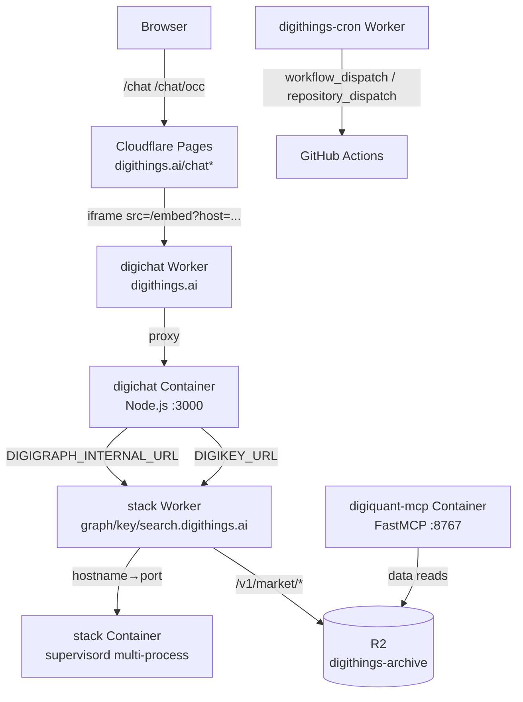

# Cloudflare Infrastructure

digithings.ai production runs on Cloudflare **Workers Paid** using four surface areas: the **digichat Container** (chat BFF on `digithings.ai`), the **Profile A stack Container** (digigraph, digikey, digisearch, digivault, LiteLLM on custom domains), the **digithings-cron Worker** (org-wide clocks), and the **digiquant-mcp Container** (market-data MCP on `mcp.digithings.ai` — currently gated). All deploy through `wrangler deploy` from a monorepo-root Dockerfile build context.

## Topology overview

*Production request topology: chat shells on Pages, APIs and embed on the digichat Worker routing to one shared Container, backends on the stack Worker routing to one multi-process Container.*

## digichat Container

The digichat Cloudflare Container (`cloudflare/digichat-cloudflare`) hosts the digichat Node.js process (Next.js BFF + React chat UI) behind a thin Worker. One shared Container serves all marketing tenants — digithings (digithings.ai), OCC (digithings.ai/chat/occ), and the digiquant dashboard embed — differentiated at request time through `?host=` / `X-Embed-Host` and the `DIGICHAT_EMBED_TENANTS` registry secret.

### Path ownership

Pages and the Worker share the `digithings.ai` hostname:

| Public path | Owner | Role |
|---|---|---|
| `digithings.ai/chat` | Pages | Marketing shell → iframe `/embed?host=digithings.ai` |
| `digithings.ai/chat/occ` | Pages | OCC shell → iframe `/embed?host=occ.digithings.ai` |
| `digithings.ai/embed*` | Worker → Container | Chat widget, tenant selected by `host` param |
| `digithings.ai/api/chat*` | Worker → Container | Chat API |
| `digithings.ai/api/embed*` | Worker → Container | Embed API |
| `digithings.ai/api/byok*` | Worker → Container | Bring-your-own-key API |
| `digithings.ai/api/plan-proof*` | Worker → Container | Desk+ plan-proof HMAC endpoint |
| `digithings.ai/api/health` | Worker → Container | Health check |
| `digithings.ai/_dtchat*` | Worker → Container | Next.js asset prefix (avoids `/_next` clash with Pages) |
| Other paths | Pages | Static export |

The asset prefix `/_dtchat` is baked into the Docker image via `DIGICHAT_ASSET_PREFIX` build arg so the Container's Next.js static assets never collide with Pages' own `/_next` path.

### Container class

The Worker's `DigiChatContainer` class (repo://cloudflare/digichat-cloudflare/src/index.ts) extends Cloudflare's `Container`. Key configuration:

- **defaultPort**: `3000` — the Node.js server port inside the container
- **sleepAfter**: `"3m"` — idle tail (each wake bills the full sleep-after window)
- **max_instances**: 5 — shared across all tenants
- **shared container ID**: `shared-v7` (repo://cloudflare/digichat-cloudflare/src/paths.ts#L22)

The `envVars` block forwards secrets and vars to the Node process. Critically, `DIGICHAT_ENABLED_SERVICES` defaults to `"digigraph"` — the Container only probes digigraph and digikey; digisearch and digivault are loopback inside the Profile A stack and unreachable from the digichat Container directly.

Runtime env forwarded to the Container (repo://cloudflare/digichat-cloudflare/src/index.ts#L32-L56): `AUTH_SECRET`, `DIGICHAT_EMBED_TENANTS`, `DIGIGRAPH_INTERNAL_URL`, `DIGIKEY_URL`, `DIGIKEY_BFF_TOKEN`, `DIGICHAT_PLAN_PROOF_SECRET`, `DIGICHAT_DASHBOARD_SUPABASE_URL`, `DIGICHAT_DASHBOARD_SUPABASE_ANON_KEY`, plus control-plane vars (`DIGICHAT_REQUIRE_ROOT_AUTH`, `DIGICHAT_EMBED_HOSTS`, `DIGICHAT_AUTO_MIGRATE`, `DIGICHAT_TRUSTED_PROXIES`, `DIGICHAT_ENABLED_SERVICES`).

The legacy anonymous embed flag (`DIGICHAT_LEGACY_EMBED_ENABLED`) is deliberately unset — a stock deploy refuses unregistered hosts (repo://cloudflare/digichat-cloudflare/src/embed-flag.ts). When `DIGICHAT_EMBED_TENANTS` is configured, the flag is ignored entirely.

### Tenant registry

`DIGICHAT_EMBED_TENANTS` is a JSON secret mapping host keys to tenant configs. Each entry carries gate mode, skin, LLM access policy, backend type, and optional per-tenant MCP server entries. The digithings and OCC tenants use `backend.type: digigraph`; the OCC tenant additionally specifies `digisearchIndex: "occ_help"` and `vaultPathPrefix: "clients/online-compliance-center"` for its RAG corpus and vault namespace.

First-party hosts (`digithings.ai`, `www.digithings.ai`, `occ.digithings.ai`) skip `X-Embed-Token` when the request carries a browser-attested origin — `X-Embed-Host` alone does not authorize. `DIGICHAT_EMBED_HOSTS` (a plain var, not a secret) controls CSP `frame-ancestors` for the embed endpoint.

### Docker image

Built from `Dockerfile.digichat-cloudflare` (repo root context). Multi-stage Node.js 22 Alpine build: deps → builder → runner. The runner stage uses the `trusted-proxy-server.mjs` entrypoint, which spawns Next.js on `127.0.0.1:3001` and listens on `:3000` with optional `x-digichat-peer-ip` forwarding when `DIGICHAT_TRUSTED_PROXIES` is set. The image ships the `drizzle/` migration folder for `DIGICHAT_AUTO_MIGRATE`.

Postgres is optional — without `DIGICHAT_DATABASE_URL`, conversations stay in `localStorage` and `/api/health` reports `database: skipped`. The Cloudflare deployment is deliberately DB-less.

## Profile A stack Container

The Profile A stack Container (`cloudflare/digithings-stack-cloudflare`) replaces Mac Docker Compose + `*.trycloudflare.com` quick tunnels for production. One multi-process Container runs under supervisord, with three edge ports exposed through the Worker and the rest loopback-only.

### Public hostnames and ports

The stack Worker publishes three custom domains, routing each to the correct in-container port (repo://cloudflare/digithings-stack-cloudflare/src/ports.ts):

| Host | Internal port | Service | Auth required |
|---|---|---|---|
| `graph.digithings.ai` | `:8000` | digigraph | JWT (digikey BFF exchange) |
| `key.digithings.ai` | `:8005` | digikey | JWT / BFF token |
| `search.digithings.ai` | `:8002` | digisearch | JWT `digisearch:query` |

All three are declared as custom domain routes in `wrangler.toml`. The `workers.dev` endpoint is disabled — the stack is reachable only through the named domains.

Additionally, `mcp.digithings.ai` is reserved for the digiquant-mcp Container but its route is **commented out** in `wrangler.toml` behind a HUMAN GATE comment — it must not be enabled until Worker-edge digikey JWT enforcement is in place.

### Internal services (loopback-only)

Inside the Container, these services bind `127.0.0.1` only:

| Service | Port | Role |
|---|---|---|
| digivault | `:8004` | Vault notes (REST + MCP) |
| LiteLLM | `:4000` | LLM routing proxy |
| Redis | `:6379` | digikey blocklist |

### MCP servers (container-internal, key-gated edge)

Several MCP servers bind `0.0.0.0` inside the Container so the Worker can reach them at the container network address. They are exposed externally only through `/_stack/mcp/*` edge paths on `graph.digithings.ai`, gated by the `x-digi-mcp-key` header:

| MCP server | Port | Edge path | Auth |
|---|---|---|---|
| zammad-mcp | `:8770` | `/_stack/mcp/zammad/*` | `x-digi-mcp-key` vs `MCP_EDGE_KEY` |
| digisearch-mcp | `:8765` | `/_stack/mcp/digisearch/*` | `x-digi-mcp-key` |
| digivault-mcp | `:8769` | `/_stack/mcp/digivault/*` | `x-digi-mcp-key` |

The edge key check (repo://cloudflare/digithings-stack-cloudflare/src/index.ts#L338-L358) is **fail-closed**: if `MCP_EDGE_KEY` is unset or the provided key does not match, the Worker returns 401 immediately without reaching the container. Per-server override keys are supported via the optional `MCP_EDGE_KEYS` JSON secret, falling back to the shared `MCP_EDGE_KEY`.

The digigraph-mcp server (`:8766`) is loopback-only inside the container and uses its own `DIGI_MCP_REQUIRE_AUTH=1` with stack JWKS validation. The zammad MCP is read-only and serves the OCC embed's ticket search.

### Auth-exempt paths

Each host allows only a minimal set of paths without authentication: `/health`, `/healthz`, `/metrics`, `/docs`, `/redoc`, `/openapi.json`, plus OPTIONS preflights. On `graph.digithings.ai`, the Worker also serves `/_stack/meta` (a lightweight status JSON) and `/v1/market/tickers|closes` (read-only R2 market data) without container proxying.

The `/_stack/key/*` path prefix is forwarded to digikey on `:8005` after stripping the prefix — this provides a workers.dev fallback for digikey health checks when working without a custom domain.

### Container class

The `DigiStackContainer` class (repo://cloudflare/digithings-stack-cloudflare/src/index.ts#L45-L146) extends Cloudflare's `Container`:

- **defaultPort**: `8000` (digigraph — required for Worker readiness)
- **requiredPorts**: `[8000]` — digigraph must bind for the container to report ready
- **sleepAfter**: `"3m"`
- **max_instances**: 5
- **instance_type**: `standard-2` (multi-process needs real RAM)
- **shared container ID**: `shared-v15` (repo://cloudflare/digithings-stack-cloudflare/src/ports.ts#L37)

The `fetch()` method performs per-request port waiting: a request for `search.digithings.ai` waits for digisearch `:8002` in addition to digigraph `:8000`; a request for `key.digithings.ai` waits for digikey `:8005`. The port-ready timeout is 180 seconds.

### Boot sequence and supervisord

The container entrypoint (repo://cloudflare/digithings-stack-cloudflare/container/entrypoint.sh) starts supervisord immediately — blocking here causes Cloudflare error 1101 (port-not-ready). Supervisord must log to files under `/var/log/supervisor/`, never `/dev/stdout` (Firecracker raises `ENXIO`).

Supervisord program order (repo://cloudflare/digithings-stack-cloudflare/container/supervisor/supervisord.conf):

1. **redis** (priority 10) — binds `127.0.0.1:6379`, used by digikey blocklist
2. **digikey** (priority 20) — waits for Redis PONG, then starts on `:8005`
3. **digigraph** (priority 25) — starts on `0.0.0.0:8000`
4. **seed_chroma** (priority 30, oneshot) — waits for digigraph `/healthz`, then seeds Chroma indexes
5. **digivault** (priority 40) — binds `127.0.0.1:8004`
6. **digisearch** (priority 40) — waits for seed marker or Vectorize, then starts on `0.0.0.0:8002`
7. **MCP servers** (priority 45–46) — digisearch-mcp, digivault-mcp, digigraph-mcp, zammad-mcp
8. **litellm** (priority 50) — binds `127.0.0.1:4000`

### Chroma seeding

The oneshot `seed_chroma` script (repo://cloudflare/digithings-stack-cloudflare/container/seed_chroma.sh) seeds two Chroma indexes:

- `digithings_docs` from `/seed/digithings_docs` (digithings.ai/chat corpus)
- `occ_help` from `/seed/occ_help` (digithings.ai/chat/occ corpus)

The seed MARKER version is `v4`. A success marker (`.stack_chroma_seeded_v4`) prevents re-seeding on subsequent boots. A failure marker (`.stack_chroma_seed_failed_v4`) does **not** prevent retry — the next boot re-attempts from scratch.

When remote Vectorize credentials (`CLOUDFLARE_ACCOUNT_ID`/`CLOUDFLARE_API_TOKEN`) are present, `DIGI_VECTORIZE_ACTIVE` is set to `1` and **no boot seeding occurs** — `seed_chroma.sh` exits immediately and `start_digisearch.sh` starts digisearch directly against the remote index. The container disk is ephemeral either way, so pointing at a remote index eliminates the re-parse/re-chunk/re-embed cost of every cold boot.

### Docker image

Built from `Dockerfile.digithings-stack-cloudflare` (Python 3.12-slim, repo root context). Installs all Python packages via `uv pip install --system -e` in dependency order. LiteLLM is pinned at `1.72.6` with `fastapi<0.116`. The image ships the `supervisord.conf`, entrypoint, seed scripts, MCP servers, and config overlays.

The `CLOUDFLARE_API_TOKEN` credential trap: this variable doubles as wrangler's auth token, so sourcing `.env` before `wrangler secret put` makes wrangler authenticate as the Vectorize/D1-scoped token instead of the operator's login session (auth error 10000). The fix is `env -u CLOUDFLARE_API_TOKEN npx wrangler secret put ...`.

### Read-only market data

The Worker serves `/v1/market/tickers` and `/v1/market/closes` directly from the `MARKET_DATA` R2 binding (`digithings-archive` bucket), never proxying to the container (repo://cloudflare/digithings-stack-cloudflare/src/market-data.ts). The handler reads a `market-data/manifest.json`, resolves per-ticker Parquet pointers, and returns sorted `{ date, ticker, close }` rows. SHA-256 integrity checks verify each object. CORS is limited to origins in `MARKET_DATA_ALLOWED_ORIGINS` (default: `digiquant.io`, `digithings.ai`, `localhost:3005`). Max 25 tickers per request; exceeding returns 400.

## digiquant-mcp Container

A dedicated, single-replica Container (`cloudflare/digithings-stack-cloudflare`) serves the digiquant market-data MCP tools via FastMCP streamable-http on port `:8767`:

- **Container class**: `DigiQuantMcpContainer` (repo://cloudflare/digithings-stack-cloudflare/src/index.ts#L159-L205)
- **sleepAfter**: `"3m"`
- **max_instances**: 1 (single pinned id `mcp-v1` — the in-memory 900s TTL cache assumes a single replica)
- **instance_type**: `standard-2`
- **Dockerfile**: `digiquant/Dockerfile.mcp` (separate image, `[research]+[mcp]` extras)

The dedicated image avoids coupling deploy cycles with the chat-only Profile A stack. The MCP scope defaults to `read` only; `full` never leaves localhost.

The `mcp.digithings.ai` custom-domain route is currently **commented out** in wrangler.toml behind a HUMAN GATE — the MCP tools are unauthenticated localhost today. Once Worker-edge digikey JWT enforcement (scope `digiquant:backtest`) is in place, the route can be enabled.

## digithings-cron Worker

The digithings-cron Worker (`cloudflare/digithings-cron`) is a thin Worker (no Containers, no Durable Objects) that replaces unreliable GitHub Actions schedule triggers with Cloudflare Cron Triggers. It dispatches `workflow_dispatch` and `repository_dispatch` events to the `digithings-ai/digithings` and `digithings-ai/twelve-x` repos on the `develop` branch.

### Jobs

34 unique cron expressions in `wrangler.toml` `[triggers]`, mapping to 34 jobs defined in repo://cloudflare/digithings-cron/src/jobs.ts. Jobs are typed with `id`, `cron`, `repo`, `kind` (`workflow_dispatch` or `repository_dispatch`), optional `inputs`, optional `etOpenGate`, and `enabled`.

Major job categories:

| Category | Examples | Repo |
|---|---|---|
| digiquant prices | `prices-at-open-13/14`, `prices-intraday`, `prices-fx-refresh`, `prices-eod-macro` | digithings |
| House run (research/portfolio) | `house-run-09` through `house-run-12` (daily, `repository_dispatch` with event_type `digiquant-baseline`) | digithings |
| Research + onchain | `research-metrics`, `tearsheets`, `onchain` | digithings |
| Ops / agent / smoke | `continuous-improvement`, `maintenance`, `provider-review`, `agent-pr-finalizer`, `smoke-stack`, `smoke-site`, `token-canary`, `security-pip-audit`, `ci-pr-hygiene`, `refresh-repo-activity`, `project-enforce-assignment` | digithings |
| twelve-x (FX Hub) | `twelve-x-asia`, `twelve-x-london`, `twelve-x-new-york`, `twelve-x-market-context-*`, `twelve-x-performance-eval`, `twelve-x-primemarket-heartbeat`, `twelve-x-session-catchup`, `twelve-x-archive-maintenance` | twelve-x |

### ET open gate

Jobs with `etOpenGate: true` (the at-open price clocks) use a season-aware gate (repo://cloudflare/digithings-cron/src/et-open.ts) that checks whether the current America/New_York wall-clock time is at or after 09:30. Only the EDT cron (`40 13 * * MON-FRI`) dispatches during Eastern Daylight Time and the EST cron (`40 14 * * MON-FRI`) during Eastern Standard Time; the other is skipped.

### Dispatch mechanics

The `dispatch()` function (repo://cloudflare/digithings-cron/src/dispatch.ts) sends a POST to the GitHub Actions API:

- `workflow_dispatch`: `POST /repos/{repo}/actions/workflows/{workflow}/dispatches` with `{ ref, inputs }`
- `repository_dispatch`: `POST /repos/{repo}/dispatches` with `{ event_type, client_payload }`

Rate limits trigger up to 3 retries with `Retry-After`-aware backoff. A 422 that explicitly says "already queued" or "already running" is treated as benign (OK). `DRY_RUN=1` logs the intended POST without calling GitHub.

### Operational endpoints

- `GET /` or `GET /healthz`: returns `{ ok: true, service: "digithings-cron", dry_run: boolean }`
- `POST /kick`: requires `Authorization: Bearer <CRON_KICK_SECRET>`, accepts `{ cron: "..." }` in the body to manually trigger jobs for a cron expression

### Secrets and config

- `GH_DISPATCH_TOKEN` (secret, required) — fine-grained PAT with Actions write on both repos
- `CRON_KICK_SECRET` (secret, optional) — enables `POST /kick`
- `DRY_RUN` (var, default `"0"`) — set to `"1"` to log only

## Deployment workflow

All three Cloudflare surfaces deploy through GitHub Actions workflows that run `wrangler deploy`:

| Surface | Workflow | Trigger |
|---|---|---|
| digichat Container | `.github/workflows/deploy-digichat-cloudflare-container.yml` | Push to main (path filter) + `workflow_dispatch` |
| stack Container | `.github/workflows/deploy-digithings-stack-cloudflare.yml` | `workflow_dispatch` only (production environment gate) |
| digithings-cron | `.github/workflows/deploy-digithings-cron.yml` | Push to develop/main (path filter) + `workflow_dispatch` |

`wrangler deploy` builds the Docker image from the repo root and provisions the Container. Custom domain routes (`graph/key/search.digithings.ai`) are declared in `wrangler.toml` and provisioned on first deploy.

## Container lifecycle and cold starts

Both Containers use `sleepAfter: "3m"` — after 3 minutes of idleness the Firecracker microVM suspends. Each wake bills for the full `sleepAfter` window, so the short tail keeps costs predictable. Cold starts are generally seamless: the Worker's `fetch()` waits for required ports with a 180-second timeout, returning 503 with the error message if the container fails to become ready.

Bumping the shared container ID (e.g., `shared-v7` → `shared-v8` or `shared-v15` → `shared-v16`) forces a new Firecracker instance on next deploy, which is necessary when:
- New secrets or env vars must reach a running container (the container reads worker env only at start)
- The image is rebuilt and a warm instance must be recycled
- `Dockerfile.digithings-stack-cloudflare` includes a rebuild-marker comment for context-only changes that would otherwise be cached
